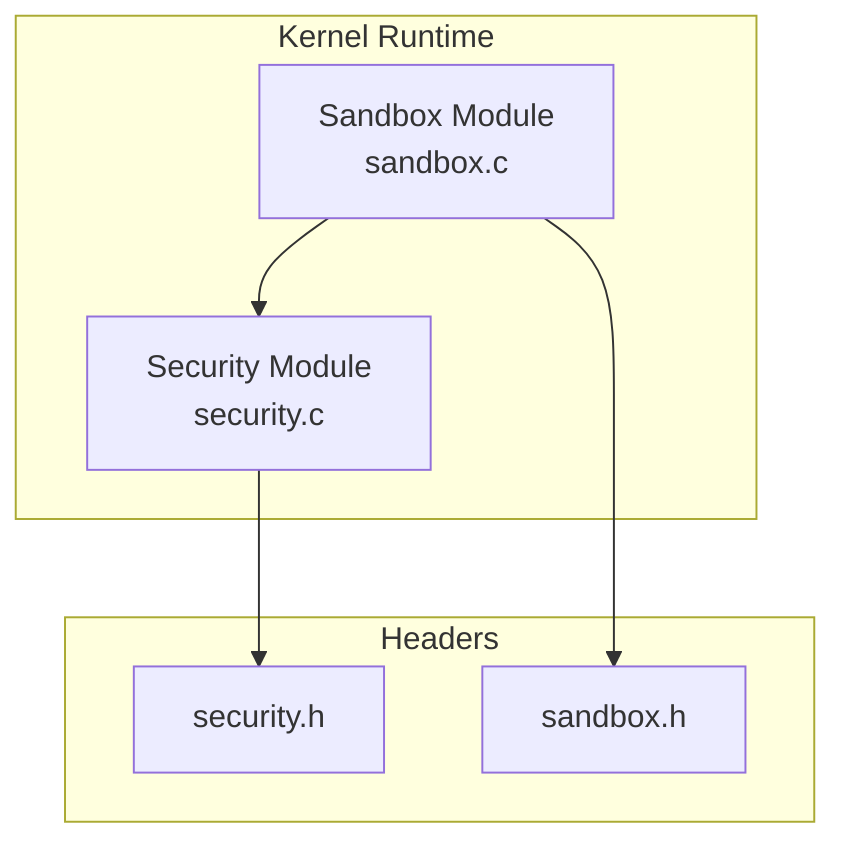
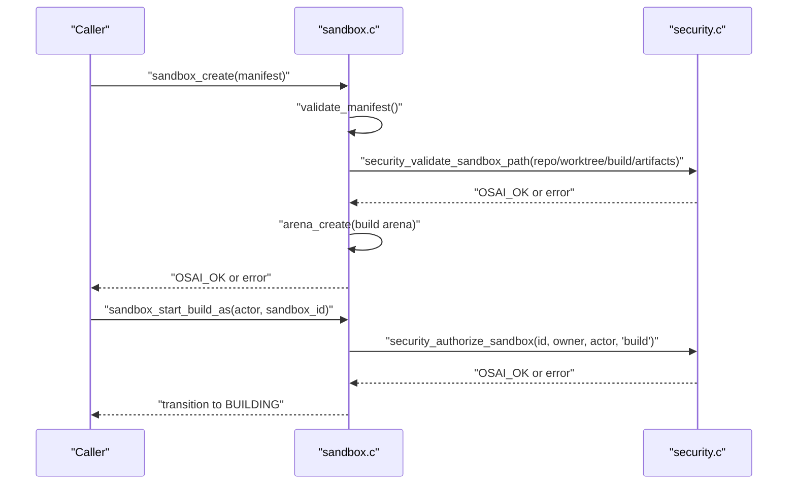
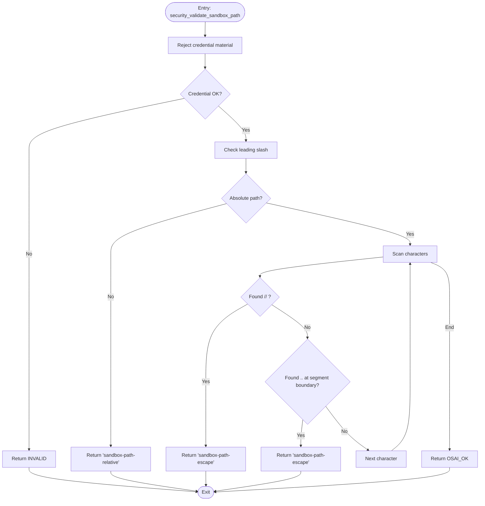
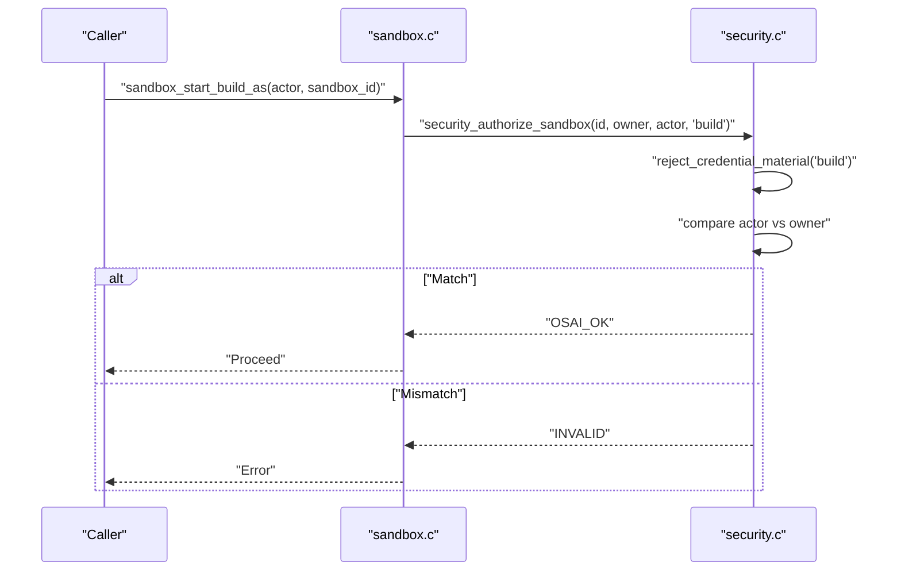
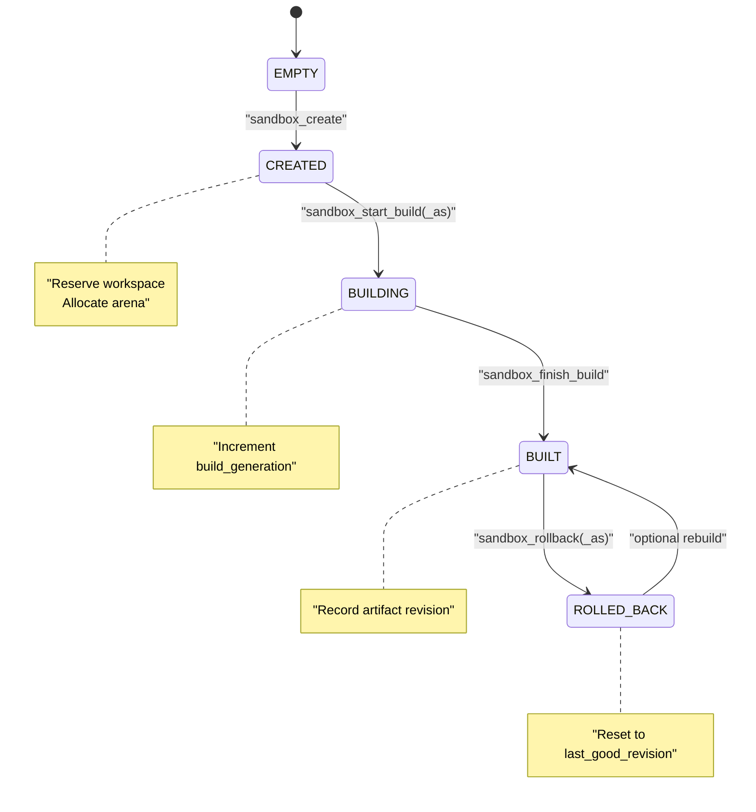
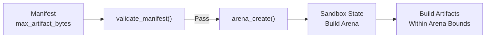
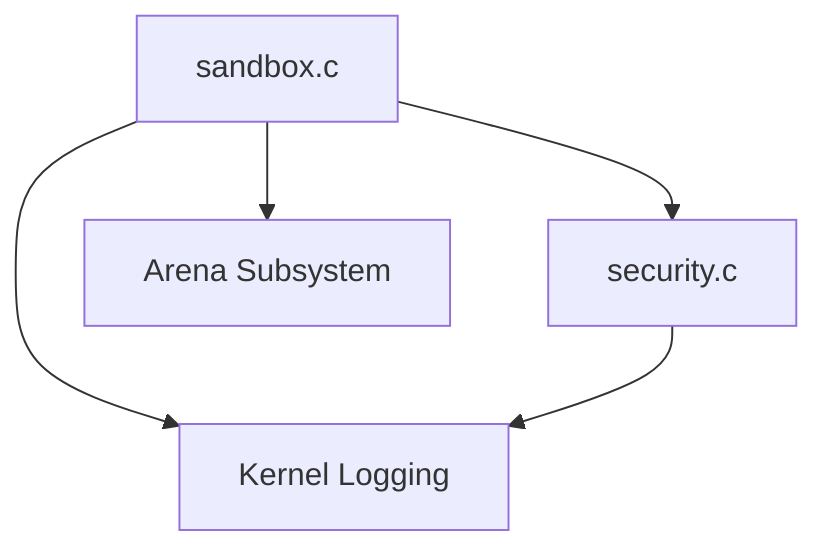

# Sandbox Implementation

<cite>
**Referenced Files in This Document**
- [security.c](file://kernel/runtime/security.c)
- [security.h](file://kernel/include/osai/security.h)
- [sandbox.c](file://kernel/runtime/sandbox.c)
- [sandbox.h](file://kernel/include/osai/sandbox.h)
- [kmain.c](file://kernel/core/kmain.c)
- [early.c](file://kernel/arch/x86_64/early.c)
</cite>

## Table of Contents
1. [Introduction](#introduction)
2. [Project Structure](#project-structure)
3. [Core Components](#core-components)
4. [Architecture Overview](#architecture-overview)
5. [Detailed Component Analysis](#detailed-component-analysis)
6. [Dependency Analysis](#dependency-analysis)
7. [Performance Considerations](#performance-considerations)
8. [Troubleshooting Guide](#troubleshooting-guide)
9. [Conclusion](#conclusion)
10. [Appendices](#appendices)

## Introduction
This document describes OSAI’s sandbox security model and process isolation mechanisms. It focuses on the sandbox lifecycle, boundary enforcement, path validation, ownership verification, and resource limitations. It also covers monitoring counters, debugging techniques, and practical examples of sandbox creation and enforcement.

## Project Structure
The sandbox implementation spans two primary modules:
- Security runtime: path validation, credential rejection, authorization, and audit counters
- Sandbox runtime: lifecycle management, workspace ownership tracking, and arena-backed artifact limits

**Diagram sources**
- [security.c:1-589](file://kernel/runtime/security.c#L1-L589)
- [sandbox.c:1-269](file://kernel/runtime/sandbox.c#L1-L269)
- [security.h:1-53](file://kernel/include/osai/security.h#L1-L53)
- [sandbox.h:1-43](file://kernel/include/osai/sandbox.h#L1-L43)

**Section sources**
- [security.c:1-589](file://kernel/runtime/security.c#L1-L589)
- [sandbox.c:1-269](file://kernel/runtime/sandbox.c#L1-L269)
- [security.h:1-53](file://kernel/include/osai/security.h#L1-L53)
- [sandbox.h:1-43](file://kernel/include/osai/sandbox.h#L1-L43)

## Core Components
- security_validate_sandbox_path: Enforces absolute path, rejects credential material, and blocks path traversal sequences
- security_authorize_sandbox: Verifies actor ownership for sandbox operations
- sandbox_create/start_build/finish_build/rollback: Lifecycle transitions with authorization checks and workspace ownership tracking
- Resource limits via arena-backed artifact quotas

Key responsibilities:
- Boundary enforcement: All sandbox paths validated against traversal and credential patterns
- Ownership verification: Operations require matching owner cell identity
- Resource limitation: Build artifacts constrained by per-sandbox arenas
- Monitoring: Counters track denials and rejections

**Section sources**
- [security.c:422-446](file://kernel/runtime/security.c#L422-L446)
- [security.c:257-271](file://kernel/runtime/security.c#L257-L271)
- [sandbox.c:116-153](file://kernel/runtime/sandbox.c#L116-L153)
- [sandbox.c:163-181](file://kernel/runtime/sandbox.c#L163-L181)
- [sandbox.c:183-197](file://kernel/runtime/sandbox.c#L183-L197)
- [sandbox.c:207-231](file://kernel/runtime/sandbox.c#L207-L231)

## Architecture Overview
The sandbox module orchestrates lifecycle events and enforces security policies at each step. Authorization relies on the security module, which performs path validation and credential checks. Workspace ownership is tracked to prevent conflicts, and build artifacts are isolated in dedicated arenas.

**Diagram sources**
- [sandbox.c:45-67](file://kernel/runtime/sandbox.c#L45-L67)
- [security.c:422-446](file://kernel/runtime/security.c#L422-L446)
- [security.c:257-271](file://kernel/runtime/security.c#L257-L271)
- [sandbox.c:116-153](file://kernel/runtime/sandbox.c#L116-L153)
- [sandbox.c:163-181](file://kernel/runtime/sandbox.c#L163-L181)

## Detailed Component Analysis

### Path Validation and Escape Detection
The security module validates sandbox paths to prevent traversal and credential leakage:
- Rejects null or relative paths
- Detects double slashes indicating attempts to bypass boundaries
- Detects parent-directory traversal sequences, anchored to path segments
- Rejects inputs containing credential-like patterns

**Diagram sources**
- [security.c:422-446](file://kernel/runtime/security.c#L422-L446)

**Section sources**
- [security.c:422-446](file://kernel/runtime/security.c#L422-L446)
- [security.c:300-318](file://kernel/runtime/security.c#L300-L318)

### Ownership Verification and Authorization
The security module authorizes sandbox operations by verifying actor identity against the sandbox owner:
- Rejects credential material in operation strings
- Compares actor cell ID with owner cell ID
- Returns standardized denial errors with counters incremented

**Diagram sources**
- [security.c:257-271](file://kernel/runtime/security.c#L257-L271)
- [sandbox.c:163-181](file://kernel/runtime/sandbox.c#L163-L181)

**Section sources**
- [security.c:257-271](file://kernel/runtime/security.c#L257-L271)
- [sandbox.c:163-181](file://kernel/runtime/sandbox.c#L163-L181)

### Sandbox Lifecycle Management
The sandbox runtime manages a fixed number of sandboxes with strict state transitions:
- Created: Validates manifest, reserves workspace, allocates build arena
- Building: Authorized start, increments build generation
- Built: Finalized with artifact revision
- Rolled Back: Authorized rollback to last good revision

**Diagram sources**
- [sandbox.h:7-14](file://kernel/include/osai/sandbox.h#L7-L14)
- [sandbox.c:98-153](file://kernel/runtime/sandbox.c#L98-L153)
- [sandbox.c:163-197](file://kernel/runtime/sandbox.c#L163-L197)
- [sandbox.c:207-231](file://kernel/runtime/sandbox.c#L207-L231)

**Section sources**
- [sandbox.h:7-14](file://kernel/include/osai/sandbox.h#L7-L14)
- [sandbox.c:98-153](file://kernel/runtime/sandbox.c#L98-L153)
- [sandbox.c:163-197](file://kernel/runtime/sandbox.c#L163-L197)
- [sandbox.c:207-231](file://kernel/runtime/sandbox.c#L207-L231)

### Resource Limitation Strategies
Each sandbox uses an arena to constrain build output size:
- Arena allocation per sandbox with a configurable byte limit
- Build artifacts stored within arena bounds
- Maximum artifact bytes enforced during manifest validation

**Diagram sources**
- [sandbox.c:45-67](file://kernel/runtime/sandbox.c#L45-L67)
- [sandbox.c:127-133](file://kernel/runtime/sandbox.c#L127-L133)

**Section sources**
- [sandbox.c:45-67](file://kernel/runtime/sandbox.c#L45-L67)
- [sandbox.c:127-133](file://kernel/runtime/sandbox.c#L127-L133)

### Sandbox Configuration Options
- sandbox_id: Unique identifier within the fixed pool
- cell_id: Owner identity for authorization
- workspace_id: Workspace reservation linkage
- repo_path/worktree_path/build_dir/artifact_dir: Paths validated for traversal and credential patterns
- source_revision: Baseline revision for builds
- max_artifact_bytes: Per-sandbox artifact size limit
- allow_network: Currently restricted to disabled

**Section sources**
- [sandbox.h:16-27](file://kernel/include/osai/sandbox.h#L16-L27)
- [sandbox.c:45-67](file://kernel/runtime/sandbox.c#L45-L67)

### Sandbox Monitoring Capabilities
The security module maintains counters for auditing:
- Denied operations, capability denials, FS denials, workspace denials, sandbox denials, rollback denials
- Update policy rejects, signature accept/reject counts, credential rejects, admin denials
- Update authorization attempts, replay rejects, key accept/reject counts
- Sandbox escape rejects

These counters enable operators to detect suspicious activity and validate enforcement effectiveness.

**Section sources**
- [security.c:12-28](file://kernel/runtime/security.c#L12-L28)
- [security.c:458-520](file://kernel/runtime/security.c#L458-L520)

## Dependency Analysis
The sandbox module depends on the security module for:
- Path validation
- Authorization checks
- Credential rejection

It also integrates with the arena subsystem for resource limits and logs via kernel logging facilities.

**Diagram sources**
- [sandbox.c:1-5](file://kernel/runtime/sandbox.c#L1-L5)
- [security.c:1-5](file://kernel/runtime/security.c#L1-L5)

**Section sources**
- [sandbox.c:1-5](file://kernel/runtime/sandbox.c#L1-L5)
- [security.c:1-5](file://kernel/runtime/security.c#L1-L5)

## Performance Considerations
- Path validation is linear in path length and uses simple scans; overhead is minimal
- Authorization compares small integers (cell IDs) and short strings; negligible cost
- Arena allocation occurs once per sandbox creation; subsequent builds operate within preallocated memory
- Logging introduces I/O overhead; keep logs at appropriate verbosity for production

## Troubleshooting Guide
Common issues and diagnostics:
- Sandbox creation fails with invalid manifest:
  - Verify all paths begin with expected prefixes and pass traversal checks
  - Confirm workspace is free and sandbox_id/workspace_id are within bounds
- Build start fails with invalid authorization:
  - Ensure actor_cell_id matches the sandbox owner
  - Check that the sandbox is in the CREATED state
- Rollback denied:
  - Verify actor has sufficient privileges and sandbox is in BUILT state
- Excessive sandbox escape rejects:
  - Review inputs for traversal patterns or credential material
- Resource exhaustion:
  - Increase max_artifact_bytes cautiously; monitor arena usage

Operational tips:
- Use self-tests to validate behavior under known failure conditions
- Inspect counters to identify denial patterns and potential misconfigurations
- Enable kernel logging to trace transitions and denials

**Section sources**
- [sandbox.c:241-268](file://kernel/runtime/sandbox.c#L241-L268)
- [security.c:522-589](file://kernel/runtime/security.c#L522-L589)
- [security.c:458-520](file://kernel/runtime/security.c#L458-L520)

## Conclusion
OSAI’s sandbox implementation enforces strong boundary controls through explicit path validation, ownership-based authorization, and arena-backed resource limits. The modular design separates security policy from lifecycle management, enabling clear auditing and straightforward troubleshooting.

## Appendices

### Practical Examples

- Example: Sandbox Creation
  - Prepare a manifest with absolute paths under allowed prefixes
  - Call sandbox_create; observe creation log and workspace reservation
  - Reference: [sandbox.c:116-153](file://kernel/runtime/sandbox.c#L116-L153)

- Example: Sandbox Validation
  - Use security_validate_sandbox_path on each path field prior to creation
  - Reference: [security.c:422-446](file://kernel/runtime/security.c#L422-L446)

- Example: Sandbox Security Enforcement
  - Authorize build/rollback actions via security_authorize_sandbox
  - Reference: [security.c:257-271](file://kernel/runtime/security.c#L257-L271)

- Example: Sandbox Lifecycle Enforcement
  - Start build only from CREATED state; finish to BUILT; rollback only from BUILT
  - Reference: [sandbox.c:163-197](file://kernel/runtime/sandbox.c#L163-L197), [sandbox.c:207-231](file://kernel/runtime/sandbox.c#L207-L231)

- Example: Namespace Isolation and Monitoring
  - Monitor counters for denials and escapes to validate enforcement
  - Reference: [security.c:458-520](file://kernel/runtime/security.c#L458-L520)

- Example: Contract Readiness and Security Gate
  - Full OS readiness requires security contract readiness
  - Reference: [early.c:600-615](file://kernel/arch/x86_64/early.c#L600-L615)