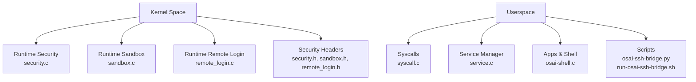
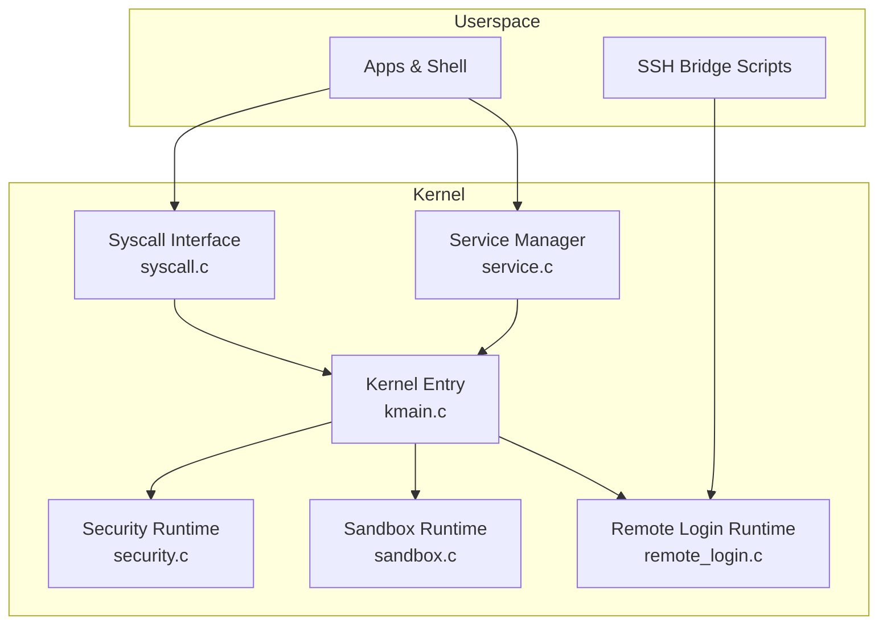
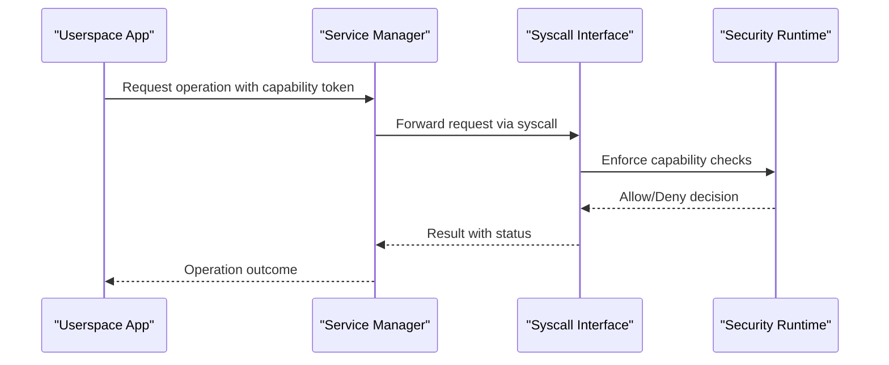
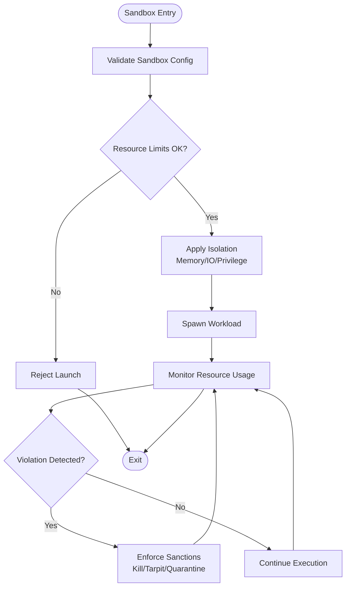
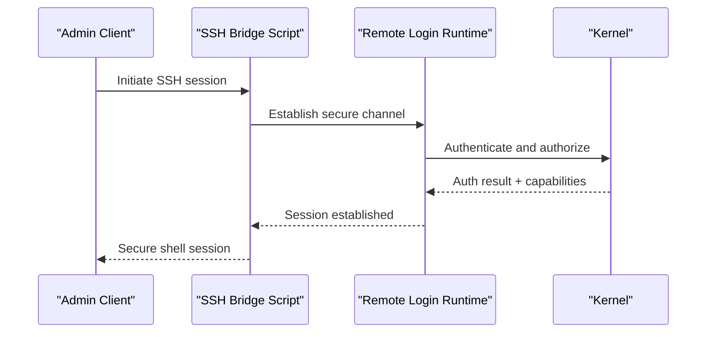
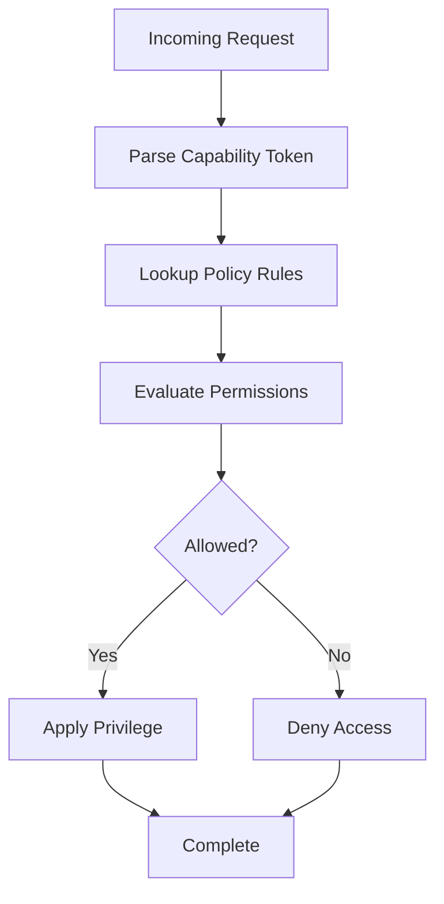
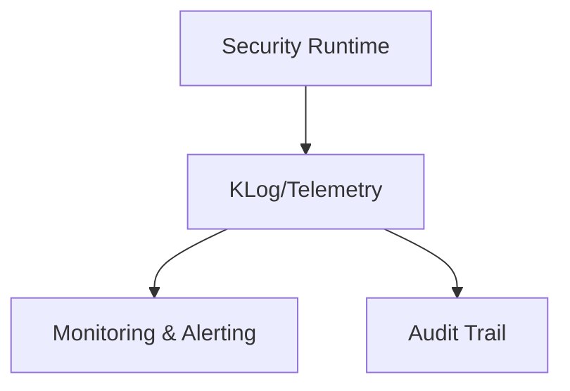
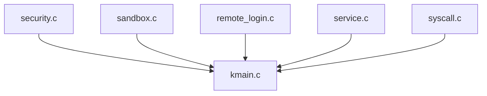

# Security Model

<cite>
**Referenced Files in This Document**
- [security.h](file://kernel/include/osai/security.h)
- [security.c](file://kernel/runtime/security.c)
- [sandbox.h](file://kernel/include/osai/sandbox.h)
- [sandbox.c](file://kernel/runtime/sandbox.c)
- [remote_login.h](file://kernel/include/osai/remote_login.h)
- [remote_login.c](file://kernel/runtime/remote_login.c)
- [kmain.c](file://kernel/core/kmain.c)
- [syscall.c](file://kernel/user/syscall.c)
- [service.c](file://kernel/user/service.c)
- [osai-ssh-bridge.py](file://scripts/osai-ssh-bridge.py)
- [run-osai-ssh-bridge.sh](file://scripts/run-osai-ssh-bridge.sh)
- [README.md](file://README.md)
- [SECURITY.md](file://SECURITY.md)
</cite>

## Table of Contents
1. [Introduction](#introduction)
2. [Project Structure](#project-structure)
3. [Core Components](#core-components)
4. [Architecture Overview](#architecture-overview)
5. [Detailed Component Analysis](#detailed-component-analysis)
6. [Dependency Analysis](#dependency-analysis)
7. [Performance Considerations](#performance-considerations)
8. [Troubleshooting Guide](#troubleshooting-guide)
9. [Conclusion](#conclusion)
10. [Appendices](#appendices)

## Introduction
This document describes OSAI’s security model with emphasis on capability-based security, sandboxing, remote login, and operational security. It explains how capability tokens mediate permissions, how access control is enforced, how the sandbox isolates workloads, and how SSH-based remote login integrates with administrative controls. It also covers security policies, audit and intrusion detection capabilities, threat modeling, security boundaries, and incident response procedures.

## Project Structure
OSAI organizes security-related logic across kernel headers and runtime implementations, user-space services, and scripts for secure remote operations. The kernel exposes security primitives and runtime modules for capability management, sandboxing, and remote login. Userspace provides services and shell utilities that interact with the kernel via syscalls and service interfaces.

**Diagram sources**
- [security.c](file://kernel/runtime/security.c)
- [sandbox.c](file://kernel/runtime/sandbox.c)
- [remote_login.c](file://kernel/runtime/remote_login.c)
- [security.h](file://kernel/include/osai/security.h)
- [sandbox.h](file://kernel/include/osai/sandbox.h)
- [remote_login.h](file://kernel/include/osai/remote_login.h)
- [syscall.c](file://kernel/user/syscall.c)
- [service.c](file://kernel/user/service.c)
- [osai-ssh-bridge.py](file://scripts/osai-ssh-bridge.py)
- [run-osai-ssh-bridge.sh](file://scripts/run-osai-ssh-bridge.sh)

**Section sources**
- [README.md](file://README.md)
- [SECURITY.md](file://SECURITY.md)

## Core Components
- Capability-based security: Defines capability tokens and permission delegation semantics used by the runtime and services.
- Sandbox: Implements process isolation, resource limits, and privilege separation for untrusted workloads.
- Remote login: Integrates SSH-based remote access with administrative controls and secure channels.
- Audit and telemetry: Provides logging and telemetry hooks for security events and monitoring.

Key implementation anchors:
- Capability and access control definitions: [security.h](file://kernel/include/osai/security.h)
- Capability enforcement and policy evaluation: [security.c](file://kernel/runtime/security.c)
- Sandbox isolation and resource control: [sandbox.h](file://kernel/include/osai/sandbox.h), [sandbox.c](file://kernel/runtime/sandbox.c)
- Remote login integration and admin controls: [remote_login.h](file://kernel/include/osai/remote_login.h), [remote_login.c](file://kernel/runtime/remote_login.c)
- Kernel entry and syscall interface: [kmain.c](file://kernel/core/kmain.c), [syscall.c](file://kernel/user/syscall.c)
- Service manager and userspace coordination: [service.c](file://kernel/user/service.c)

**Section sources**
- [security.h](file://kernel/include/osai/security.h)
- [security.c](file://kernel/runtime/security.c)
- [sandbox.h](file://kernel/include/osai/sandbox.h)
- [sandbox.c](file://kernel/runtime/sandbox.c)
- [remote_login.h](file://kernel/include/osai/remote_login.h)
- [remote_login.c](file://kernel/runtime/remote_login.c)
- [kmain.c](file://kernel/core/kmain.c)
- [syscall.c](file://kernel/user/syscall.c)
- [service.c](file://kernel/user/service.c)

## Architecture Overview
OSAI’s security architecture centers on capability-based access control enforced by the kernel runtime, combined with sandbox isolation for process containment. Remote login leverages SSH with administrative controls and secure bridging scripts. Services and applications interact with the kernel through controlled syscalls and service interfaces.

**Diagram sources**
- [security.c](file://kernel/runtime/security.c)
- [sandbox.c](file://kernel/runtime/sandbox.c)
- [remote_login.c](file://kernel/runtime/remote_login.c)
- [kmain.c](file://kernel/core/kmain.c)
- [syscall.c](file://kernel/user/syscall.c)
- [service.c](file://kernel/user/service.c)
- [osai-ssh-bridge.py](file://scripts/osai-ssh-bridge.py)

## Detailed Component Analysis

### Capability-Based Security
Capability tokens represent delegated permissions that are checked by the kernel at runtime. The capability model defines token formats, permission sets, and delegation semantics. Enforcement occurs during syscall invocation and service interactions.

**Diagram sources**
- [security.c](file://kernel/runtime/security.c)
- [syscall.c](file://kernel/user/syscall.c)
- [service.c](file://kernel/user/service.c)

Implementation highlights:
- Token validation and permission set evaluation: [security.c](file://kernel/runtime/security.c)
- Capability definitions and policy structures: [security.h](file://kernel/include/osai/security.h)

**Section sources**
- [security.h](file://kernel/include/osai/security.h)
- [security.c](file://kernel/runtime/security.c)
- [syscall.c](file://kernel/user/syscall.c)
- [service.c](file://kernel/user/service.c)

### Sandbox Implementation
The sandbox enforces process isolation, resource limits, and privilege separation. It ensures untrusted workloads operate under strict constraints, reducing the blast radius of potential exploits.

**Diagram sources**
- [sandbox.c](file://kernel/runtime/sandbox.c)
- [sandbox.h](file://kernel/include/osai/sandbox.h)

Operational controls:
- Isolation boundaries and privilege reduction: [sandbox.c](file://kernel/runtime/sandbox.c)
- Resource limit configuration and enforcement: [sandbox.h](file://kernel/include/osai/sandbox.h)

**Section sources**
- [sandbox.h](file://kernel/include/osai/sandbox.h)
- [sandbox.c](file://kernel/runtime/sandbox.c)

### Remote Login Security
Remote login integrates SSH for administrative access, with secure bridging scripts and runtime controls to manage trust and access.

**Diagram sources**
- [remote_login.c](file://kernel/runtime/remote_login.c)
- [remote_login.h](file://kernel/include/osai/remote_login.h)
- [osai-ssh-bridge.py](file://scripts/osai-ssh-bridge.py)
- [run-osai-ssh-bridge.sh](file://scripts/run-osai-ssh-bridge.sh)

Administrative controls:
- Authentication and authorization gating: [remote_login.c](file://kernel/runtime/remote_login.c)
- SSH bridge orchestration: [osai-ssh-bridge.py](file://scripts/osai-ssh-bridge.py), [run-osai-ssh-bridge.sh](file://scripts/run-osai-ssh-bridge.sh)

**Section sources**
- [remote_login.h](file://kernel/include/osai/remote_login.h)
- [remote_login.c](file://kernel/runtime/remote_login.c)
- [osai-ssh-bridge.py](file://scripts/osai-ssh-bridge.py)
- [run-osai-ssh-bridge.sh](file://scripts/run-osai-ssh-bridge.sh)

### Access Control Mechanisms
Access control combines capability-based checks with kernel-enforced policies. Requests traverse syscalls and services, where capability tokens are validated against configured policies.

**Diagram sources**
- [security.c](file://kernel/runtime/security.c)
- [security.h](file://kernel/include/osai/security.h)
- [syscall.c](file://kernel/user/syscall.c)

**Section sources**
- [security.h](file://kernel/include/osai/security.h)
- [security.c](file://kernel/runtime/security.c)
- [syscall.c](file://kernel/user/syscall.c)

### Audit Trails and Intrusion Detection
The system logs security-relevant events and telemetry for audit and detection. These logs support incident response and continuous monitoring.

**Diagram sources**
- [security.c](file://kernel/runtime/security.c)
- [kmain.c](file://kernel/core/kmain.c)

**Section sources**
- [security.c](file://kernel/runtime/security.c)
- [kmain.c](file://kernel/core/kmain.c)

## Dependency Analysis
Security components depend on kernel entry points and syscall interfaces. The service manager coordinates userspace requests to the kernel. Remote login depends on SSH bridge scripts and runtime controls.

**Diagram sources**
- [security.c](file://kernel/runtime/security.c)
- [sandbox.c](file://kernel/runtime/sandbox.c)
- [remote_login.c](file://kernel/runtime/remote_login.c)
- [syscall.c](file://kernel/user/syscall.c)
- [service.c](file://kernel/user/service.c)
- [kmain.c](file://kernel/core/kmain.c)

**Section sources**
- [kmain.c](file://kernel/core/kmain.c)
- [syscall.c](file://kernel/user/syscall.c)
- [service.c](file://kernel/user/service.c)
- [security.c](file://kernel/runtime/security.c)
- [sandbox.c](file://kernel/runtime/sandbox.c)
- [remote_login.c](file://kernel/runtime/remote_login.c)

## Performance Considerations
- Capability checks and policy evaluation should minimize overhead by caching frequently accessed permissions and using efficient lookup structures.
- Sandbox enforcement must balance isolation strength with performance impact; avoid excessive context switches and memory copies.
- Remote login sessions should leverage connection pooling and keep-alive strategies to reduce handshake overhead while maintaining security.

## Troubleshooting Guide
Common issues and resolutions:
- Capability denial errors: Verify token validity and permission sets against policy definitions. Check capability delegation and revocation timelines.
  - Reference: [security.h](file://kernel/include/osai/security.h), [security.c](file://kernel/runtime/security.c)
- Sandbox violations: Review resource limits and isolation settings; confirm workload does not exceed configured quotas.
  - Reference: [sandbox.h](file://kernel/include/osai/sandbox.h), [sandbox.c](file://kernel/runtime/sandbox.c)
- Remote login failures: Validate SSH bridge script configuration and kernel-side authorization rules.
  - Reference: [remote_login.h](file://kernel/include/osai/remote_login.h), [remote_login.c](file://kernel/runtime/remote_login.c), [osai-ssh-bridge.py](file://scripts/osai-ssh-bridge.py)

**Section sources**
- [security.h](file://kernel/include/osai/security.h)
- [security.c](file://kernel/runtime/security.c)
- [sandbox.h](file://kernel/include/osai/sandbox.h)
- [sandbox.c](file://kernel/runtime/sandbox.c)
- [remote_login.h](file://kernel/include/osai/remote_login.h)
- [remote_login.c](file://kernel/runtime/remote_login.c)
- [osai-ssh-bridge.py](file://scripts/osai-ssh-bridge.py)

## Conclusion
OSAI’s security model integrates capability-based access control, sandbox isolation, and secure remote login to form a layered defense. By enforcing strict capability checks, isolating workloads, and controlling administrative access, the system reduces attack surfaces and improves resilience. Operational security is supported by logging, telemetry, and scripts that facilitate secure remote operations.

## Appendices

### Threat Modeling and Attack Surface
- Internal threats: Misconfigured capabilities, insufficient sandbox limits, or compromised service managers.
- External threats: Unauthorized SSH access attempts, privilege escalation, and resource exhaustion attacks.
- Mitigations: Least-privilege capability tokens, strong sandbox boundaries, and strict admin controls.

### Security Boundaries
- Kernel boundary: Enforces capability checks and isolation.
- Sandbox boundary: Contains workload execution and resource usage.
- Remote login boundary: Secures administrative access via SSH and bridge scripts.

### Security Configuration and Policy Management
- Capability policies: Define token issuance, delegation, and revocation rules.
- Sandbox policies: Set CPU/memory/disk/network quotas and isolation parameters.
- Remote login policies: Configure allowed hosts, keys, and administrative groups.

### Security Incident Response
- Immediate actions: Quarantine affected workloads, revoke compromised tokens, and audit recent log entries.
- Forensic analysis: Correlate capability denials, sandbox violations, and remote login events.
- Remediation: Tighten policies, update isolation rules, and re-validate SSH configurations.