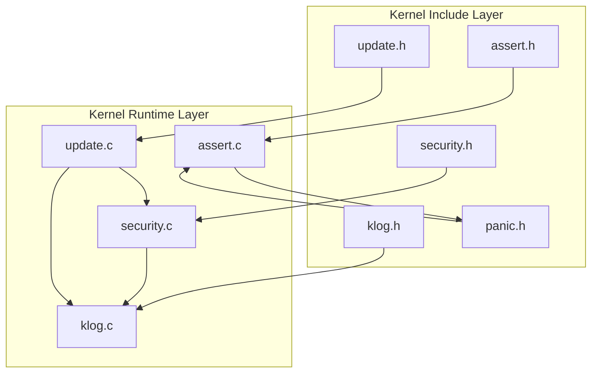
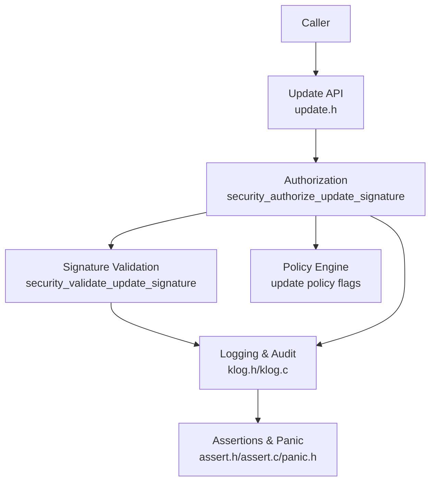
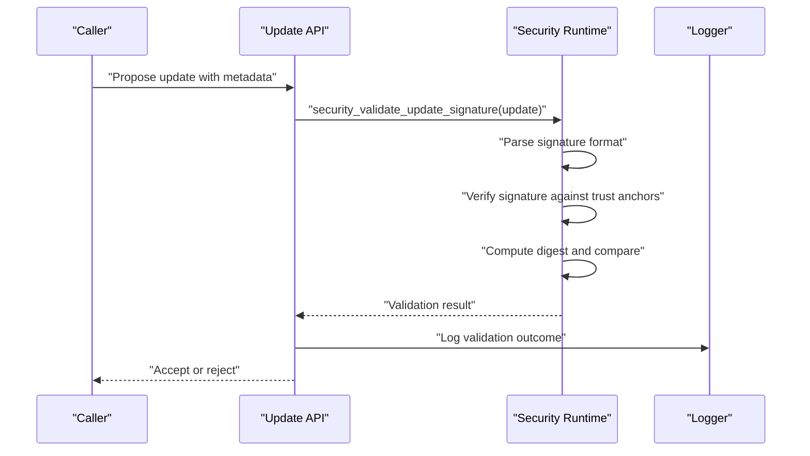
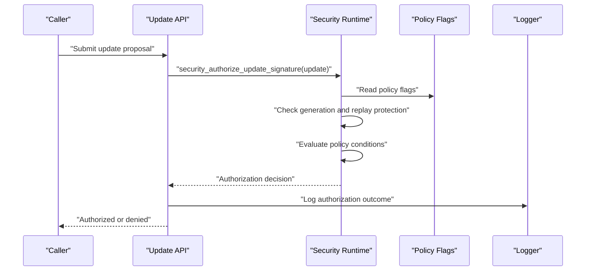
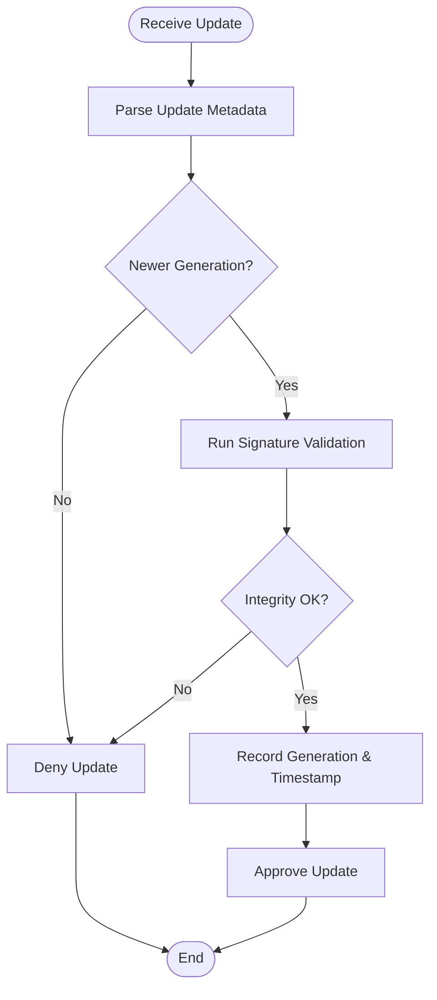
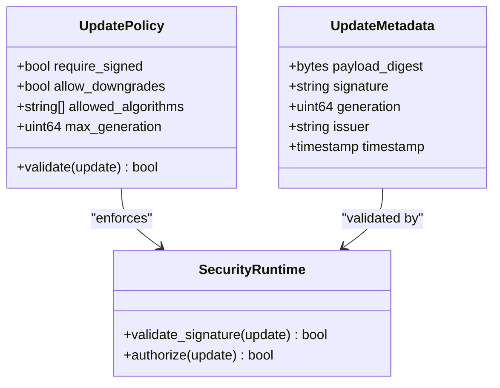
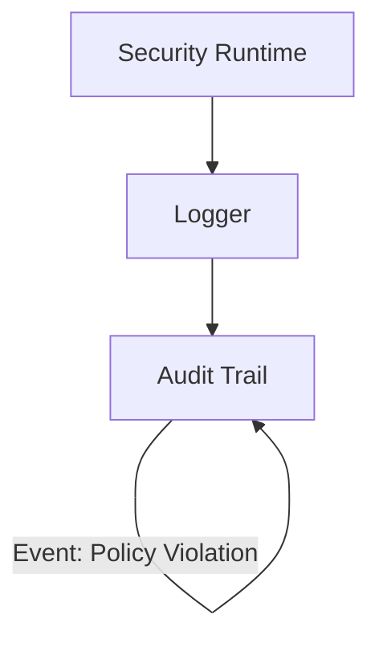
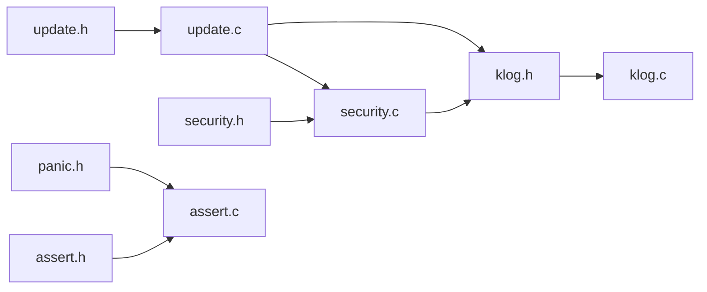

# Update Security Policy

<cite>
**Referenced Files in This Document**
- [security.h](file://kernel/include/osai/security.h)
- [security.c](file://kernel/runtime/security.c)
- [update.h](file://kernel/include/osai/update.h)
- [update.c](file://kernel/runtime/update.c)
- [klog.h](file://kernel/include/osai/klog.h)
- [klog.c](file://kernel/core/klog.c)
- [panic.h](file://kernel/include/osai/panic.h)
- [assert.h](file://kernel/include/osai/assert.h)
- [assert.c](file://kernel/core/assert.c)
- [README.md](file://README.md)
- [SECURITY.md](file://SECURITY.md)
</cite>

## Table of Contents
1. [Introduction](#introduction)
2. [Project Structure](#project-structure)
3. [Core Components](#core-components)
4. [Architecture Overview](#architecture-overview)
5. [Detailed Component Analysis](#detailed-component-analysis)
6. [Dependency Analysis](#dependency-analysis)
7. [Performance Considerations](#performance-considerations)
8. [Troubleshooting Guide](#troubleshooting-guide)
9. [Conclusion](#conclusion)
10. [Appendices](#appendices)

## Introduction
This document describes OSAI’s update security policy and software integrity verification system. It focuses on the cryptographic signature validation process, update authorization workflow, policy configuration, integrity checks, logging, auditing, and operational procedures for secure updates. The primary functions covered are:
- security_validate_update_signature
- security_authorize_update_signature
- Update policy configuration and enforcement
- Replay attack prevention and generation tracking
- Update security logging and audit trails
- Exceptions, bypass procedures, and troubleshooting

## Project Structure
OSAI organizes update and security logic under the kernel subsystem:
- Update interfaces and runtime logic are defined in kernel/include/osai/update.h and implemented in kernel/runtime/update.c
- Security interfaces and runtime logic are defined in kernel/include/osai/security.h and implemented in kernel/runtime/security.c
- Logging and diagnostics are provided via kernel/include/osai/klog.h and kernel/core/klog.c
- Assertions and panics are provided via kernel/include/osai/assert.h and kernel/core/assert.c, kernel/include/osai/panic.h

**Diagram sources**
- [update.h](file://kernel/include/osai/update.h)
- [update.c](file://kernel/runtime/update.c)
- [security.h](file://kernel/include/osai/security.h)
- [security.c](file://kernel/runtime/security.c)
- [klog.h](file://kernel/include/osai/klog.h)
- [klog.c](file://kernel/core/klog.c)
- [assert.h](file://kernel/include/osai/assert.h)
- [assert.c](file://kernel/core/assert.c)
- [panic.h](file://kernel/include/osai/panic.h)

**Section sources**
- [update.h](file://kernel/include/osai/update.h)
- [update.c](file://kernel/runtime/update.c)
- [security.h](file://kernel/include/osai/security.h)
- [security.c](file://kernel/runtime/security.c)
- [klog.h](file://kernel/include/osai/klog.h)
- [klog.c](file://kernel/core/klog.c)
- [assert.h](file://kernel/include/osai/assert.h)
- [assert.c](file://kernel/core/assert.c)
- [panic.h](file://kernel/include/osai/panic.h)

## Core Components
- Update interface and policy definitions: Declares update metadata, policy flags, and authorization/validation APIs.
- Security runtime: Implements cryptographic signature validation, authorization checks, and policy enforcement.
- Logging and diagnostics: Provides structured logging for security events and audit trails.
- Assertions and panic: Enforces hard-failures on security violations to prevent unsafe state progression.

Key responsibilities:
- Validate update signatures against configured trust anchors and algorithms
- Authorize updates according to policy flags and current system state
- Track update generations and prevent replays
- Record security events for audit and forensics
- Fail closed on policy violations

**Section sources**
- [update.h](file://kernel/include/osai/update.h)
- [update.c](file://kernel/runtime/update.c)
- [security.h](file://kernel/include/osai/security.h)
- [security.c](file://kernel/runtime/security.c)
- [klog.h](file://kernel/include/osai/klog.h)
- [klog.c](file://kernel/core/klog.c)
- [assert.h](file://kernel/include/osai/assert.h)
- [assert.c](file://kernel/core/assert.c)
- [panic.h](file://kernel/include/osai/panic.h)

## Architecture Overview
The update security architecture integrates policy, authorization, and integrity verification into a cohesive flow. The runtime components depend on the interface definitions and leverage logging and assertions for safety.

**Diagram sources**
- [update.h](file://kernel/include/osai/update.h)
- [update.c](file://kernel/runtime/update.c)
- [security.h](file://kernel/include/osai/security.h)
- [security.c](file://kernel/runtime/security.c)
- [klog.h](file://kernel/include/osai/klog.h)
- [klog.c](file://kernel/core/klog.c)
- [assert.h](file://kernel/include/osai/assert.h)
- [assert.c](file://kernel/core/assert.c)
- [panic.h](file://kernel/include/osai/panic.h)

## Detailed Component Analysis

### Update Signature Validation Workflow
This workflow validates an update’s cryptographic signature and ensures integrity and authenticity.

**Diagram sources**
- [security.c](file://kernel/runtime/security.c)
- [update.c](file://kernel/runtime/update.c)
- [klog.c](file://kernel/core/klog.c)

**Section sources**
- [security.c](file://kernel/runtime/security.c)
- [update.c](file://kernel/runtime/update.c)
- [klog.c](file://kernel/core/klog.c)

### Update Authorization Workflow
This workflow enforces policy flags and system state before authorizing an update.

**Diagram sources**
- [security.c](file://kernel/runtime/security.c)
- [update.c](file://kernel/runtime/update.c)
- [klog.c](file://kernel/core/klog.c)

**Section sources**
- [security.c](file://kernel/runtime/security.c)
- [update.c](file://kernel/runtime/update.c)
- [klog.c](file://kernel/core/klog.c)

### Replay Attack Prevention and Generation Tracking
Replay prevention is achieved by tracking update generations and rejecting duplicates or older versions.

**Diagram sources**
- [security.c](file://kernel/runtime/security.c)
- [update.c](file://kernel/runtime/update.c)
- [klog.c](file://kernel/core/klog.c)

**Section sources**
- [security.c](file://kernel/runtime/security.c)
- [update.c](file://kernel/runtime/update.c)
- [klog.c](file://kernel/core/klog.c)

### Update Policy Configuration and Enforcement
Policy flags define acceptable update channels, signing algorithms, and constraints. Enforcement occurs during authorization and validation.

**Diagram sources**
- [update.h](file://kernel/include/osai/update.h)
- [security.h](file://kernel/include/osai/security.h)
- [security.c](file://kernel/runtime/security.c)

**Section sources**
- [update.h](file://kernel/include/osai/update.h)
- [security.h](file://kernel/include/osai/security.h)
- [security.c](file://kernel/runtime/security.c)

### Update Security Logging and Audit Trails
Logging records all security-relevant events for auditability and incident response.

**Diagram sources**
- [klog.h](file://kernel/include/osai/klog.h)
- [klog.c](file://kernel/core/klog.c)
- [security.c](file://kernel/runtime/security.c)
- [update.c](file://kernel/runtime/update.c)

**Section sources**
- [klog.h](file://kernel/include/osai/klog.h)
- [klog.c](file://kernel/core/klog.c)
- [security.c](file://kernel/runtime/security.c)
- [update.c](file://kernel/runtime/update.c)

### Update Security Exceptions, Bypass Procedures, and Troubleshooting
Exceptions and bypasses are intended for emergency scenarios and must be tightly controlled. Troubleshooting relies on logs and assertions.

- Exceptions: Emergency bypass flags or trusted operator channels may exist in policy for recovery mode. These are disabled by default and require explicit activation.
- Bypass procedures: Operator-driven override steps, such as entering recovery mode, disabling specific policy flags temporarily, and re-validating.
- Troubleshooting: Review audit logs, confirm policy flags, verify trust anchors, and ensure integrity checks pass. Use assertions and panic to isolate failures.

**Section sources**
- [security.h](file://kernel/include/osai/security.h)
- [security.c](file://kernel/runtime/security.c)
- [klog.h](file://kernel/include/osai/klog.h)
- [klog.c](file://kernel/core/klog.c)
- [assert.h](file://kernel/include/osai/assert.h)
- [assert.c](file://kernel/core/assert.c)
- [panic.h](file://kernel/include/osai/panic.h)

## Dependency Analysis
The update and security modules depend on shared interfaces and diagnostics.

**Diagram sources**
- [update.h](file://kernel/include/osai/update.h)
- [update.c](file://kernel/runtime/update.c)
- [security.h](file://kernel/include/osai/security.h)
- [security.c](file://kernel/runtime/security.c)
- [klog.h](file://kernel/include/osai/klog.h)
- [klog.c](file://kernel/core/klog.c)
- [assert.h](file://kernel/include/osai/assert.h)
- [assert.c](file://kernel/core/assert.c)
- [panic.h](file://kernel/include/osai/panic.h)

**Section sources**
- [update.h](file://kernel/include/osai/update.h)
- [update.c](file://kernel/runtime/update.c)
- [security.h](file://kernel/include/osai/security.h)
- [security.c](file://kernel/runtime/security.c)
- [klog.h](file://kernel/include/osai/klog.h)
- [klog.c](file://kernel/core/klog.c)
- [assert.h](file://kernel/include/osai/assert.h)
- [assert.c](file://kernel/core/assert.c)
- [panic.h](file://kernel/include/osai/panic.h)

## Performance Considerations
- Signature verification cost scales with algorithm and key size; prefer hardware-accelerated primitives when available.
- Logging overhead should be minimized in hot paths; defer expensive operations until after validation.
- Replay detection requires persistent storage of last accepted generation; ensure efficient reads/writes.
- Policy evaluation should short-circuit on failure to reduce unnecessary computation.

## Troubleshooting Guide
Common issues and resolutions:
- Signature validation fails: Verify trust anchors, algorithm compatibility, and payload digest alignment.
- Authorization denied: Confirm policy flags, generation freshness, and issuer permissions.
- Replay detected: Investigate generation monotonicity and clock synchronization.
- Audit trail missing: Ensure logging is enabled and not filtered by severity level.
- Panic or assertion failures: Inspect recent security events and stack traces; address root cause immediately.

**Section sources**
- [klog.c](file://kernel/core/klog.c)
- [assert.c](file://kernel/core/assert.c)
- [panic.h](file://kernel/include/osai/panic.h)
- [security.c](file://kernel/runtime/security.c)
- [update.c](file://kernel/runtime/update.c)

## Conclusion
OSAI’s update security policy centers on robust signature validation, strict authorization, replay prevention, and comprehensive logging. By enforcing policies at compile-time and runtime, leveraging secure cryptographic primitives, and maintaining detailed audit trails, the system ensures software integrity and secure update deployment.

## Appendices

### Secure Update Deployment Example
- Prepare update package with signed metadata and payload digest
- Configure policy flags to require signatures and restrict algorithms
- Run security_validate_update_signature to verify authenticity and integrity
- Apply security_authorize_update_signature to enforce policy and generation rules
- Record and review audit logs for compliance and forensics

**Section sources**
- [security.c](file://kernel/runtime/security.c)
- [update.c](file://kernel/runtime/update.c)
- [klog.c](file://kernel/core/klog.c)

### Update Policy Configuration Reference
- require_signed: Enforce signed updates
- allow_downgrades: Permit downgrade to older generations
- allowed_algorithms: Whitelist of supported signature algorithms
- max_generation: Upper bound for accepted update generation

**Section sources**
- [update.h](file://kernel/include/osai/update.h)
- [security.h](file://kernel/include/osai/security.h)

### Security Interfaces and Functions
- security_validate_update_signature: Validates signature and integrity
- security_authorize_update_signature: Enforces policy and prevents replays

**Section sources**
- [security.h](file://kernel/include/osai/security.h)
- [security.c](file://kernel/runtime/security.c)