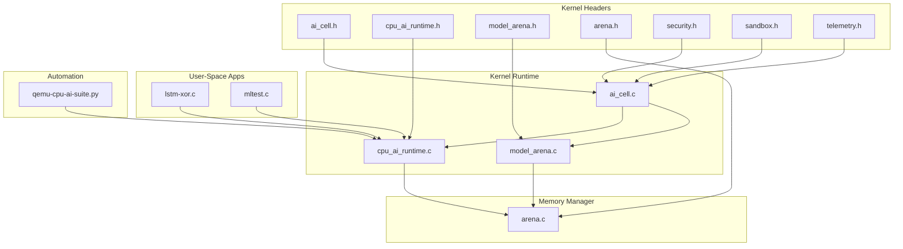
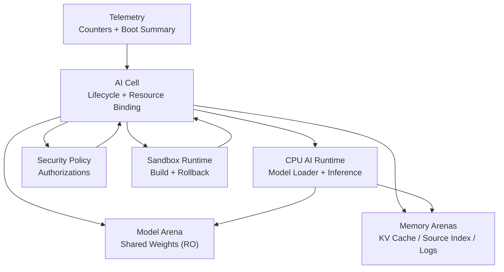
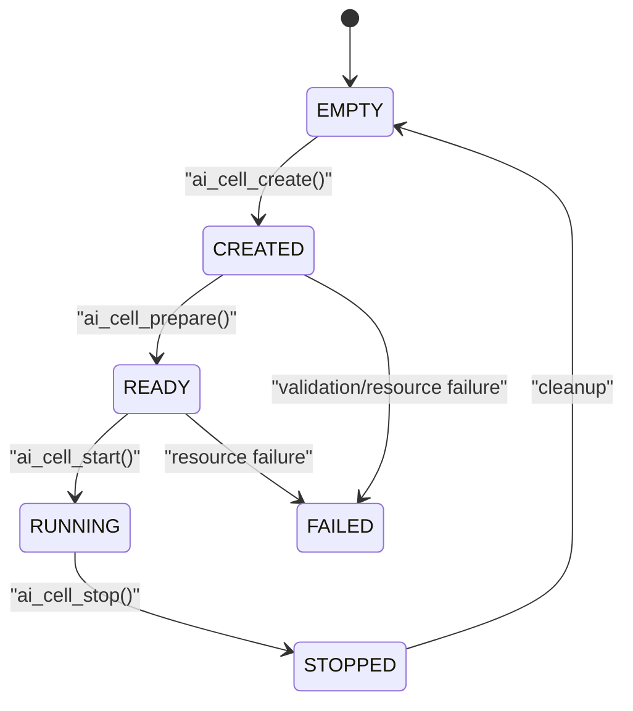
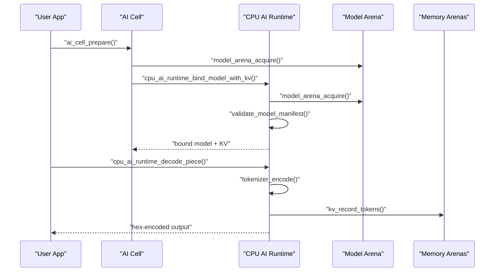
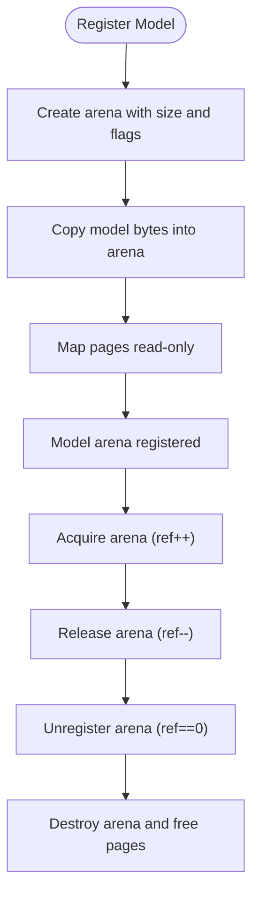
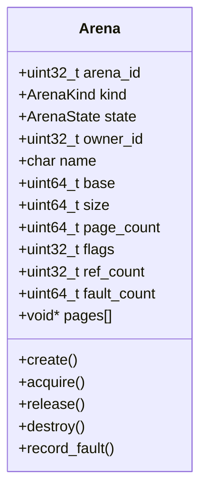
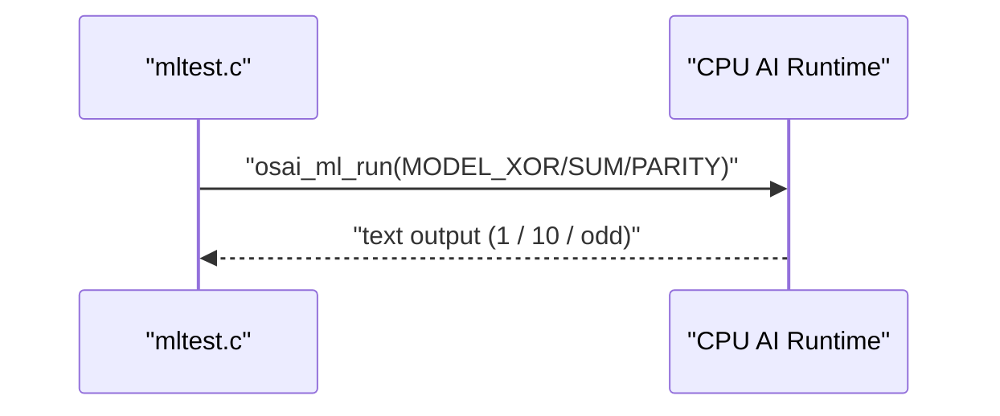
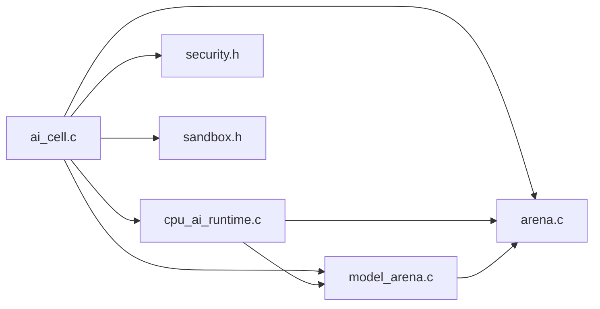

# AI Runtime Architecture

<cite>
**Referenced Files in This Document**
- [ai_cell.h](file://kernel/include/osai/ai_cell.h)
- [cpu_ai_runtime.h](file://kernel/include/osai/cpu_ai_runtime.h)
- [model_arena.h](file://kernel/include/osai/model_arena.h)
- [arena.h](file://kernel/include/osai/arena.h)
- [ai_cell.c](file://kernel/runtime/ai_cell.c)
- [cpu_ai_runtime.c](file://kernel/runtime/cpu_ai_runtime.c)
- [model_arena.c](file://kernel/runtime/model_arena.c)
- [arena.c](file://kernel/mm/arena.c)
- [security.h](file://kernel/include/osai/security.h)
- [sandbox.h](file://kernel/include/osai/sandbox.h)
- [telemetry.h](file://kernel/include/osai/telemetry.h)
- [lstm-xor.c](file://userspace/apps/lstm-xor.c)
- [mltest.c](file://userspace/apps/mltest.c)
- [qemu-cpu-ai-suite.py](file://scripts/qemu-cpu-ai-suite.py)
- [README.md](file://README.md)
</cite>

## Table of Contents
1. [Introduction](#introduction)
2. [Project Structure](#project-structure)
3. [Core Components](#core-components)
4. [Architecture Overview](#architecture-overview)
5. [Detailed Component Analysis](#detailed-component-analysis)
6. [Dependency Analysis](#dependency-analysis)
7. [Performance Considerations](#performance-considerations)
8. [Troubleshooting Guide](#troubleshooting-guide)
9. [Conclusion](#conclusion)
10. [Appendices](#appendices)

## Introduction
This document explains OSAI’s AI runtime architecture with a focus on CPU-only AI agent hosting, the CPU AI runtime engine for optimized inference execution, and model arena management for efficient model storage and loading. It documents the AI agent lifecycle, resource allocation strategies, performance optimization techniques, and practical examples for deployment and inference. It also covers integration with the file system, the security model for AI processes, monitoring and telemetry, workload scaling, debugging, and performance tuning.

## Project Structure
OSAI organizes AI runtime code primarily under kernel/include/osai and kernel/runtime, with memory management under kernel/mm and user-space example applications under userspace/apps. The runtime integrates model loading, CPU-only inference, and per-cell resource arenas.

**Diagram sources**
- [ai_cell.h:1-103](file://kernel/include/osai/ai_cell.h#L1-L103)
- [cpu_ai_runtime.h:1-51](file://kernel/include/osai/cpu_ai_runtime.h#L1-L51)
- [model_arena.h:1-28](file://kernel/include/osai/model_arena.h#L1-L28)
- [arena.h:1-57](file://kernel/include/osai/arena.h#L1-L57)
- [ai_cell.c:1-723](file://kernel/runtime/ai_cell.c#L1-L723)
- [cpu_ai_runtime.c:1-824](file://kernel/runtime/cpu_ai_runtime.c#L1-L824)
- [model_arena.c:1-141](file://kernel/runtime/model_arena.c#L1-L141)
- [arena.c:1-256](file://kernel/mm/arena.c#L1-L256)
- [lstm-xor.c:1-185](file://userspace/apps/lstm-xor.c#L1-L185)
- [mltest.c:1-61](file://userspace/apps/mltest.c#L1-L61)
- [qemu-cpu-ai-suite.py:1-94](file://scripts/qemu-cpu-ai-suite.py#L1-L94)

**Section sources**
- [README.md:1-86](file://README.md#L1-L86)

## Core Components
- AI Cell: Defines the CPU-only AI agent container with lifecycle states, resource bindings, and metrics. It validates descriptors, reserves per-cell arenas, binds NIC queues and workspaces, and transitions through created/ready/running/stopped.
- CPU AI Runtime: Loads and validates CPU-only model images, binds shared model weights into per-cell KV caches, performs deterministic decoding, and exposes generic ML kernels (XOR, SUM, PARITY).
- Model Arena: Registers read-only model weight arenas, supports shared access, and enforces read-only mapping for safety and performance.
- Memory Arenas: Manages virtual memory arenas with page mapping, prefaulting, and ref-counted access for model weights, KV cache, source index, build output, logs, and telemetry.

Key responsibilities:
- Resource admission and rejection policies
- Shared model weight binding and private KV cache per cell
- Deterministic CPU inference with minimal overhead
- Telemetry counters for monitoring and tuning

**Section sources**
- [ai_cell.h:24-101](file://kernel/include/osai/ai_cell.h#L24-L101)
- [cpu_ai_runtime.h:7-51](file://kernel/include/osai/cpu_ai_runtime.h#L7-L51)
- [model_arena.h:9-26](file://kernel/include/osai/model_arena.h#L9-L26)
- [arena.h:14-56](file://kernel/include/osai/arena.h#L14-L56)

## Architecture Overview
OSAI’s AI runtime architecture centers on the AI Cell orchestrating CPU-only inference via the CPU AI Runtime, backed by shared model arenas and per-cell memory arenas. Security and sandboxing policies govern access to resources and workspaces. Telemetry tracks runtime behavior and resource usage.

**Diagram sources**
- [ai_cell.c:350-508](file://kernel/runtime/ai_cell.c#L350-L508)
- [cpu_ai_runtime.c:334-475](file://kernel/runtime/cpu_ai_runtime.c#L334-L475)
- [model_arena.c:41-84](file://kernel/runtime/model_arena.c#L41-L84)
- [arena.c:102-155](file://kernel/mm/arena.c#L102-L155)
- [security.h:7-51](file://kernel/include/osai/security.h#L7-L51)
- [sandbox.h:16-40](file://kernel/include/osai/sandbox.h#L16-L40)
- [telemetry.h:4-6](file://kernel/include/osai/telemetry.h#L4-L6)

## Detailed Component Analysis

### AI Cell Design and Lifecycle
The AI Cell encapsulates CPU-only AI agents with strict resource contracts:
- Descriptor validation ensures required flags, checksum, and bounds.
- Resource admission reserves per-cell arenas (KV cache, source index, build output, logs) and binds NIC queue/workspace.
- Lifecycle transitions: EMPTY → CREATED → READY → RUNNING → STOPPED.
- Metrics track descriptor acceptance/rejection, resource admission/rejection, arena usage, and conflicts.

**Diagram sources**
- [ai_cell.c:423-508](file://kernel/runtime/ai_cell.c#L423-L508)
- [ai_cell.h:24-31](file://kernel/include/osai/ai_cell.h#L24-L31)

**Section sources**
- [ai_cell.h:33-76](file://kernel/include/osai/ai_cell.h#L33-L76)
- [ai_cell.c:389-508](file://kernel/runtime/ai_cell.c#L389-L508)

### CPU AI Runtime Engine
The CPU AI Runtime enforces CPU-only model admission, validates model manifests, and executes deterministic inference:
- Validates model image header, flags, quantization, tokenizer/runtime IDs, and payload hash.
- Registers model bytes into a read-only arena and binds to a cell with optional KV cache.
- Tokenizer encodes byte pieces into tokens; runtime decodes deterministically into hex-encoded output.
- Provides generic ML kernels for XOR, SUM, and PARITY.

**Diagram sources**
- [cpu_ai_runtime.c:389-522](file://kernel/runtime/cpu_ai_runtime.c#L389-L522)
- [model_arena.c:101-123](file://kernel/runtime/model_arena.c#L101-L123)
- [ai_cell.c:455-468](file://kernel/runtime/ai_cell.c#L455-L468)

**Section sources**
- [cpu_ai_runtime.h:13-48](file://kernel/include/osai/cpu_ai_runtime.h#L13-L48)
- [cpu_ai_runtime.c:143-198](file://kernel/runtime/cpu_ai_runtime.c#L143-L198)
- [cpu_ai_runtime.c:389-457](file://kernel/runtime/cpu_ai_runtime.c#L389-L457)

### Model Arena Management
Model arenas provide shared, read-only access to model weights:
- Registers model bytes into an arena and maps pages read-only for safety and performance.
- Ref-counted acquisition/release enables multiple cells to share the same weights.
- Unregister requires zero references.

**Diagram sources**
- [model_arena.c:54-99](file://kernel/runtime/model_arena.c#L54-L99)
- [arena.c:102-155](file://kernel/mm/arena.c#L102-L155)

**Section sources**
- [model_arena.h:9-26](file://kernel/include/osai/model_arena.h#L9-L26)
- [model_arena.c:54-123](file://kernel/runtime/model_arena.c#L54-L123)
- [arena.h:29-42](file://kernel/include/osai/arena.h#L29-L42)
- [arena.c:102-194](file://kernel/mm/arena.c#L102-L194)

### Memory Arenas and Resource Allocation
Memory arenas allocate virtual pages, map physical frames, and track usage:
- Prefaulting improves first-access latency.
- Flags control read-only, shared, user-visible, and pre-fault behavior.
- Fault recording and committed-page accounting enable monitoring.

**Diagram sources**
- [arena.h:29-56](file://kernel/include/osai/arena.h#L29-L56)
- [arena.c:102-202](file://kernel/mm/arena.c#L102-L202)

**Section sources**
- [arena.c:102-194](file://kernel/mm/arena.c#L102-L194)

### AI Agent Lifecycle Examples
Concrete examples demonstrate deployment and inference:
- LSTM XOR example uses CPU-only decode via the runtime and logs training and inference timing.
- Generic ML test validates XOR, SUM, and PARITY kernels.

**Diagram sources**
- [mltest.c:17-60](file://userspace/apps/mltest.c#L17-L60)
- [cpu_ai_runtime.c:557-606](file://kernel/runtime/cpu_ai_runtime.c#L557-L606)

**Section sources**
- [lstm-xor.c:104-184](file://userspace/apps/lstm-xor.c#L104-L184)
- [mltest.c:17-60](file://userspace/apps/mltest.c#L17-L60)

## Dependency Analysis
The AI runtime composes several subsystems with clear boundaries:
- AI Cell depends on CPU AI Runtime, Model Arena, Memory Arenas, Security, and Sandbox.
- CPU AI Runtime depends on Model Arena and Memory Arenas.
- Model Arena depends on Memory Arenas for backing storage.
- Security and Sandbox provide policy enforcement for workspaces and sandboxes.

**Diagram sources**
- [ai_cell.c:1-20](file://kernel/runtime/ai_cell.c#L1-L20)
- [cpu_ai_runtime.c:1-10](file://kernel/runtime/cpu_ai_runtime.c#L1-L10)
- [model_arena.c:1-10](file://kernel/runtime/model_arena.c#L1-L10)
- [arena.c:1-10](file://kernel/mm/arena.c#L1-L10)
- [security.h:7-51](file://kernel/include/osai/security.h#L7-L51)
- [sandbox.h:16-40](file://kernel/include/osai/sandbox.h#L16-L40)

**Section sources**
- [ai_cell.c:1-20](file://kernel/runtime/ai_cell.c#L1-L20)
- [cpu_ai_runtime.c:1-10](file://kernel/runtime/cpu_ai_runtime.c#L1-L10)
- [model_arena.c:1-10](file://kernel/runtime/model_arena.c#L1-L10)
- [arena.c:1-10](file://kernel/mm/arena.c#L1-L10)

## Performance Considerations
- CPU-only inference minimizes cross-core migration and avoids GPU overhead.
- Shared model weights reduce memory duplication; read-only mapping prevents accidental writes.
- Prefaulted arenas reduce first-access page faults during inference.
- Deterministic runtime simplifies predictability and repeatability.
- Telemetry counters guide tuning: model loads, shared weight binds, KV writes, runtime calls, admission rejections, checksum failures.

[No sources needed since this section provides general guidance]

## Troubleshooting Guide
Common issues and diagnostics:
- Admission rejections: Inspect model manifest validation, checksum mismatches, and GPU-required flags.
- Resource conflicts: NIC queue or workspace binding conflicts cause prepare failures.
- KV cache exhaustion: KV writes fail when capacity is exceeded.
- Telemetry counters: Use counters to quantify failures and throughput.

Operational checks:
- Self-tests validate descriptor validation, shared weights, private KV, and admission policies.
- Gate scripts verify expected log markers and telemetry thresholds.

**Section sources**
- [cpu_ai_runtime.c:143-198](file://kernel/runtime/cpu_ai_runtime.c#L143-L198)
- [cpu_ai_runtime.c:675-800](file://kernel/runtime/cpu_ai_runtime.c#L675-L800)
- [ai_cell.c:148-181](file://kernel/runtime/ai_cell.c#L148-L181)
- [ai_cell.c:699-722](file://kernel/runtime/ai_cell.c#L699-L722)
- [qemu-cpu-ai-suite.py:8-40](file://scripts/qemu-cpu-ai-suite.py#L8-L40)

## Conclusion
OSAI’s AI runtime architecture provides a CPU-only foundation for embedding AI agents with strong isolation, predictable performance, and efficient resource sharing. The AI Cell orchestrates lifecycle and resources; the CPU AI Runtime validates and executes models deterministically; Model and Memory Arenas manage shared weights and per-cell memory. Security and sandboxing enforce access controls, while telemetry and gates support monitoring and quality assurance.

[No sources needed since this section summarizes without analyzing specific files]

## Appendices

### Integration with File System and Model Loading
- Model files are loaded from the initramfs and validated before registration into model arenas.
- Read-only mapping ensures model integrity and performance.

**Section sources**
- [cpu_ai_runtime.c:357-381](file://kernel/runtime/cpu_ai_runtime.c#L357-L381)
- [model_arena.c:23-39](file://kernel/runtime/model_arena.c#L23-L39)

### Security Model for AI Processes
- Authorization APIs for capabilities, filesystem access, Git workspace, sandbox operations, updates, and admin actions.
- Denial counters track policy violations.

**Section sources**
- [security.h:7-51](file://kernel/include/osai/security.h#L7-L51)

### Monitoring and Telemetry
- Telemetry emits boot summaries and runtime counters for model loads, KV writes, runtime calls, and admission decisions.
- Gates parse logs and counters to validate runtime behavior.

**Section sources**
- [telemetry.h:4-6](file://kernel/include/osai/telemetry.h#L4-L6)
- [qemu-cpu-ai-suite.py:56-89](file://scripts/qemu-cpu-ai-suite.py#L56-L89)