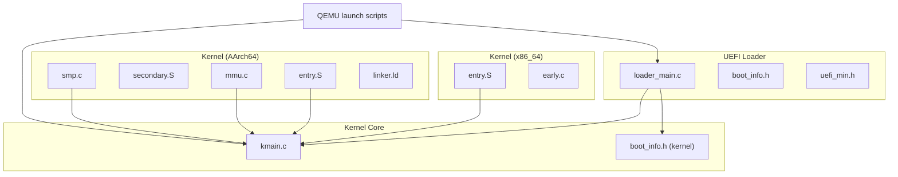
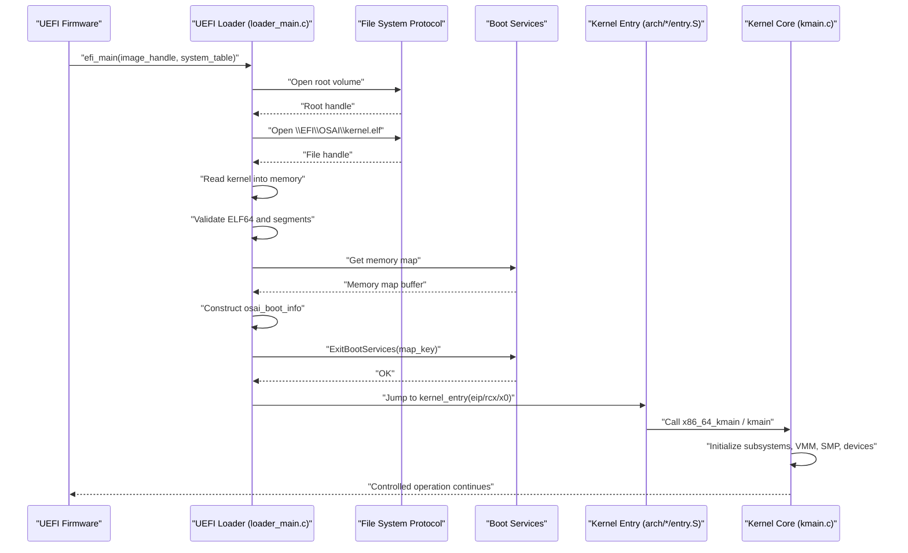
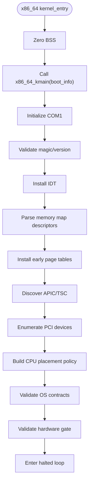
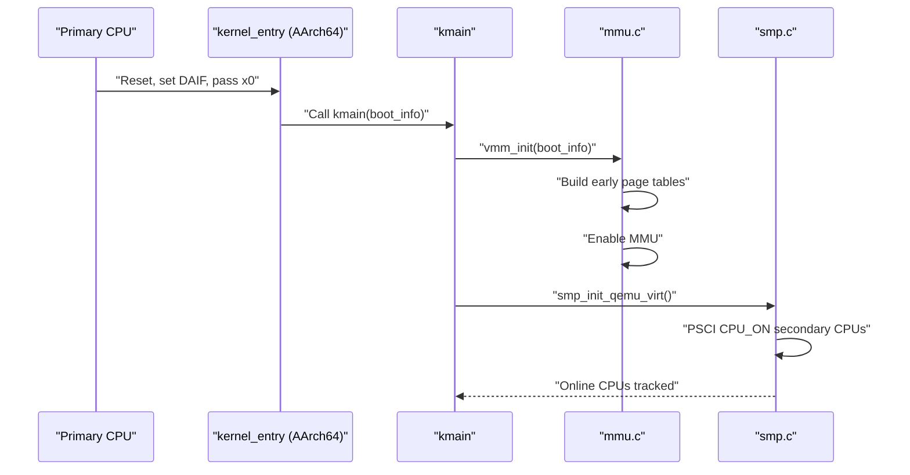
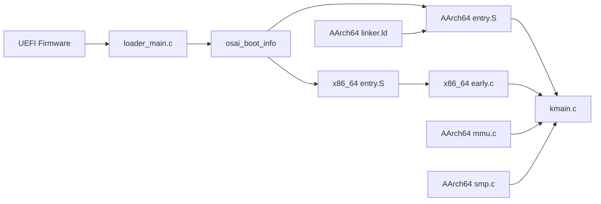

# Boot Process

<cite>
**Referenced Files in This Document**
- [loader_main.c](file://boot/uefi/loader_main.c)
- [boot_info.h](file://boot/uefi/boot_info.h)
- [uefi_min.h](file://boot/uefi/include/uefi_min.h)
- [entry.S (x86_64)](file://kernel/arch/x86_64/entry.S)
- [early.c (x86_64)](file://kernel/arch/x86_64/early.c)
- [entry.S (AArch64)](file://kernel/arch/aarch64/entry.S)
- [secondary.S (AArch64)](file://kernel/arch/aarch64/secondary.S)
- [mmu.c (AArch64)](file://kernel/arch/aarch64/mmu.c)
- [smp.c (AArch64)](file://kernel/arch/aarch64/smp.c)
- [linker.ld (AArch64)](file://kernel/arch/aarch64/linker.ld)
- [boot_info.h (kernel)](file://kernel/include/osai/boot_info.h)
- [kmain.c (kernel)](file://kernel/core/kmain.c)
- [run-qemu-x86_64.sh](file://scripts/run-qemu-x86_64.sh)
- [run-qemu-aarch64.sh](file://scripts/run-qemu-aarch64.sh)
</cite>

## Table of Contents
1. [Introduction](#introduction)
2. [Project Structure](#project-structure)
3. [Core Components](#core-components)
4. [Architecture Overview](#architecture-overview)
5. [Detailed Component Analysis](#detailed-component-analysis)
6. [Dependency Analysis](#dependency-analysis)
7. [Performance Considerations](#performance-considerations)
8. [Troubleshooting Guide](#troubleshooting-guide)
9. [Conclusion](#conclusion)
10. [Appendices](#appendices)

## Introduction
This document explains OSAI’s boot process architecture with a focus on the UEFI-based boot loader, memory map setup, and kernel entry point initialization sequence. It covers multi-architecture support for x86_64 and AArch64, detailing:
- UEFI loader responsibilities: locating and validating the kernel, copying segments, collecting firmware memory maps, and invoking the kernel entry point.
- Early kernel initialization paths: x86_64 (interrupts, paging, PCI, CPU placement, contracts) and AArch64 (MMU enablement, SMP bring-up, VMM mapping).
- Transition from firmware to kernel space: boot info validation, memory layout establishment, and early system setup.
- Practical examples of boot parameter handling, memory mapping, and platform-specific differences.
- Common boot-time issues, debugging techniques, and performance considerations during the critical boot phase.

## Project Structure
OSAI organizes boot-related code across two primary areas:
- UEFI loader under boot/uefi/, responsible for ELF parsing, segment loading, memory map collection, and passing a structured boot info to the kernel.
- Architecture-specific kernel entry and early initialization under kernel/arch/<arch>/, including assembly entry points, early C routines, and platform-specific subsystems.

**Diagram sources**
- [loader_main.c:1-348](file://boot/uefi/loader_main.c#L1-L348)
- [boot_info.h:1-7](file://boot/uefi/boot_info.h#L1-L7)
- [uefi_min.h:1-150](file://boot/uefi/include/uefi_min.h#L1-L150)
- [entry.S (x86_64):1-100](file://kernel/arch/x86_64/entry.S#L1-L100)
- [early.c (x86_64):1-726](file://kernel/arch/x86_64/early.c#L1-L726)
- [entry.S (AArch64):1-59](file://kernel/arch/aarch64/entry.S#L1-L59)
- [secondary.S (AArch64):1-16](file://kernel/arch/aarch64/secondary.S#L1-L16)
- [mmu.c (AArch64):1-452](file://kernel/arch/aarch64/mmu.c#L1-L452)
- [smp.c (AArch64):1-285](file://kernel/arch/aarch64/smp.c#L1-L285)
- [linker.ld (AArch64):1-50](file://kernel/arch/aarch64/linker.ld#L1-L50)
- [boot_info.h (kernel):1-34](file://kernel/include/osai/boot_info.h#L1-L34)
- [kmain.c (kernel):1-223](file://kernel/core/kmain.c#L1-L223)

**Section sources**
- [loader_main.c:1-348](file://boot/uefi/loader_main.c#L1-L348)
- [boot_info.h:1-7](file://boot/uefi/boot_info.h#L1-L7)
- [uefi_min.h:1-150](file://boot/uefi/include/uefi_min.h#L1-L150)
- [entry.S (x86_64):1-100](file://kernel/arch/x86_64/entry.S#L1-L100)
- [early.c (x86_64):1-726](file://kernel/arch/x86_64/early.c#L1-L726)
- [entry.S (AArch64):1-59](file://kernel/arch/aarch64/entry.S#L1-L59)
- [secondary.S (AArch64):1-16](file://kernel/arch/aarch64/secondary.S#L1-L16)
- [mmu.c (AArch64):1-452](file://kernel/arch/aarch64/mmu.c#L1-L452)
- [smp.c (AArch64):1-285](file://kernel/arch/aarch64/smp.c#L1-L285)
- [linker.ld (AArch64):1-50](file://kernel/arch/aarch64/linker.ld#L1-L50)
- [boot_info.h (kernel):1-34](file://kernel/include/osai/boot_info.h#L1-L34)
- [kmain.c (kernel):1-223](file://kernel/core/kmain.c#L1-L223)

## Core Components
- UEFI Loader: Reads kernel.elf, validates ELF64, loads segments into memory, collects firmware memory map, constructs osai_boot_info, exits boot services, and jumps to kernel entry.
- Boot Info: A portable structure shared between firmware and kernel, carrying memory map metadata, kernel physical bounds, and platform UART base.
- x86_64 Early Path: Initializes IDT, parses memory map, installs early paging, discovers APIC/TSC, enumerates PCI, builds placement policy, validates contracts, and gates milestones.
- AArch64 Early Path: Builds early page tables, enables MMU, initializes SMP via PSCI, and prepares VMM mappings for MMIO and kernel regions.
- Kernel Core: Validates boot info, initializes exception/timer/SMP/VMM, maps MMIO, runs self-tests, and starts user-space services.

**Section sources**
- [loader_main.c:1-348](file://boot/uefi/loader_main.c#L1-L348)
- [boot_info.h (kernel):1-34](file://kernel/include/osai/boot_info.h#L1-L34)
- [early.c (x86_64):673-726](file://kernel/arch/x86_64/early.c#L673-L726)
- [mmu.c (AArch64):258-339](file://kernel/arch/aarch64/mmu.c#L258-L339)
- [kmain.c (kernel):60-146](file://kernel/core/kmain.c#L60-L146)

## Architecture Overview
The boot process follows a consistent flow across architectures, with platform-specific entry points and initialization routines.

**Diagram sources**
- [loader_main.c:273-347](file://boot/uefi/loader_main.c#L273-L347)
- [uefi_min.h:44-147](file://boot/uefi/include/uefi_min.h#L44-L147)
- [entry.S (x86_64):5-15](file://kernel/arch/x86_64/entry.S#L5-L15)
- [entry.S (AArch64):9-22](file://kernel/arch/aarch64/entry.S#L9-L22)
- [kmain.c (kernel):60-146](file://kernel/core/kmain.c#L60-L146)

## Detailed Component Analysis

### UEFI Loader (loader_main.c)
Responsibilities:
- Open root volume and locate kernel.elf.
- Allocate memory and read kernel into EFI_LOADER_DATA pages.
- Validate ELF64: magic, class/data, type/exec, machine, program headers.
- Load segments into physical memory with EFI_ALLOCATE_ADDRESS, zeroing and copying file data.
- Collect memory map via Boot Services, allocate pool for map, and pass map key.
- Construct osai_boot_info with magic/version, memory map pointers, kernel bounds, and UART base.
- Exit boot services and jump to kernel entry point.

Key validations and flows:
- ELF validation checks include e_phoff/e_phnum/e_phentsize and segment offsets within kernel size.
- Segment loading allocates contiguous physical blocks aligned to page boundaries and copies file content.
- Memory map collection uses a retry pattern with EFI_BUFFER_TOO_SMALL to allocate sufficient buffer.

Practical examples:
- Platform UART base selection is defined per target (x86_64 vs AArch64).
- Kernel entry is invoked with a pointer to osai_boot_info.

**Section sources**
- [loader_main.c:13-24](file://boot/uefi/loader_main.c#L13-L24)
- [loader_main.c:161-190](file://boot/uefi/loader_main.c#L161-L190)
- [loader_main.c:192-245](file://boot/uefi/loader_main.c#L192-L245)
- [loader_main.c:247-271](file://boot/uefi/loader_main.c#L247-L271)
- [loader_main.c:273-347](file://boot/uefi/loader_main.c#L273-L347)

### Boot Info Structure (osai_boot_info)
The boot info structure carries:
- Magic/version for validation.
- Memory map pointer/size/descriptor size/version.
- Kernel physical base/end.
- UART base for early logging.

Platform wrapper:
- boot/uefi/boot_info.h includes the kernel-side definition for consistent usage across loader and kernel.

Validation in kernel:
- x86_64 early path validates magic/version and logs memory descriptors and kernel range.
- AArch64 early path reads UART base to keep early serial stable during MMU enablement.
- Kernel core validates magic/version and logs boot parameters.

**Section sources**
- [boot_info.h (kernel):1-34](file://kernel/include/osai/boot_info.h#L1-L34)
- [boot_info.h:1-7](file://boot/uefi/boot_info.h#L1-L7)
- [early.c (x86_64):681-687](file://kernel/arch/x86_64/early.c#L681-L687)
- [mmu.c (AArch64):275-278](file://kernel/arch/aarch64/mmu.c#L275-L278)
- [kmain.c (kernel):60-70](file://kernel/core/kmain.c#L60-L70)

### x86_64 Boot Flow
Assembly entry:
- Clears BSS, passes boot info to x86_64_kmain.

Early initialization (x86_64):
- Serial initialization and logging via COM1.
- IDT installation for 32 exception vectors.
- Memory map parsing to compute usable pages and largest region.
- Identity mapping and large-page table setup for early paging.
- APIC/TSC discovery and reporting.
- PCI enumeration and classification (bridges, virtio, network, NVMe).
- Placement policy for housekeeping/AI/background cores.
- OS contract validation and hardware gate checks.
- Halting loop after milestones.

**Diagram sources**
- [entry.S (x86_64):5-19](file://kernel/arch/x86_64/entry.S#L5-L19)
- [early.c (x86_64):673-726](file://kernel/arch/x86_64/early.c#L673-L726)

**Section sources**
- [entry.S (x86_64):1-100](file://kernel/arch/x86_64/entry.S#L1-L100)
- [early.c (x86_64):239-290](file://kernel/arch/x86_64/early.c#L239-L290)
- [early.c (x86_64):326-354](file://kernel/arch/x86_64/early.c#L326-L354)
- [early.c (x86_64):356-396](file://kernel/arch/x86_64/early.c#L356-L396)
- [early.c (x86_64):398-432](file://kernel/arch/x86_64/early.c#L398-L432)
- [early.c (x86_64):434-469](file://kernel/arch/x86_64/early.c#L434-L469)
- [early.c (x86_64):480-538](file://kernel/arch/x86_64/early.c#L480-L538)
- [early.c (x86_64):540-598](file://kernel/arch/x86_64/early.c#L540-L598)
- [early.c (x86_64):600-633](file://kernel/arch/x86_64/early.c#L600-L633)
- [early.c (x86_64):635-654](file://kernel/arch/x86_64/early.c#L635-L654)
- [early.c (x86_64):673-726](file://kernel/arch/x86_64/early.c#L673-L726)

### AArch64 Boot Flow
Assembly entry:
- Clears BSS, saves argument, sets DAIF mask, and calls kmain.
- Provides user entry/return helpers for user-mode transitions.

Secondary entry:
- Per-CPU stack setup and WFE loop; invoked via PSCI on secondary CPUs.

MMU initialization:
- Builds early L0/L1/L2/L3 tables, identity maps up to 4GiB, keeps UART region mapped for early serial stability, maps kernel pages, and enables MMU.

SMP initialization:
- Uses PSCI CPU_ON to start secondary cores, waits for online CPUs, and logs states.

**Diagram sources**
- [entry.S (AArch64):9-25](file://kernel/arch/aarch64/entry.S#L9-L25)
- [secondary.S (AArch64):5-15](file://kernel/arch/aarch64/secondary.S#L5-L15)
- [mmu.c (AArch64):258-339](file://kernel/arch/aarch64/mmu.c#L258-L339)
- [smp.c (AArch64):61-104](file://kernel/arch/aarch64/smp.c#L61-L104)

**Section sources**
- [entry.S (AArch64):1-59](file://kernel/arch/aarch64/entry.S#L1-L59)
- [secondary.S (AArch64):1-16](file://kernel/arch/aarch64/secondary.S#L1-L16)
- [mmu.c (AArch64):1-452](file://kernel/arch/aarch64/mmu.c#L1-L452)
- [smp.c (AArch64):1-285](file://kernel/arch/aarch64/smp.c#L1-L285)

### Kernel Core Initialization (kmain.c)
- Initializes logging with boot info, validates magic/version, logs memory map and kernel bounds.
- Initializes exceptions, timers, and SMP.
- Initializes PMM and VMM, performs VMM self-tests, maps MMIO regions for UART and known devices.
- Runs extensive self-tests for VMM, GIC, VirtIO, persistence, mutable FS, updates, networking, initramfs, syscalls, user processes, services, AI runtime, telemetry.
- Starts user-space init, service manager, and worker processes.
- Enters idle loop awaiting interrupts.

**Section sources**
- [kmain.c (kernel):60-146](file://kernel/core/kmain.c#L60-L146)
- [kmain.c (kernel):147-223](file://kernel/core/kmain.c#L147-L223)

## Dependency Analysis
- Loader depends on UEFI minimal headers for protocol handles and Boot Services.
- Loader constructs osai_boot_info and passes it to kernel entry.
- x86_64 entry calls x86_64_kmain; AArch64 entry calls kmain.
- AArch64 relies on linker script to place entry and secondary sections at predictable addresses.
- Kernel core depends on VMM/MMU, SMP, and device drivers initialized via boot info.

**Diagram sources**
- [loader_main.c:273-347](file://boot/uefi/loader_main.c#L273-L347)
- [uefi_min.h:44-147](file://boot/uefi/include/uefi_min.h#L44-L147)
- [boot_info.h (kernel):1-34](file://kernel/include/osai/boot_info.h#L1-L34)
- [entry.S (x86_64):1-100](file://kernel/arch/x86_64/entry.S#L1-L100)
- [entry.S (AArch64):1-59](file://kernel/arch/aarch64/entry.S#L1-L59)
- [linker.ld (AArch64):1-50](file://kernel/arch/aarch64/linker.ld#L1-L50)
- [mmu.c (AArch64):258-339](file://kernel/arch/aarch64/mmu.c#L258-L339)
- [smp.c (AArch64):61-104](file://kernel/arch/aarch64/smp.c#L61-L104)
- [kmain.c (kernel):60-146](file://kernel/core/kmain.c#L60-L146)

**Section sources**
- [loader_main.c:1-348](file://boot/uefi/loader_main.c#L1-L348)
- [uefi_min.h:1-150](file://boot/uefi/include/uefi_min.h#L1-L150)
- [boot_info.h (kernel):1-34](file://kernel/include/osai/boot_info.h#L1-L34)
- [entry.S (x86_64):1-100](file://kernel/arch/x86_64/entry.S#L1-L100)
- [entry.S (AArch64):1-59](file://kernel/arch/aarch64/entry.S#L1-L59)
- [linker.ld (AArch64):1-50](file://kernel/arch/aarch64/linker.ld#L1-L50)
- [mmu.c (AArch64):1-452](file://kernel/arch/aarch64/mmu.c#L1-L452)
- [smp.c (AArch64):1-285](file://kernel/arch/aarch64/smp.c#L1-L285)
- [kmain.c (kernel):1-223](file://kernel/core/kmain.c#L1-L223)

## Performance Considerations
- Early paging on x86_64 uses large pages to reduce TLB pressure and accelerate boot; ensure identity limit and NX bits are configured appropriately.
- AArch64 MMU enablement uses staged table building and immediate invalidation to minimize latency; keep UART region mapped during enablement to preserve early diagnostics.
- Boot services exit should occur after collecting the memory map; avoid unnecessary allocations post-exit.
- Segment loading uses page-aligned allocation; ensure alignment and copy sizes match ELF program headers to prevent extra work.
- Logging via COM1/UART should be kept minimal during early boot to reduce overhead.

[No sources needed since this section provides general guidance]

## Troubleshooting Guide
Common boot-time issues and remedies:
- ELF validation failures: Verify kernel.elf is ELF64 Exec for the correct machine type; confirm e_phoff/e_phnum/e_phentsize and segment offsets fit within file size.
- Segment load errors: Ensure EFI_ALLOCATE_ADDRESS succeeds and allocated ranges cover all PT_LOAD segments; check file size read matches expected kernel size.
- Memory map retrieval: Handle EFI_BUFFER_TOO_SMALL by allocating larger buffers; ensure map_key is preserved across get_memory_map calls.
- Boot info mismatch: On x86_64, verify magic/version; on AArch64, confirm UART base is valid and MMIO region remains mapped during early serial.
- Exception vectors and paging: On x86_64, confirm IDT installation and page tables are loaded; verify EFER.NXE and CR3 settings.
- SMP bring-up: On AArch64, ensure PSCI CPU_ON returns success and secondary stacks are correctly addressed; monitor online CPU counts.
- Device detection: On x86_64, PCI enumeration should find network/NVMe/VirtIO devices; on AArch64, ensure VirtIO devices are present in the VM configuration.

Debugging techniques:
- Use serial output to COM1/UART for early diagnostics; on AArch64, keep UART region identity-mapped during MMU enablement.
- Enable self-tests in kernel core to validate VMM, GIC, VirtIO, and user process lifecycles.
- Validate memory map descriptors and kernel bounds; log descriptor counts and sizes.
- Use QEMU scripts to launch with appropriate firmware and hardware configurations.

**Section sources**
- [loader_main.c:161-190](file://boot/uefi/loader_main.c#L161-L190)
- [loader_main.c:247-271](file://boot/uefi/loader_main.c#L247-L271)
- [early.c (x86_64):656-671](file://kernel/arch/x86_64/early.c#L656-L671)
- [mmu.c (AArch64):275-278](file://kernel/arch/aarch64/mmu.c#L275-L278)
- [kmain.c (kernel):60-146](file://kernel/core/kmain.c#L60-L146)

## Conclusion
OSAI’s boot process cleanly separates firmware responsibilities (UEFI loader) from kernel initialization (arch-specific entry and early routines). The loader validates and loads the kernel, collects firmware memory maps, and passes a standardized boot info. The kernel validates this info, initializes subsystems, and transitions into controlled operation. Multi-architecture support is achieved through distinct entry points and initialization paths tailored to x86_64 and AArch64, with robust validation and diagnostic hooks to aid boot-time troubleshooting.

[No sources needed since this section summarizes without analyzing specific files]

## Appendices

### Practical Examples Index
- Boot parameter handling: osai_boot_info fields (magic, version, memory map, kernel bounds, UART base).
- Memory mapping:
  - x86_64: identity mapping and large-page tables, EFER.NXE, CR3 update.
  - AArch64: L0/L1/L2/L3 tables, identity mapping up to 4GiB, MMIO mapping around UART.
- Platform-specific differences:
  - x86_64: COM1 serial, IDT, APIC/TSC, PCI enumeration, CPU placement policy.
  - AArch64: PSCI SMP, MMU enablement, user entry/return helpers.

**Section sources**
- [boot_info.h (kernel):1-34](file://kernel/include/osai/boot_info.h#L1-L34)
- [early.c (x86_64):398-432](file://kernel/arch/x86_64/early.c#L398-L432)
- [mmu.c (AArch64):258-339](file://kernel/arch/aarch64/mmu.c#L258-L339)
- [smp.c (AArch64):61-104](file://kernel/arch/aarch64/smp.c#L61-L104)

### QEMU Launch References
- x86_64: firmware selection, drive configuration, networking, and serial output.
- AArch64: firmware selection, machine acceleration, VirtIO block/net devices, and serial output.

**Section sources**
- [run-qemu-x86_64.sh:109-119](file://scripts/run-qemu-x86_64.sh#L109-L119)
- [run-qemu-aarch64.sh:132-154](file://scripts/run-qemu-aarch64.sh#L132-L154)