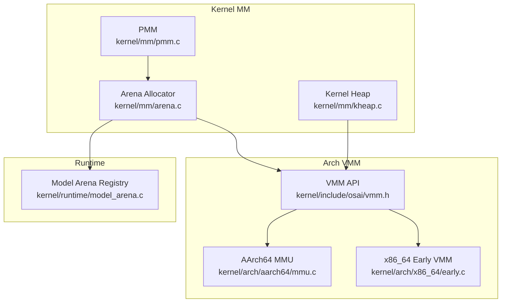
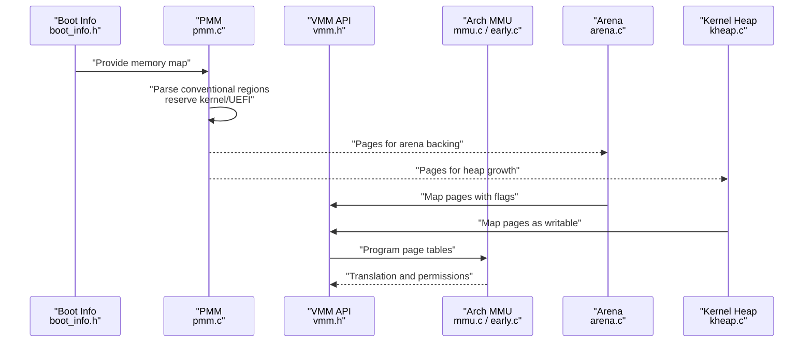
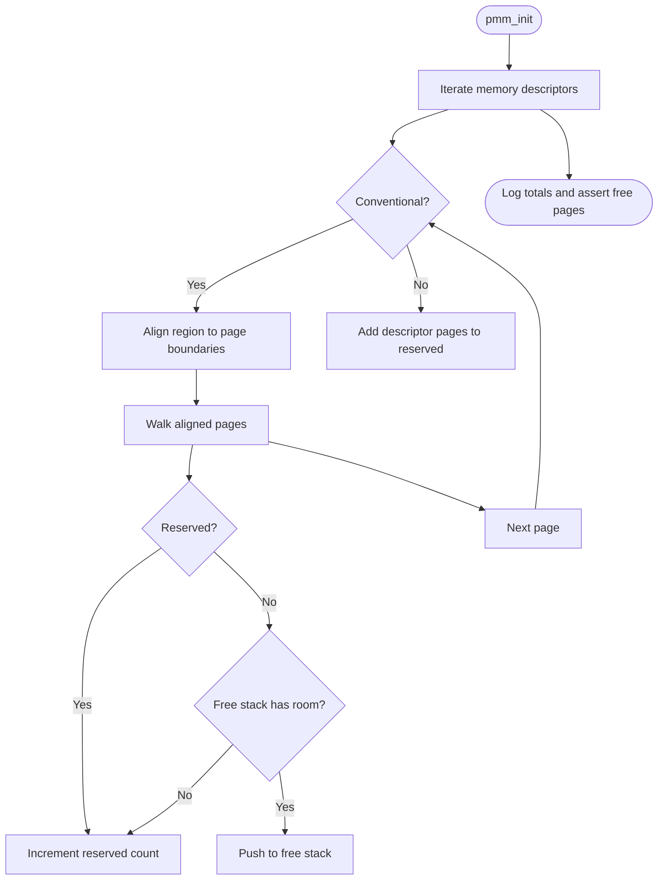
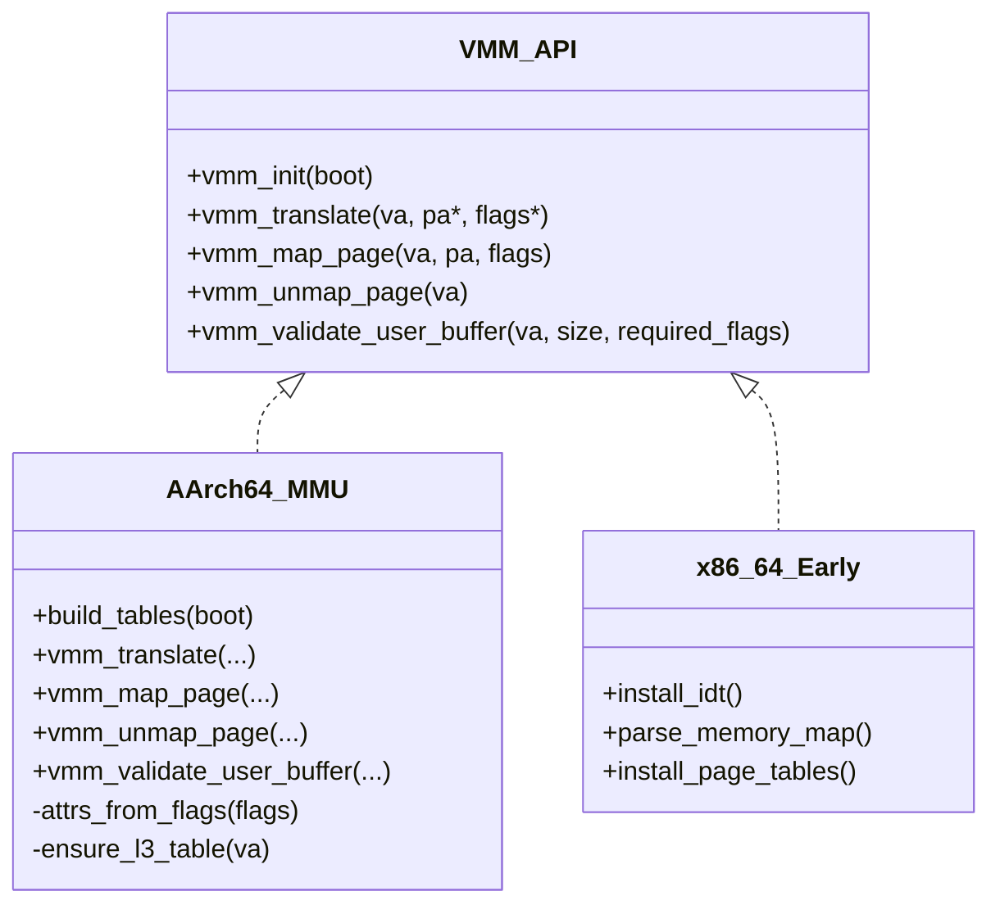
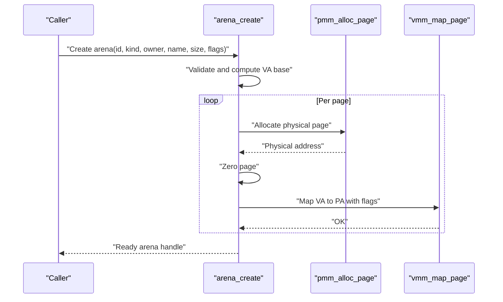
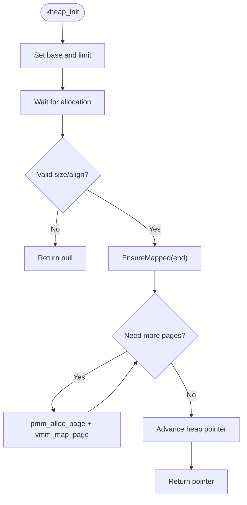
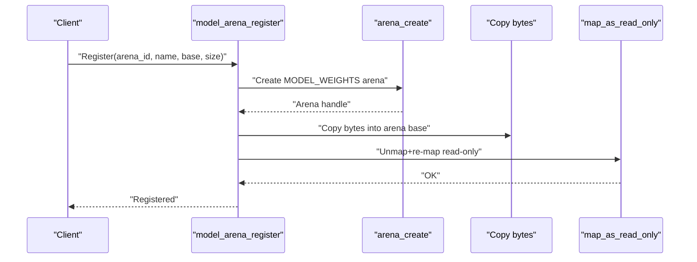
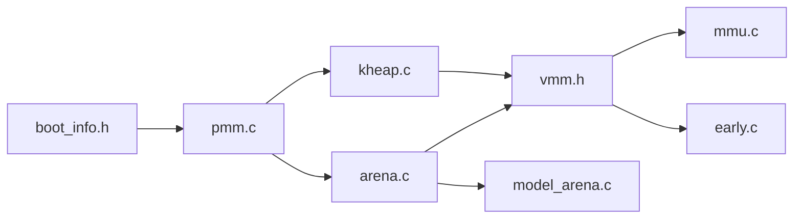

# Memory Management Architecture

<cite>
**Referenced Files in This Document**
- [pmm.c](file://kernel/mm/pmm.c)
- [pmm.h](file://kernel/include/osai/pmm.h)
- [arena.c](file://kernel/mm/arena.c)
- [arena.h](file://kernel/include/osai/arena.h)
- [kheap.c](file://kernel/mm/kheap.c)
- [kheap.h](file://kernel/include/osai/kheap.h)
- [vmm.h](file://kernel/include/osai/vmm.h)
- [mmu.c](file://kernel/arch/aarch64/mmu.c)
- [boot_info.h](file://kernel/include/osai/boot_info.h)
- [early.c](file://kernel/arch/x86_64/early.c)
- [model_arena.c](file://kernel/runtime/model_arena.c)
- [model_arena.h](file://kernel/include/osai/model_arena.h)
</cite>

## Table of Contents
1. [Introduction](#introduction)
2. [Project Structure](#project-structure)
3. [Core Components](#core-components)
4. [Architecture Overview](#architecture-overview)
5. [Detailed Component Analysis](#detailed-component-analysis)
6. [Dependency Analysis](#dependency-analysis)
7. [Performance Considerations](#performance-considerations)
8. [Troubleshooting Guide](#troubleshooting-guide)
9. [Security Implications](#security-implications)
10. [Conclusion](#conclusion)

## Introduction
This document explains OSAI’s memory management architecture with a focus on the dual-layer design:
- Physical Memory Management (PMM): Boot-time discovery and page allocation from the platform memory map.
- Virtual Memory Management (VMM): Page table management, permission encoding, and user/kernel isolation.

It documents the arena-based allocator design, kernel heap implementation, memory protection mechanisms, and the relationship between physical and virtual addressing. It also covers page table management, MMIO range handling, fragmentation prevention, performance optimizations, debugging strategies, and security implications.

## Project Structure
OSAI organizes memory management across three layers:
- Kernel MM (PMM and allocators)
- Architecture-specific VMM (AArch64 and x86_64)
- Runtime integrations (model arenas)

**Diagram sources**
- [pmm.c:1-101](file://kernel/mm/pmm.c#L1-L101)
- [arena.c:1-256](file://kernel/mm/arena.c#L1-L256)
- [kheap.c:1-114](file://kernel/mm/kheap.c#L1-L114)
- [vmm.h:1-29](file://kernel/include/osai/vmm.h#L1-L29)
- [mmu.c:1-452](file://kernel/arch/aarch64/mmu.c#L1-L452)
- [early.c:1-726](file://kernel/arch/x86_64/early.c#L1-L726)
- [model_arena.c:1-141](file://kernel/runtime/model_arena.c#L1-L141)

**Section sources**
- [pmm.c:1-101](file://kernel/mm/pmm.c#L1-L101)
- [arena.c:1-256](file://kernel/mm/arena.c#L1-L256)
- [kheap.c:1-114](file://kernel/mm/kheap.c#L1-L114)
- [vmm.h:1-29](file://kernel/include/osai/vmm.h#L1-L29)
- [mmu.c:1-452](file://kernel/arch/aarch64/mmu.c#L1-L452)
- [early.c:1-726](file://kernel/arch/x86_64/early.c#L1-L726)
- [model_arena.c:1-141](file://kernel/runtime/model_arena.c#L1-L141)

## Core Components
- PMM: Boot-time initialization parses the UEFI memory map, identifies conventional memory regions, and builds a free-page stack for immediate allocation. It reserves kernel and firmware areas and tracks totals and free counts.
- Arena Allocator: Provides named, typed arenas with per-arena flags (read-only, shared, pre-fault, user-visible). Each arena maps a contiguous set of pages with VMM and zeros backing pages before mapping.
- Kernel Heap: A simple bump allocator backed by VMM mappings, growing on demand and tracking allocated pages and bytes.
- VMM: Exposes translation, mapping, unmapping, and user buffer validation. Architecture-specific implementations manage page tables and permission attributes.
- Model Arena Registry: Registers read-only model weights into arenas and remaps them read-only after initial copy.

**Section sources**
- [pmm.c:41-77](file://kernel/mm/pmm.c#L41-L77)
- [arena.c:102-155](file://kernel/mm/arena.c#L102-L155)
- [kheap.c:21-66](file://kernel/mm/kheap.c#L21-L66)
- [vmm.h:18-26](file://kernel/include/osai/vmm.h#L18-L26)
- [model_arena.c:54-84](file://kernel/runtime/model_arena.c#L54-L84)

## Architecture Overview
OSAI implements a dual-layer memory management system:
- PMM discovers and exposes raw physical pages.
- VMM translates virtual addresses to physical addresses and enforces permissions.
- Allocators (arena and kernel heap) allocate and commit pages via VMM.

**Diagram sources**
- [boot_info.h:20-31](file://kernel/include/osai/boot_info.h#L20-L31)
- [pmm.c:41-77](file://kernel/mm/pmm.c#L41-L77)
- [vmm.h:18-26](file://kernel/include/osai/vmm.h#L18-L26)
- [mmu.c:335-339](file://kernel/arch/aarch64/mmu.c#L335-L339)
- [early.c:398-432](file://kernel/arch/x86_64/early.c#L398-L432)
- [arena.c:128-144](file://kernel/mm/arena.c#L128-L144)
- [kheap.c:29-46](file://kernel/mm/kheap.c#L29-L46)

## Detailed Component Analysis

### Physical Memory Management (PMM)
- Initialization scans the UEFI memory map, counts total and free pages, and reserves kernel and firmware regions.
- Allocation and deallocation operate on a fixed-size free-stack with bounds checks.
- Overlap detection avoids mapping reserved regions.

**Diagram sources**
- [pmm.c:41-77](file://kernel/mm/pmm.c#L41-L77)

**Section sources**
- [pmm.c:41-77](file://kernel/mm/pmm.c#L41-L77)
- [pmm.h:7-11](file://kernel/include/osai/pmm.h#L7-L11)
- [boot_info.h:9-18](file://kernel/include/osai/boot_info.h#L9-L18)

### Virtual Memory Management (VMM) and Page Tables
- VMM API defines permission flags and user space bounds.
- AArch64 implementation:
  - Builds early identity and kernel mappings, preserves MMIO region, and programs MAIR/TCR/TTBR0.
  - Translates virtual to physical, maps/unmaps pages, validates user buffers, and sets attributes (PXN/UXN, RO/AP_EL0).
- x86_64 early path:
  - Installs IDT, parses memory map, installs large-page identity mappings, enables NX via EFER.NXE, and loads CR3.

**Diagram sources**
- [vmm.h:18-26](file://kernel/include/osai/vmm.h#L18-L26)
- [mmu.c:335-431](file://kernel/arch/aarch64/mmu.c#L335-L431)
- [early.c:326-432](file://kernel/arch/x86_64/early.c#L326-L432)

**Section sources**
- [vmm.h:8-26](file://kernel/include/osai/vmm.h#L8-L26)
- [mmu.c:187-206](file://kernel/arch/aarch64/mmu.c#L187-L206)
- [mmu.c:341-431](file://kernel/arch/aarch64/mmu.c#L341-L431)
- [early.c:398-432](file://kernel/arch/x86_64/early.c#L398-L432)

### Arena-Based Allocator Design
- Manages a bounded set of arenas with distinct kinds (model weights, KV cache, logs, telemetry).
- Each arena:
  - Reserves a virtual address range with stride-based layout.
  - Allocates physical pages via PMM, zeros them, and maps them through VMM with flags derived from arena flags.
  - Tracks committed pages and active arenas.
  - Supports acquire/release semantics and fault counters.

**Diagram sources**
- [arena.c:102-155](file://kernel/mm/arena.c#L102-L155)
- [arena.c:128-144](file://kernel/mm/arena.c#L128-L144)
- [pmm.c:79-84](file://kernel/mm/pmm.c#L79-L84)
- [vmm.h:19-23](file://kernel/include/osai/vmm.h#L19-L23)

**Section sources**
- [arena.c:45-63](file://kernel/mm/arena.c#L45-L63)
- [arena.c:102-155](file://kernel/mm/arena.c#L102-L155)
- [arena.h:29-42](file://kernel/include/osai/arena.h#L29-L42)
- [arena.c:34-43](file://kernel/mm/arena.c#L34-L43)

### Kernel Heap Implementation
- A simple bump allocator within a dedicated virtual region.
- Grows by allocating and mapping new pages on demand, ensuring alignment and bounds.
- Tracks total pages and bytes allocated.

**Diagram sources**
- [kheap.c:21-46](file://kernel/mm/kheap.c#L21-L46)
- [kheap.c:48-66](file://kernel/mm/kheap.c#L48-L66)

**Section sources**
- [kheap.c:21-66](file://kernel/mm/kheap.c#L21-L66)
- [kheap.h:6-11](file://kernel/include/osai/kheap.h#L6-L11)

### Model Arena Registry and Read-Only Promotion
- Registers pre-populated model weight buffers into arenas.
- Remaps pages read-only after population to enforce immutability.

**Diagram sources**
- [model_arena.c:54-84](file://kernel/runtime/model_arena.c#L54-L84)
- [model_arena.c:23-39](file://kernel/runtime/model_arena.c#L23-L39)
- [arena.c:102-155](file://kernel/mm/arena.c#L102-L155)

**Section sources**
- [model_arena.c:41-84](file://kernel/runtime/model_arena.c#L41-L84)
- [model_arena.h:9-16](file://kernel/include/osai/model_arena.h#L9-L16)

## Dependency Analysis
- PMM depends on boot info and platform memory map.
- Arena and Kernel Heap depend on PMM for physical pages and VMM for virtual mappings.
- VMM API is implemented per architecture and consumed by higher layers.
- Model Arena Registry depends on Arena and VMM.

**Diagram sources**
- [boot_info.h:20-31](file://kernel/include/osai/boot_info.h#L20-L31)
- [pmm.c:1-101](file://kernel/mm/pmm.c#L1-L101)
- [arena.c:1-256](file://kernel/mm/arena.c#L1-L256)
- [kheap.c:1-114](file://kernel/mm/kheap.c#L1-L114)
- [vmm.h:1-29](file://kernel/include/osai/vmm.h#L1-L29)
- [mmu.c:1-452](file://kernel/arch/aarch64/mmu.c#L1-L452)
- [early.c:1-726](file://kernel/arch/x86_64/early.c#L1-L726)
- [model_arena.c:1-141](file://kernel/runtime/model_arena.c#L1-L141)

**Section sources**
- [pmm.c:1-101](file://kernel/mm/pmm.c#L1-L101)
- [arena.c:1-256](file://kernel/mm/arena.c#L1-L256)
- [kheap.c:1-114](file://kernel/mm/kheap.c#L1-L114)
- [vmm.h:1-29](file://kernel/include/osai/vmm.h#L1-L29)
- [mmu.c:1-452](file://kernel/arch/aarch64/mmu.c#L1-L452)
- [early.c:1-726](file://kernel/arch/x86_64/early.c#L1-L726)
- [model_arena.c:1-141](file://kernel/runtime/model_arena.c#L1-L141)

## Performance Considerations
- Arena pre-faulting: Arena creation marks arenas prefaulted to reduce first-access overhead.
- Bump allocation: Kernel heap avoids fragmentation by committing pages incrementally and maintaining a single cursor.
- Attribute selection: Architecture-specific attribute selection balances performance and safety (e.g., disabling UXN/PXN for executable pages only when necessary).
- Large pages (x86_64): Uses large pages for identity and kernel regions to reduce TLB pressure.
- MMIO preservation (AArch64): Keeps serial MMIO mapped as device to avoid expensive translations during boot.

[No sources needed since this section provides general guidance]

## Troubleshooting Guide
Common issues and diagnostics:
- Allocation failures:
  - Arena creation fails if requested size exceeds VA limit or physical pages are exhausted.
  - Kernel heap allocation fails if size/alignment is invalid or limit exceeded.
- Permission errors:
  - User buffer validation fails if addresses are outside user bounds or lack required flags.
  - Read-only arenas must be remapped read-only after population.
- Translation failures:
  - vmm_translate returns invalid if page tables are not present or misconfigured.
- Debugging aids:
  - Self-tests for arena, kernel heap, and VMM map/unmap validate basic functionality.
  - Logging in PMM and allocators helps track totals and committed pages.

**Section sources**
- [arena.c:65-77](file://kernel/mm/arena.c#L65-L77)
- [arena.c:128-144](file://kernel/mm/arena.c#L128-L144)
- [kheap.c:48-66](file://kernel/mm/kheap.c#L48-L66)
- [vmm.h:24-26](file://kernel/include/osai/vmm.h#L24-L26)
- [mmu.c:408-431](file://kernel/arch/aarch64/mmu.c#L408-L431)
- [arena.c:212-255](file://kernel/mm/arena.c#L212-L255)
- [kheap.c:87-113](file://kernel/mm/kheap.c#L87-L113)
- [mmu.c:433-451](file://kernel/arch/aarch64/mmu.c#L433-L451)

## Security Implications
- Permission enforcement:
  - VMM flags encode present/writable/executable/device/user bits; architecture code maps these to CPU attributes (e.g., PXN/UXN, AP_EL0).
  - User buffer validation ensures user-mode pointers satisfy required permissions across the entire range.
- Isolation:
  - User space bounds are enforced to prevent kernel memory access.
  - Device mappings preserve MMIO attributes to prevent speculative execution misuse.
- Integrity:
  - Model weights are copied into arenas and then remapped read-only to prevent accidental modification.
- Auditability:
  - Arena records fault counts to detect unexpected page faults.

**Section sources**
- [vmm.h:8-16](file://kernel/include/osai/vmm.h#L8-L16)
- [mmu.c:187-206](file://kernel/arch/aarch64/mmu.c#L187-L206)
- [mmu.c:408-431](file://kernel/arch/aarch64/mmu.c#L408-L431)
- [model_arena.c:23-39](file://kernel/runtime/model_arena.c#L23-L39)

## Conclusion
OSAI’s memory management combines a robust PMM with flexible VMM abstractions to support safe, efficient kernel and user allocations. The arena-based design isolates functional domains (models, caches, logs) with explicit permissions and lifecycle controls. The kernel heap complements arenas for dynamic allocations. Architecture-specific MMU implementations enforce permissions and protect sensitive regions like MMIO. Together, these components provide strong isolation, predictable performance, and practical debugging hooks.