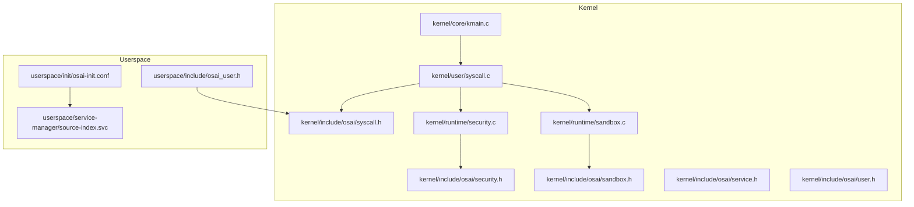
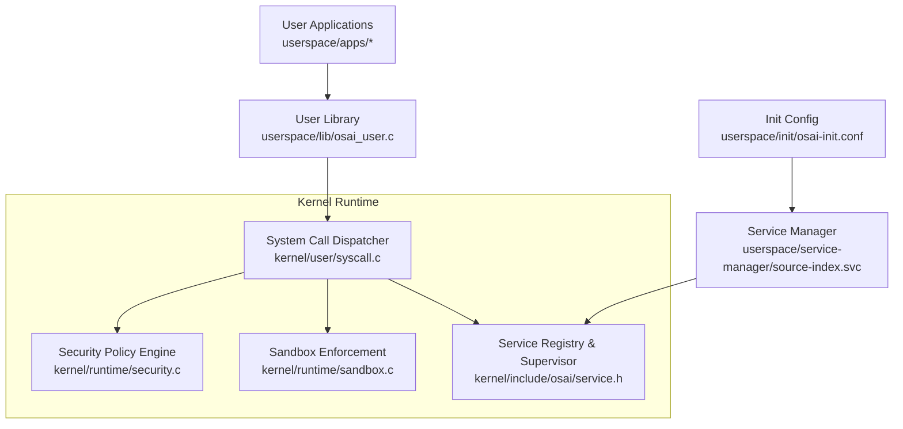
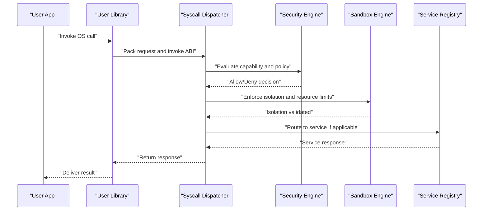
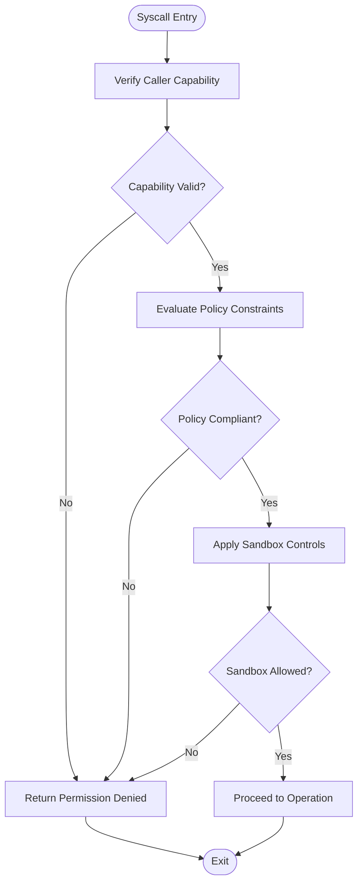
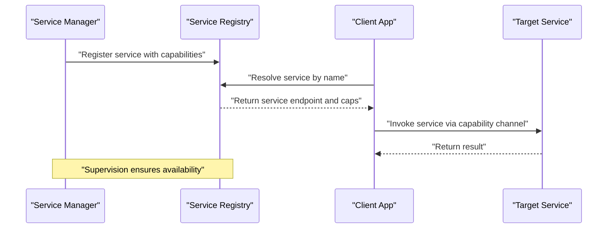
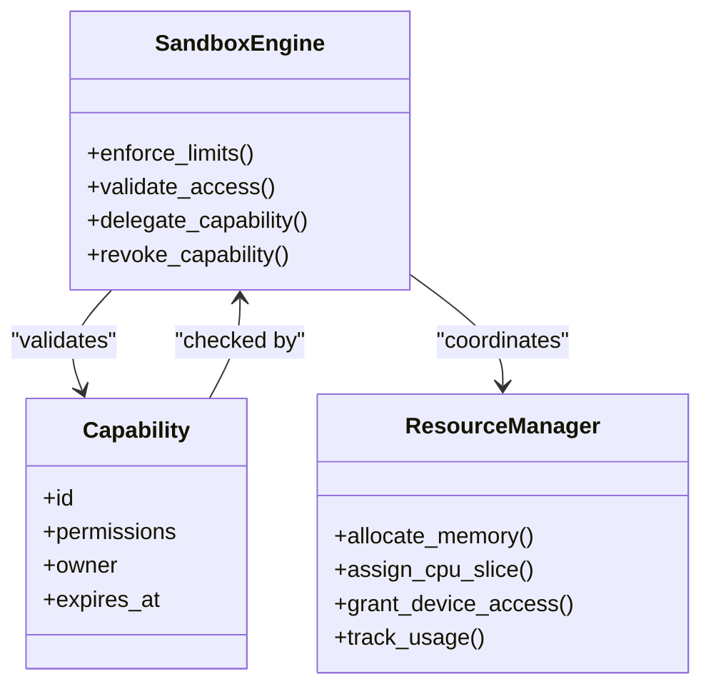
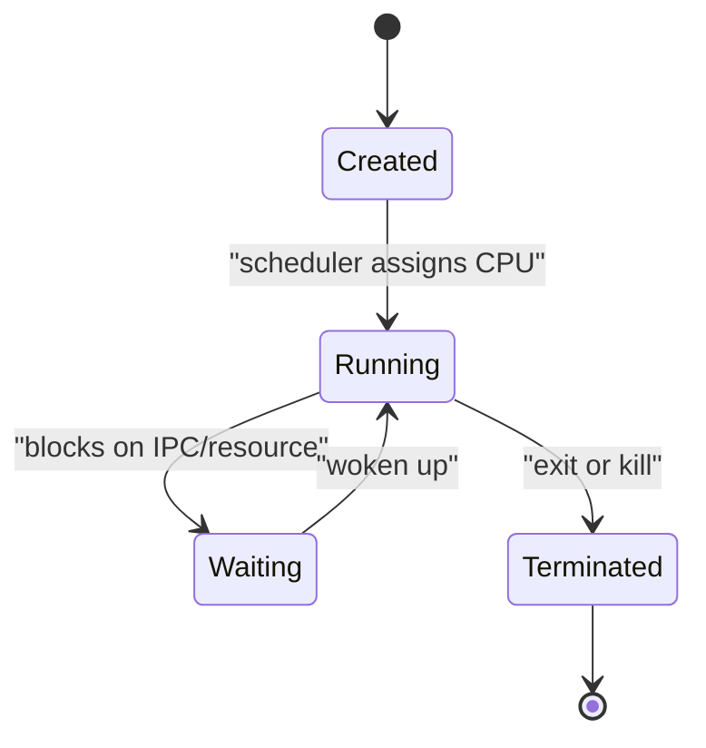
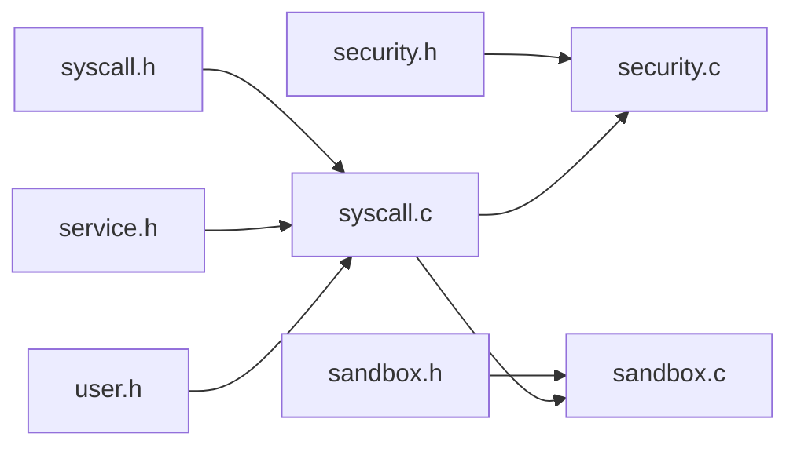

# Process Management Architecture

<cite>
**Referenced Files in This Document**
- [kmain.c](file://kernel/core/kmain.c)
- [syscall.h](file://kernel/include/osai/syscall.h)
- [security.h](file://kernel/include/osai/security.h)
- [sandbox.h](file://kernel/include/osai/sandbox.h)
- [service.h](file://kernel/include/osai/service.h)
- [user.h](file://kernel/include/osai/user.h)
- [syscall.c](file://kernel/user/syscall.c)
- [service.c](file://kernel/user/service.c)
- [security.c](file://kernel/runtime/security.c)
- [sandbox.c](file://kernel/runtime/sandbox.c)
- [service-manager/source-index.svc](file://userspace/service-manager/source-index.svc)
- [osai-init.conf](file://userspace/init/osai-init.conf)
- [osai-user.h](file://userspace/include/osai_user.h)
</cite>

## Table of Contents
1. [Introduction](#introduction)
2. [Project Structure](#project-structure)
3. [Core Components](#core-components)
4. [Architecture Overview](#architecture-overview)
5. [Detailed Component Analysis](#detailed-component-analysis)
6. [Dependency Analysis](#dependency-analysis)
7. [Performance Considerations](#performance-considerations)
8. [Troubleshooting Guide](#troubleshooting-guide)
9. [Conclusion](#conclusion)

## Introduction
This document describes the process management architecture of OSAI with emphasis on:
- Microkernel approach to process isolation
- Capability-based security model
- Service-oriented architecture
- User process lifecycle and inter-process communication
- System call interface design
- Service supervisor role, scheduling, and resource management
- Sandbox implementation, capability delegation, and permission enforcement
- Examples of process creation, termination, and state transitions
- Security boundaries, debugging techniques, and performance considerations

## Project Structure
OSAI separates kernel-side runtime and headers from userspace components:
- Kernel core and runtime implement security, sandboxing, services, and system call dispatch
- Userspace provides init configuration, service manager, and example applications
- Headers define the ABI surface for system calls and capabilities

**Diagram sources**
- [kmain.c](file://kernel/core/kmain.c)
- [syscall.h](file://kernel/include/osai/syscall.h)
- [security.h](file://kernel/include/osai/security.h)
- [sandbox.h](file://kernel/include/osai/sandbox.h)
- [service.h](file://kernel/include/osai/service.h)
- [user.h](file://kernel/include/osai/user.h)
- [syscall.c](file://kernel/user/syscall.c)
- [security.c](file://kernel/runtime/security.c)
- [sandbox.c](file://kernel/runtime/sandbox.c)
- [osai-init.conf](file://userspace/init/osai-init.conf)
- [source-index.svc](file://userspace/service-manager/source-index.svc)
- [osai-user.h](file://userspace/include/osai_user.h)

**Section sources**
- [kmain.c](file://kernel/core/kmain.c)
- [syscall.h](file://kernel/include/osai/syscall.h)
- [security.h](file://kernel/include/osai/security.h)
- [sandbox.h](file://kernel/include/osai/sandbox.h)
- [service.h](file://kernel/include/osai/service.h)
- [user.h](file://kernel/include/osai/user.h)
- [syscall.c](file://kernel/user/syscall.c)
- [security.c](file://kernel/runtime/security.c)
- [sandbox.c](file://kernel/runtime/sandbox.c)
- [osai-init.conf](file://userspace/init/osai-init.conf)
- [source-index.svc](file://userspace/service-manager/source-index.svc)
- [osai-user.h](file://userspace/include/osai_user.h)

## Core Components
- System call interface: Defines the ABI and dispatch mechanism for user-kernel interactions
- Security runtime: Enforces capability-based permissions and policy decisions
- Sandbox runtime: Implements process isolation boundaries and resource controls
- Service runtime: Manages service discovery, registration, and supervision
- Userspace headers and service manager: Provide userland contracts and service orchestration

Key responsibilities:
- Isolation: enforced via sandbox policies and memory protection
- Permissioning: enforced via capability checks and delegation
- IPC: mediated through system call channels and service registry
- Lifecycle: creation, scheduling, and termination coordinated by kernel runtime

**Section sources**
- [syscall.h](file://kernel/include/osai/syscall.h)
- [security.h](file://kernel/include/osai/security.h)
- [sandbox.h](file://kernel/include/osai/sandbox.h)
- [service.h](file://kernel/include/osai/service.h)
- [user.h](file://kernel/include/osai/user.h)
- [syscall.c](file://kernel/user/syscall.c)
- [security.c](file://kernel/runtime/security.c)
- [sandbox.c](file://kernel/runtime/sandbox.c)

## Architecture Overview
OSAI employs a microkernel architecture where privileged operations and isolation are handled by the kernel, while userland runs as unprivileged processes under strict sandbox policies. Services are registered and supervised by the service manager, enabling a service-oriented architecture.

**Diagram sources**
- [syscall.c](file://kernel/user/syscall.c)
- [security.c](file://kernel/runtime/security.c)
- [sandbox.c](file://kernel/runtime/sandbox.c)
- [service.h](file://kernel/include/osai/service.h)
- [osai-user.h](file://userspace/include/osai_user.h)
- [source-index.svc](file://userspace/service-manager/source-index.svc)
- [osai-init.conf](file://userspace/init/osai-init.conf)

## Detailed Component Analysis

### System Call Interface Design
The system call interface defines the ABI and dispatch path from userland to kernel runtime. It encapsulates:
- Request envelope and response framing
- Dispatch to security and sandbox enforcement
- Service routing and IPC coordination

**Diagram sources**
- [syscall.c](file://kernel/user/syscall.c)
- [security.c](file://kernel/runtime/security.c)
- [sandbox.c](file://kernel/runtime/sandbox.c)
- [service.h](file://kernel/include/osai/service.h)
- [osai-user.h](file://userspace/include/osai_user.h)

**Section sources**
- [syscall.h](file://kernel/include/osai/syscall.h)
- [syscall.c](file://kernel/user/syscall.c)
- [osai-user.h](file://userspace/include/osai_user.h)

### Capability-Based Security Model
Capability-based security enforces least-privilege by binding permissions to capability tokens. Enforcement occurs at:
- System call entry: capability verification and policy evaluation
- Sandbox boundary: isolation and resource gating
- Service access: service-specific capability checks

**Diagram sources**
- [security.c](file://kernel/runtime/security.c)
- [sandbox.c](file://kernel/runtime/sandbox.c)
- [security.h](file://kernel/include/osai/security.h)
- [sandbox.h](file://kernel/include/osai/sandbox.h)

**Section sources**
- [security.h](file://kernel/include/osai/security.h)
- [security.c](file://kernel/runtime/security.c)
- [sandbox.h](file://kernel/include/osai/sandbox.h)
- [sandbox.c](file://kernel/runtime/sandbox.c)

### Service-Oriented Architecture and Supervisor Role
Services are registered and supervised by the service manager. The supervisor:
- Registers service descriptors and capabilities
- Monitors health and restarts failed services
- Provides discovery and routing for inter-service communication

**Diagram sources**
- [service.h](file://kernel/include/osai/service.h)
- [source-index.svc](file://userspace/service-manager/source-index.svc)
- [osai-init.conf](file://userspace/init/osai-init.conf)

**Section sources**
- [service.h](file://kernel/include/osai/service.h)
- [source-index.svc](file://userspace/service-manager/source-index.svc)
- [osai-init.conf](file://userspace/init/osai-init.conf)

### Sandbox Implementation and Resource Management
The sandbox enforces process isolation and resource limits:
- Memory protection and address space partitioning
- CPU time allocation and preemption
- Device and filesystem access controls
- Capability delegation and revocation

**Diagram sources**
- [sandbox.c](file://kernel/runtime/sandbox.c)
- [sandbox.h](file://kernel/include/osai/sandbox.h)
- [security.c](file://kernel/runtime/security.c)
- [security.h](file://kernel/include/osai/security.h)

**Section sources**
- [sandbox.h](file://kernel/include/osai/sandbox.h)
- [sandbox.c](file://kernel/runtime/sandbox.c)
- [security.h](file://kernel/include/osai/security.h)
- [security.c](file://kernel/runtime/security.c)

### User Process Lifecycle and State Transitions
Lifecycle stages:
- Creation: capability validation, sandbox initialization, service registration
- Running: scheduled execution, capability enforcement, resource accounting
- Waiting: blocked on IPC or resources
- Termination: cleanup, capability revocation, resource deallocation

[No sources needed since this diagram shows conceptual workflow, not actual code structure]

### Inter-Process Communication Mechanisms
IPC is capability-mediated and routed through the service registry:
- Named service invocation with capability negotiation
- Message-based channels with sandbox-aware buffers
- Synchronous and asynchronous patterns supported

**Section sources**
- [service.h](file://kernel/include/osai/service.h)
- [syscall.c](file://kernel/user/syscall.c)

### Examples of Process Operations
- Process creation: validate caller capability, allocate sandbox, register service descriptor, return handle
- Process termination: revoke capabilities, reclaim resources, notify supervisors
- State transitions: scheduler-driven transitions between Created, Running, Waiting, Terminated

**Section sources**
- [syscall.c](file://kernel/user/syscall.c)
- [sandbox.c](file://kernel/runtime/sandbox.c)
- [service.h](file://kernel/include/osai/service.h)

## Dependency Analysis
The kernel’s process management depends on:
- System call headers for ABI contract
- Security and sandbox headers for policy and isolation
- Service headers for registry and supervision
- Userspace headers for userland contracts

**Diagram sources**
- [syscall.h](file://kernel/include/osai/syscall.h)
- [security.h](file://kernel/include/osai/security.h)
- [sandbox.h](file://kernel/include/osai/sandbox.h)
- [service.h](file://kernel/include/osai/service.h)
- [user.h](file://kernel/include/osai/user.h)
- [syscall.c](file://kernel/user/syscall.c)
- [security.c](file://kernel/runtime/security.c)
- [sandbox.c](file://kernel/runtime/sandbox.c)

**Section sources**
- [syscall.h](file://kernel/include/osai/syscall.h)
- [security.h](file://kernel/include/osai/security.h)
- [sandbox.h](file://kernel/include/osai/sandbox.h)
- [service.h](file://kernel/include/osai/service.h)
- [user.h](file://kernel/include/osai/user.h)
- [syscall.c](file://kernel/user/syscall.c)
- [security.c](file://kernel/runtime/security.c)
- [sandbox.c](file://kernel/runtime/sandbox.c)

## Performance Considerations
- Minimize syscall overhead by batching capability checks and reducing context switches
- Use efficient scheduling queues and preemption thresholds
- Cache frequently accessed service descriptors and capability metadata
- Employ zero-copy IPC where feasible and safe under sandbox constraints
- Profile memory allocation and deallocation in sandbox initialization

[No sources needed since this section provides general guidance]

## Troubleshooting Guide
Common issues and diagnostics:
- Permission denied errors: verify capability validity and policy compliance
- Sandbox violations: inspect isolation boundaries and resource limit enforcement
- Service resolution failures: confirm service registration and capability exposure
- Deadlocks: monitor waiting states and IPC channel contention
- Debugging: enable kernel telemetry and userland logging around syscall boundaries

**Section sources**
- [security.c](file://kernel/runtime/security.c)
- [sandbox.c](file://kernel/runtime/sandbox.c)
- [syscall.c](file://kernel/user/syscall.c)
- [telemetry.h](file://kernel/include/osai/telemetry.h)

## Conclusion
OSAI’s process management combines a microkernel isolation model with capability-based security and a service-oriented architecture. The system call interface mediates secure, auditable interactions between userland and kernel runtime, while the sandbox enforces strict isolation and resource management. The service supervisor ensures resilience and discoverability. Together, these components deliver a robust foundation for secure, scalable process management.