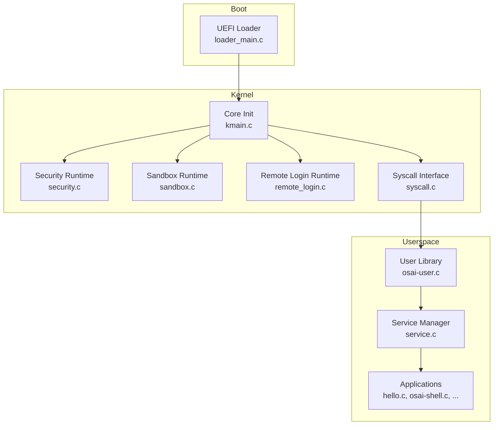
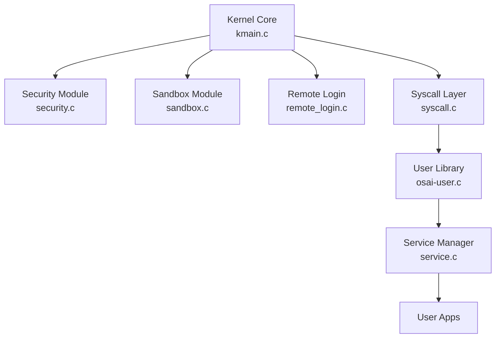
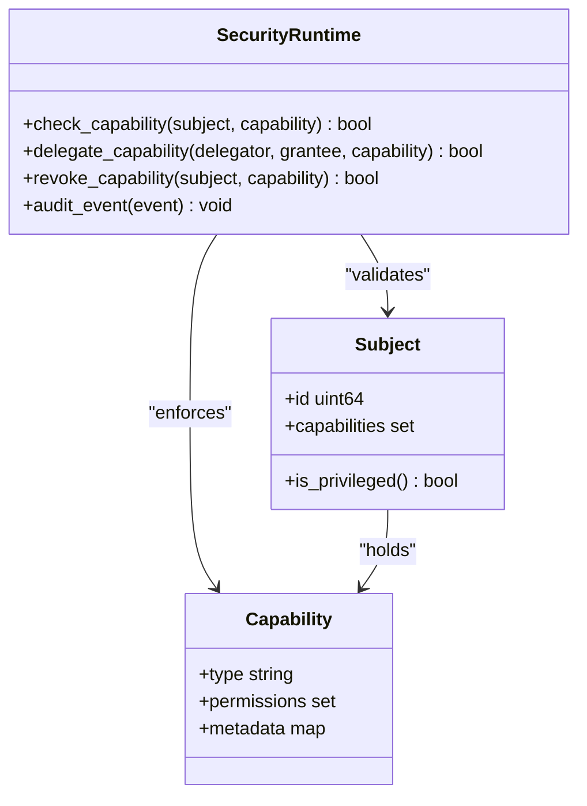
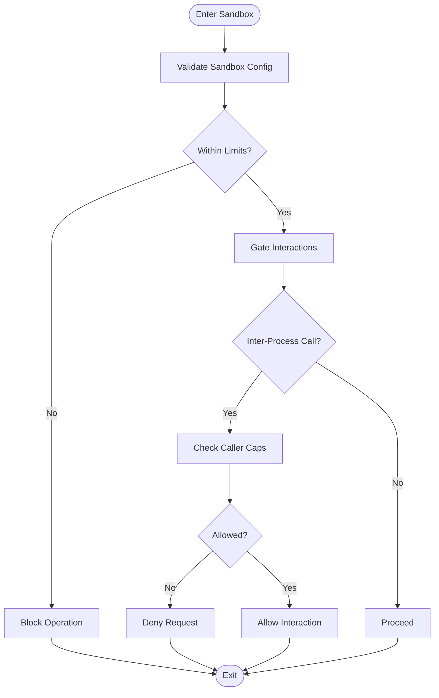
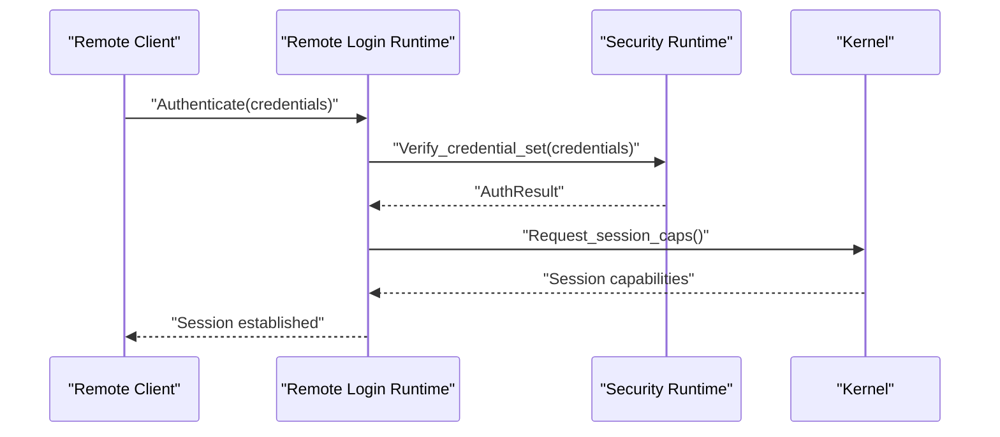
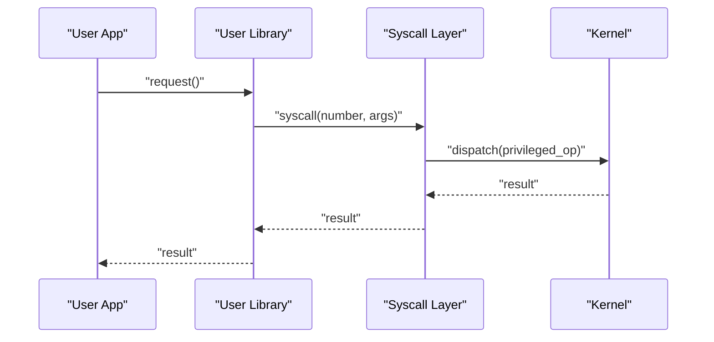
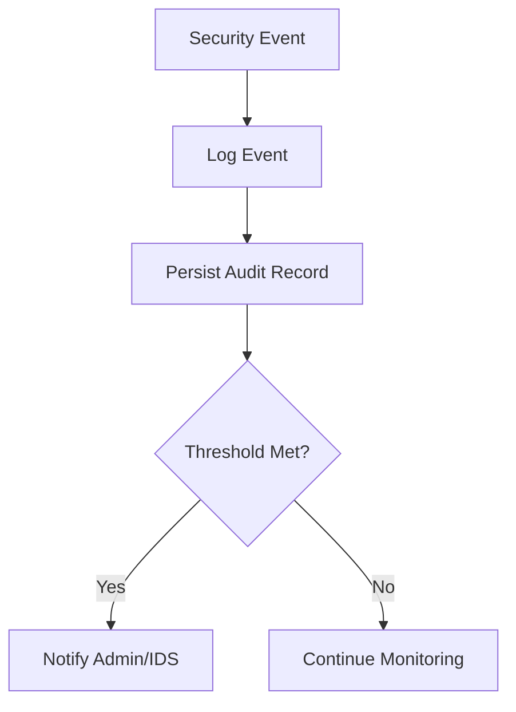
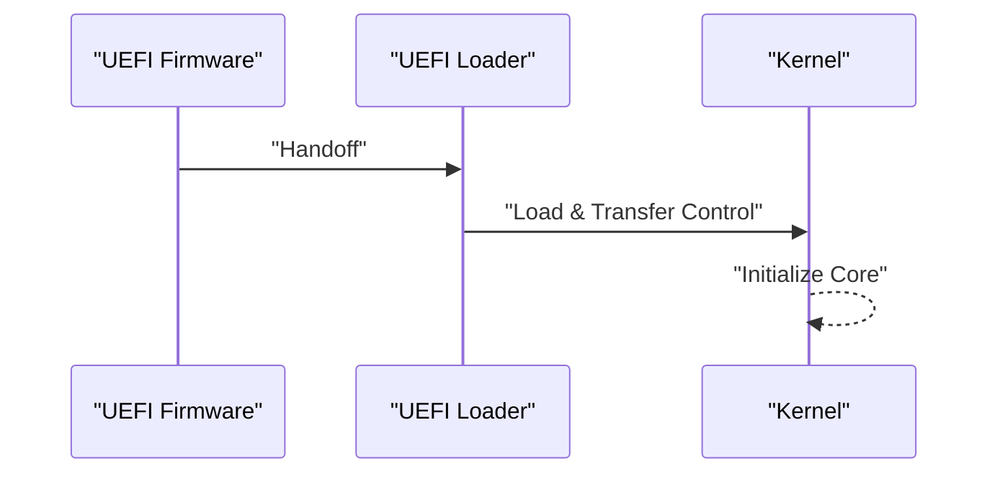
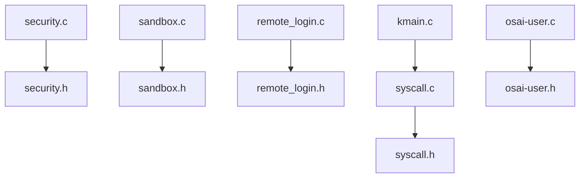

# Security Model Architecture

<cite>
**Referenced Files in This Document**
- [security.h](file://kernel/include/osai/security.h)
- [security.c](file://kernel/runtime/security.c)
- [sandbox.h](file://kernel/include/osai/sandbox.h)
- [sandbox.c](file://kernel/runtime/sandbox.c)
- [remote_login.h](file://kernel/include/osai/remote_login.h)
- [remote_login.c](file://kernel/runtime/remote_login.c)
- [kmain.c](file://kernel/core/kmain.c)
- [syscall.h](file://kernel/include/osai/syscall.h)
- [syscall.c](file://kernel/user/syscall.c)
- [service.c](file://kernel/user/service.c)
- [osai-user.h](file://userspace/include/osai_user.h)
- [osai-user.c](file://userspace/lib/osai_user.c)
- [loader_main.c](file://boot/uefi/loader_main.c)
- [klog.h](file://kernel/include/osai/klog.h)
- [klog.c](file://kernel/core/klog.c)
- [panic.h](file://kernel/include/osai/panic.h)
- [panic.c](file://kernel/core/panic.c)
- [README.md](file://README.md)
- [SECURITY.md](file://SECURITY.md)
</cite>

## Table of Contents
1. [Introduction](#introduction)
2. [Project Structure](#project-structure)
3. [Core Components](#core-components)
4. [Architecture Overview](#architecture-overview)
5. [Detailed Component Analysis](#detailed-component-analysis)
6. [Dependency Analysis](#dependency-analysis)
7. [Performance Considerations](#performance-considerations)
8. [Troubleshooting Guide](#troubleshooting-guide)
9. [Conclusion](#conclusion)
10. [Appendices](#appendices)

## Introduction
This document describes OSAI’s capability-based security model architecture, focusing on microkernel security principles, capability delegation, sandboxing for process isolation, remote login security, access control enforcement, privilege separation, and security boundaries among kernel, services, and user applications. It also covers security auditing, intrusion detection, secure boot, and practical guidelines for secure application development within the OSAI ecosystem.

## Project Structure
OSAI organizes security-critical components across three layers:
- Kernel: Microkernel core, memory management, device drivers, and runtime security enforcement
- Runtime: Capability and sandbox management, remote login, and telemetry/logging
- Userspace: Application libraries, service manager, and userland utilities

**Diagram sources**
- [loader_main.c](file://boot/uefi/loader_main.c)
- [kmain.c](file://kernel/core/kmain.c)
- [security.c](file://kernel/runtime/security.c)
- [sandbox.c](file://kernel/runtime/sandbox.c)
- [remote_login.c](file://kernel/runtime/remote_login.c)
- [syscall.c](file://kernel/user/syscall.c)
- [osai-user.c](file://userspace/lib/osai_user.c)
- [service.c](file://kernel/user/service.c)

**Section sources**
- [README.md](file://README.md)

## Core Components
- Capability and Access Control: Enforced via capability tokens and permission checks in the kernel runtime
- Sandbox Isolation: Process boundary enforcement and resource gating
- Remote Login Security: Authentication and session management
- Syscall Interface: Controlled entry points with privilege separation
- Logging and Auditing: Telemetry and panic handling for security events
- Secure Boot: UEFI loader initialization

**Section sources**
- [security.h](file://kernel/include/osai/security.h)
- [security.c](file://kernel/runtime/security.c)
- [sandbox.h](file://kernel/include/osai/sandbox.h)
- [sandbox.c](file://kernel/runtime/sandbox.c)
- [remote_login.h](file://kernel/include/osai/remote_login.h)
- [remote_login.c](file://kernel/runtime/remote_login.c)
- [syscall.h](file://kernel/include/osai/syscall.h)
- [syscall.c](file://kernel/user/syscall.c)
- [klog.h](file://kernel/include/osai/klog.h)
- [klog.c](file://kernel/core/klog.c)
- [panic.h](file://kernel/include/osai/panic.h)
- [panic.c](file://kernel/core/panic.c)

## Architecture Overview
OSAI employs a microkernel with capability-based access control. The kernel enforces strict privilege separation between itself, services, and user applications. Capabilities are delegated by trusted entities and checked at kernel boundaries. Sandboxing limits process resources and interactions. Remote login is mediated securely through dedicated runtime components. Syscalls are the sole privileged entry points, with userland invoking them through a controlled interface.

**Diagram sources**
- [kmain.c](file://kernel/core/kmain.c)
- [security.c](file://kernel/runtime/security.c)
- [sandbox.c](file://kernel/runtime/sandbox.c)
- [remote_login.c](file://kernel/runtime/remote_login.c)
- [syscall.c](file://kernel/user/syscall.c)
- [osai-user.c](file://userspace/lib/osai_user.c)
- [service.c](file://kernel/user/service.c)

## Detailed Component Analysis

### Capability-Based Access Control
OSAI’s capability system defines fine-grained permissions that are delegated and enforced at kernel boundaries. Capabilities are represented and validated in the security runtime, ensuring least-privilege execution and preventing unauthorized access to protected resources.

**Diagram sources**
- [security.h](file://kernel/include/osai/security.h)
- [security.c](file://kernel/runtime/security.c)

Practical examples:
- Capability assignment: A service obtains a capability from a trusted authority and stores it for later use
- Permission checking: Before accessing a protected resource, the kernel verifies the subject’s capability against required permissions
- Security policy enforcement: Deny-by-default with explicit allow-lists per capability type

**Section sources**
- [security.h](file://kernel/include/osai/security.h)
- [security.c](file://kernel/runtime/security.c)

### Sandbox Implementation for Process Isolation
The sandbox module enforces process isolation by constraining memory, CPU, and device access. It mediates inter-process interactions and ensures that untrusted workloads cannot escape their boundaries.

**Diagram sources**
- [sandbox.h](file://kernel/include/osai/sandbox.h)
- [sandbox.c](file://kernel/runtime/sandbox.c)

**Section sources**
- [sandbox.h](file://kernel/include/osai/sandbox.h)
- [sandbox.c](file://kernel/runtime/sandbox.c)

### Remote Login Security Mechanisms
Remote login is handled by a dedicated runtime that manages authentication, session establishment, and secure channel maintenance. It integrates with the kernel’s capability system to limit access to administrative functions.

**Diagram sources**
- [remote_login.h](file://kernel/include/osai/remote_login.h)
- [remote_login.c](file://kernel/runtime/remote_login.c)
- [security.c](file://kernel/runtime/security.c)

**Section sources**
- [remote_login.h](file://kernel/include/osai/remote_login.h)
- [remote_login.c](file://kernel/runtime/remote_login.c)

### Privilege Separation and Syscall Interface
Privilege separation is achieved through a strict syscall interface. Only the kernel executes privileged operations; userland applications invoke services through controlled entry points.

**Diagram sources**
- [syscall.h](file://kernel/include/osai/syscall.h)
- [syscall.c](file://kernel/user/syscall.c)
- [osai-user.h](file://userspace/include/osai_user.h)
- [osai-user.c](file://userspace/lib/osai_user.c)

**Section sources**
- [syscall.h](file://kernel/include/osai/syscall.h)
- [syscall.c](file://kernel/user/syscall.c)
- [osai-user.h](file://userspace/include/osai_user.h)
- [osai-user.c](file://userspace/lib/osai_user.c)

### Security Boundaries Between Kernel, Services, and Applications
- Kernel: Executes privileged operations and enforces capability checks
- Services: Mediate between kernel and user applications; operate under strict sandbox rules
- User Applications: Run with minimal privileges and limited capabilities

**Diagram sources**
- [security.c](file://kernel/runtime/security.c)
- [sandbox.c](file://kernel/runtime/sandbox.c)
- [service.c](file://kernel/user/service.c)

**Section sources**
- [security.c](file://kernel/runtime/security.c)
- [sandbox.c](file://kernel/runtime/sandbox.c)
- [service.c](file://kernel/user/service.c)

### Practical Examples
- Capability assignment: A service requests a capability from a supervisor; the kernel validates the request and returns a scoped capability token
- Permission checking: On a protected operation, the kernel cross-references the caller’s capability against required permissions
- Security policy enforcement: Deny-by-default policies are applied unless explicit capability grants exist

**Section sources**
- [security.h](file://kernel/include/osai/security.h)
- [security.c](file://kernel/runtime/security.c)

### Security Auditing and Intrusion Detection
- Telemetry and logging capture security-relevant events
- Panic handling ensures robust failure reporting and system hardening
- Audit trails support post-incident analysis

**Diagram sources**
- [klog.h](file://kernel/include/osai/klog.h)
- [klog.c](file://kernel/core/klog.c)
- [panic.h](file://kernel/include/osai/panic.h)
- [panic.c](file://kernel/core/panic.c)

**Section sources**
- [klog.h](file://kernel/include/osai/klog.h)
- [klog.c](file://kernel/core/klog.c)
- [panic.h](file://kernel/include/osai/panic.h)
- [panic.c](file://kernel/core/panic.c)

### Secure Boot Process
Secure boot begins with the UEFI loader, which initializes the kernel and establishes a trusted foundation.

**Diagram sources**
- [loader_main.c](file://boot/uefi/loader_main.c)
- [kmain.c](file://kernel/core/kmain.c)

**Section sources**
- [loader_main.c](file://boot/uefi/loader_main.c)
- [kmain.c](file://kernel/core/kmain.c)

## Dependency Analysis
Key dependencies and coupling:
- Security runtime depends on capability definitions and audit infrastructure
- Sandbox relies on memory and CPU scheduling abstractions
- Remote login integrates with security and syscall layers
- Syscall interface bridges user library and kernel

**Diagram sources**
- [security.c](file://kernel/runtime/security.c)
- [security.h](file://kernel/include/osai/security.h)
- [sandbox.c](file://kernel/runtime/sandbox.c)
- [sandbox.h](file://kernel/include/osai/sandbox.h)
- [remote_login.c](file://kernel/runtime/remote_login.c)
- [remote_login.h](file://kernel/include/osai/remote_login.h)
- [syscall.c](file://kernel/user/syscall.c)
- [syscall.h](file://kernel/include/osai/syscall.h)
- [osai-user.c](file://userspace/lib/osai_user.c)
- [osai-user.h](file://userspace/include/osai_user.h)
- [kmain.c](file://kernel/core/kmain.c)

**Section sources**
- [security.c](file://kernel/runtime/security.c)
- [sandbox.c](file://kernel/runtime/sandbox.c)
- [remote_login.c](file://kernel/runtime/remote_login.c)
- [syscall.c](file://kernel/user/syscall.c)
- [osai-user.c](file://userspace/lib/osai_user.c)
- [kmain.c](file://kernel/core/kmain.c)

## Performance Considerations
- Capability checks and sandbox enforcement introduce overhead; minimize checks by batching and caching where safe
- Syscall boundaries should be minimized for hot paths; leverage kernel-optimized paths for frequent operations
- Remote login sessions should reuse authenticated channels to reduce repeated credential verification costs
- Secure boot adds initial latency but is essential for trust guarantees

[No sources needed since this section provides general guidance]

## Troubleshooting Guide
- Audit logs: Review kernel logs for denied operations and capability violations
- Panic handling: Investigate panic reports to identify root causes of security failures
- Remote login issues: Verify credential sets and session capability grants
- Syscall failures: Confirm capability delegation and syscall number correctness

**Section sources**
- [klog.h](file://kernel/include/osai/klog.h)
- [klog.c](file://kernel/core/klog.c)
- [panic.h](file://kernel/include/osai/panic.h)
- [panic.c](file://kernel/core/panic.c)
- [remote_login.c](file://kernel/runtime/remote_login.c)

## Conclusion
OSAI’s security model leverages a microkernel with capability-based access control, strict sandboxing, and privilege separation. Secure boot, auditing, and remote login are integrated to form a cohesive defense-in-depth strategy. By adhering to least-privilege principles, validating capabilities at every boundary, and maintaining robust logging and panic handling, OSAI enables secure application development while preserving performance through careful design and operational discipline.

[No sources needed since this section summarizes without analyzing specific files]

## Appendices

### Guidelines for Secure Application Development
- Request only necessary capabilities; avoid broad grants
- Validate all inputs and enforce capability checks at boundaries
- Use the syscall interface exclusively for privileged operations
- Implement defensive programming and fail-safe defaults
- Integrate with the logging framework for auditable behavior

**Section sources**
- [SECURITY.md](file://SECURITY.md)
- [osai-user.h](file://userspace/include/osai_user.h)
- [osai-user.c](file://userspace/lib/osai_user.c)
- [syscall.h](file://kernel/include/osai/syscall.h)
- [security.h](file://kernel/include/osai/security.h)