# System Architecture

<cite>
**Referenced Files in This Document**
- [README.md](file://README.md)
- [loader_main.c](file://boot/uefi/loader_main.c)
- [kmain.c](file://kernel/core/kmain.c)
- [entry.S (x86_64)](file://kernel/arch/x86_64/entry.S)
- [entry.S (AArch64)](file://kernel/arch/aarch64/entry.S)
- [service.h](file://kernel/include/osai/service.h)
- [security.h](file://kernel/include/osai/security.h)
- [vmm.h](file://kernel/include/osai/vmm.h)
- [pmm.c](file://kernel/mm/pmm.c)
- [virtio_blk.c](file://kernel/dev/virtio/virtio_blk.c)
- [initramfs.c](file://kernel/fs/initramfs.c)
- [osai_user.c](file://userspace/lib/osai_user.c)
- [init.S](file://userspace/init/init.S)
- [service.c](file://kernel/user/service.c)
</cite>

## Table of Contents
1. [Introduction](#introduction)
2. [Project Structure](#project-structure)
3. [Core Components](#core-components)
4. [Architecture Overview](#architecture-overview)
5. [Detailed Component Analysis](#detailed-component-analysis)
6. [Dependency Analysis](#dependency-analysis)
7. [Performance Considerations](#performance-considerations)
8. [Troubleshooting Guide](#troubleshooting-guide)
9. [Conclusion](#conclusion)
10. [Appendices](#appendices)

## Introduction
This document describes the microkernel-based system design of OSAI, a server-only operating system tailored for CPU-only embedded AI agents. The system emphasizes predictability, isolation, and close-to-the-source development workflows. It separates kernel space from user space, adopts a service-oriented runtime, and enforces a capability-based security model. Multi-architecture support is provided for x86_64 and AArch64, with platform-specific entry points and initialization sequences. The document traces the end-to-end data flow from UEFI boot through kernel initialization to service startup, and explains system boundaries, integration patterns, and the rationale behind microkernel design choices.

## Project Structure
OSAI is organized into distinct layers:
- Boot loader (UEFI): Loads the kernel image, validates ELF, constructs a boot info structure, and transfers control to the kernel entry point.
- Kernel core: Initializes memory management, virtual memory, exception handling, SMP, timers, devices, and services; then launches user-space services.
- Device drivers: VirtIO block and network stacks for virtualized storage and networking.
- Filesystems: Read-only initramfs backed by a virtualized block device.
- Runtime subsystems: AI cell, CPU AI runtime, persistence, sandboxing, telemetry, and remote login.
- Userspace: Minimal init and service manager, plus example user applications.

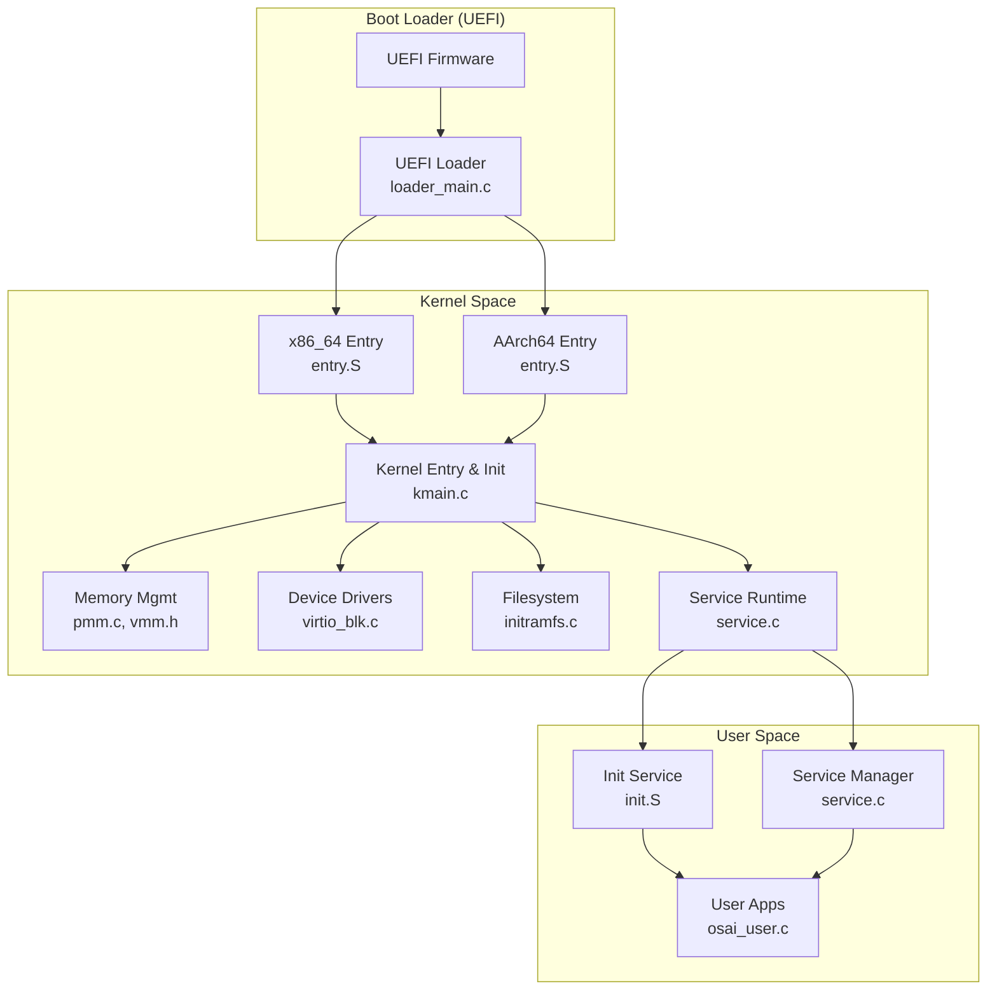

**Diagram sources**
- [loader_main.c:273-348](file://boot/uefi/loader_main.c#L273-L348)
- [entry.S (x86_64):5-20](file://kernel/arch/x86_64/entry.S#L5-L20)
- [entry.S (AArch64):9-26](file://kernel/arch/aarch64/entry.S#L9-L26)
- [kmain.c:60-134](file://kernel/core/kmain.c#L60-L134)
- [pmm.c:41-77](file://kernel/mm/pmm.c#L41-L77)
- [vmm.h:18-26](file://kernel/include/osai/vmm.h#L18-L26)
- [virtio_blk.c:87-113](file://kernel/dev/virtio/virtio_blk.c#L87-L113)
- [initramfs.c:319-397](file://kernel/fs/initramfs.c#L319-L397)
- [service.c:778-798](file://kernel/user/service.c#L778-L798)
- [init.S:5-83](file://userspace/init/init.S#L5-L83)
- [osai_user.c:3-13](file://userspace/lib/osai_user.c#L3-L13)

**Section sources**
- [README.md:1-86](file://README.md#L1-L86)
- [loader_main.c:1-348](file://boot/uefi/loader_main.c#L1-L348)
- [kmain.c:1-223](file://kernel/core/kmain.c#L1-L223)

## Core Components
- Microkernel entry and initialization: The kernel initializes exception handling, timers, SMP, physical and virtual memory, heap, arenas, security, persistence, filesystems, networking, and services. It then loads and runs user-space services.
- Capability-based security: Services operate under explicit capability masks; administrative actions require elevated privileges; policy enforcement tracks denials and audit metrics.
- Service-oriented runtime: A supervisor manages service lifecycle, policies, logging, and restart semantics; commands are processed via an osctl interface.
- Memory management: Physical memory allocator (PMM) and virtual memory manager (VMM) provide address translation and protection flags.
- Device abstraction: VirtIO block driver integrates with the VMM for DMA-safe transfers and queue management.
- Filesystem: Read-only initramfs image stored on a VirtIO block device; manifest-driven configuration determines service startup paths.
- Userspace integration: Minimal init and service manager demonstrate capability-based syscall usage and osctl command parsing.

**Section sources**
- [kmain.c:60-134](file://kernel/core/kmain.c#L60-L134)
- [service.h:7-67](file://kernel/include/osai/service.h#L7-L67)
- [security.h:7-53](file://kernel/include/osai/security.h#L7-L53)
- [vmm.h:8-26](file://kernel/include/osai/vmm.h#L8-L26)
- [pmm.c:41-77](file://kernel/mm/pmm.c#L41-L77)
- [virtio_blk.c:51-57](file://kernel/dev/virtio/virtio_blk.c#L51-L57)
- [initramfs.c:319-397](file://kernel/fs/initramfs.c#L319-L397)
- [osai_user.c:3-13](file://userspace/lib/osai_user.c#L3-L13)

## Architecture Overview
OSAI employs a microkernel design:
- Kernel space: Minimal core with strict isolation and mandatory service runtime.
- User space: Services and applications execute with explicit capabilities and are managed by the kernel’s service supervisor.
- Capability-based security: Every privileged operation requires matching capabilities; policy enforcement and auditing track denials.
- Multi-architecture: Platform-specific assembly entry points initialize per-arch state and jump to the shared kernel entry routine.

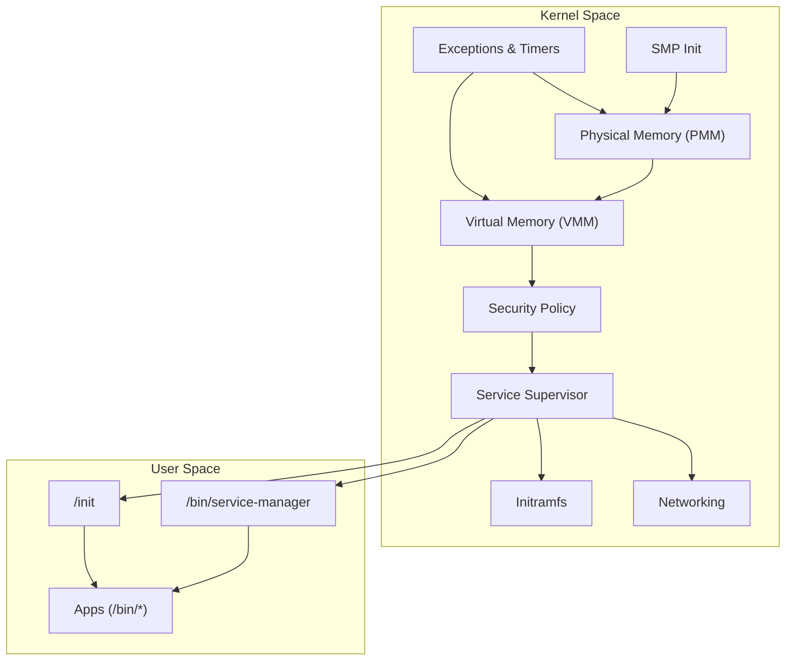

**Diagram sources**
- [kmain.c:71-133](file://kernel/core/kmain.c#L71-L133)
- [service.c:778-798](file://kernel/user/service.c#L778-L798)
- [initramfs.c:319-397](file://kernel/fs/initramfs.c#L319-L397)
- [virtio_blk.c:87-113](file://kernel/dev/virtio/virtio_blk.c#L87-L113)

## Detailed Component Analysis

### Boot Loader (UEFI) to Kernel Entry
The UEFI loader performs:
- Validates the ELF64 kernel for machine type and program headers.
- Allocates and loads kernel segments into physical memory.
- Collects a memory map and constructs a boot info structure.
- Exits boot services and jumps to the kernel entry point.

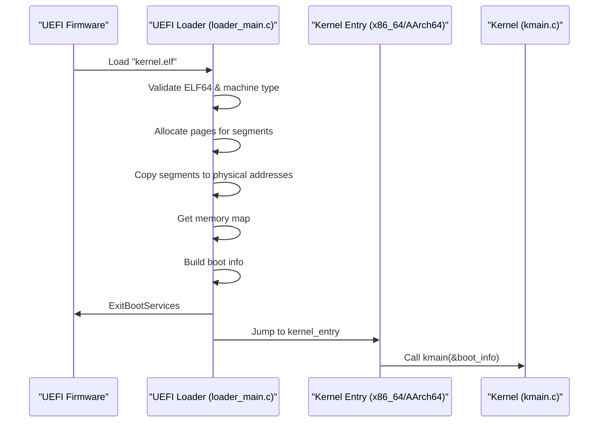

**Diagram sources**
- [loader_main.c:273-348](file://boot/uefi/loader_main.c#L273-L348)
- [entry.S (x86_64):5-19](file://kernel/arch/x86_64/entry.S#L5-L19)
- [entry.S (AArch64):9-25](file://kernel/arch/aarch64/entry.S#L9-L25)
- [kmain.c:60-64](file://kernel/core/kmain.c#L60-L64)

**Section sources**
- [loader_main.c:161-190](file://boot/uefi/loader_main.c#L161-L190)
- [loader_main.c:192-245](file://boot/uefi/loader_main.c#L192-L245)
- [loader_main.c:247-271](file://boot/uefi/loader_main.c#L247-L271)
- [loader_main.c:273-348](file://boot/uefi/loader_main.c#L273-L348)

### Kernel Initialization Sequence
The kernel initializes subsystems in a deterministic order and then starts services:
- Exception handling and self-tests.
- Timer and SMP initialization.
- Physical and virtual memory managers.
- Heap, arenas, security, persistence, filesystems, networking.
- Syscalls, process lifecycle, and service supervisor.
- Launches init, service manager, workers, and example applications.

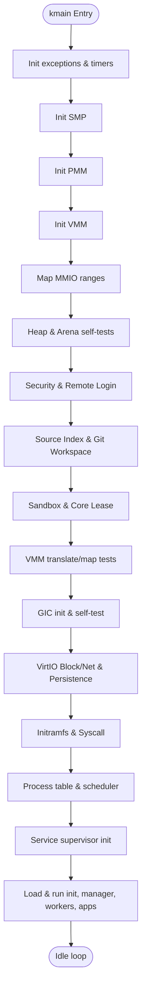

**Diagram sources**
- [kmain.c:71-133](file://kernel/core/kmain.c#L71-L133)
- [kmain.c:158-216](file://kernel/core/kmain.c#L158-L216)

**Section sources**
- [kmain.c:60-134](file://kernel/core/kmain.c#L60-L134)

### Multi-Architecture Support (x86_64 vs AArch64)
- x86_64: Clears BSS, then calls the C entry routine; sets up ISRs and common handler.
- AArch64: Clears BSS, calls kmain, and provides user entry/return helpers for EL0/EL1 transitions.

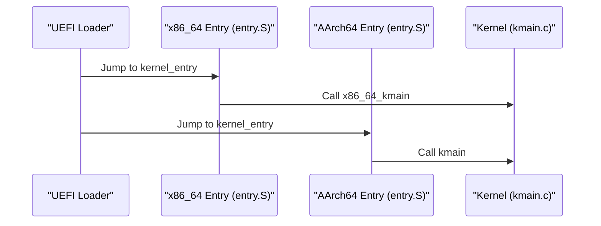

**Diagram sources**
- [entry.S (x86_64):5-19](file://kernel/arch/x86_64/entry.S#L5-L19)
- [entry.S (AArch64):9-25](file://kernel/arch/aarch64/entry.S#L9-L25)
- [kmain.c:60-64](file://kernel/core/kmain.c#L60-L64)

**Section sources**
- [entry.S (x86_64):1-100](file://kernel/arch/x86_64/entry.S#L1-L100)
- [entry.S (AArch64):1-59](file://kernel/arch/aarch64/entry.S#L1-L59)

### Capability-Based Security Model
- Services carry capability masks; administrative operations require elevated privileges.
- Security policy authorizes operations against granted vs required capabilities.
- Denial tracking and audit counters record policy decisions.

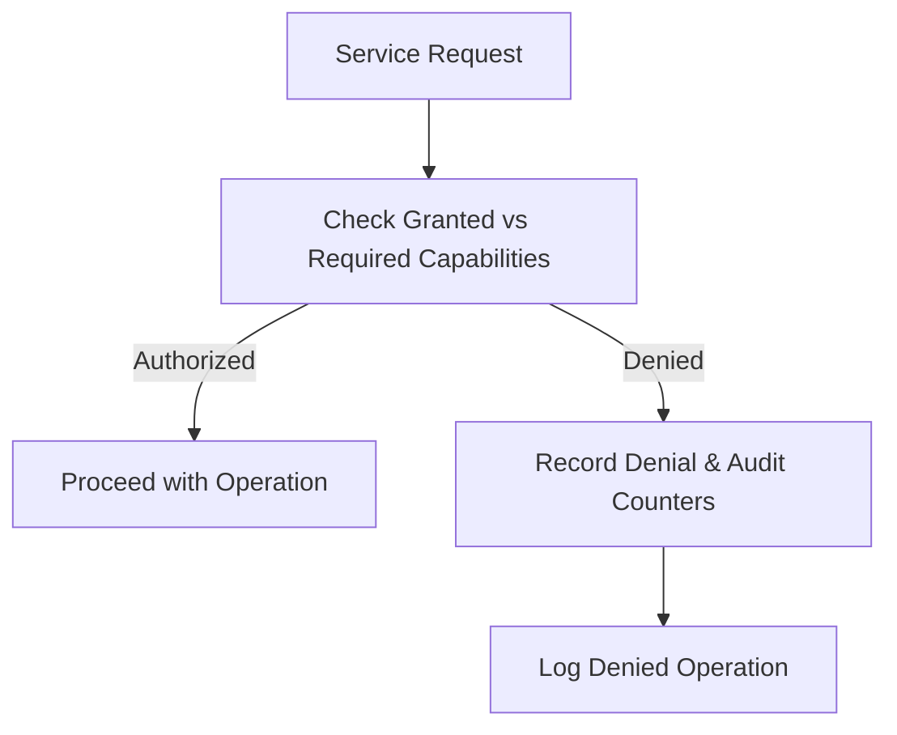

**Diagram sources**
- [service.c:103-123](file://kernel/user/service.c#L103-L123)
- [security.h:7-53](file://kernel/include/osai/security.h#L7-L53)

**Section sources**
- [service.c:103-123](file://kernel/user/service.c#L103-L123)
- [security.h:7-53](file://kernel/include/osai/security.h#L7-L53)

### Service-Oriented Design Pattern
- Service supervisor maintains state machines, policies, and lifecycle transitions.
- Osctl interface parses commands to configure, start, stop, restart, update, rollback, and inspect services.
- Administrative controls enforce policy and audit remote-safe commands.

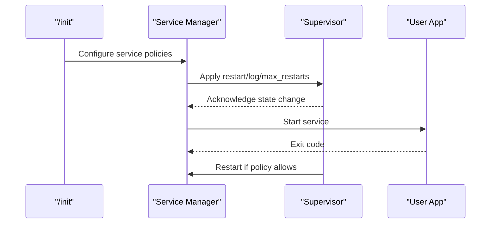

**Diagram sources**
- [service.c:355-380](file://kernel/user/service.c#L355-L380)
- [service.c:616-622](file://kernel/user/service.c#L616-L622)
- [service.c:584-614](file://kernel/user/service.c#L584-L614)
- [service.h:41-67](file://kernel/include/osai/service.h#L41-L67)

**Section sources**
- [service.c:778-798](file://kernel/user/service.c#L778-L798)
- [service.c:355-380](file://kernel/user/service.c#L355-L380)
- [service.c:616-622](file://kernel/user/service.c#L616-L622)
- [service.c:584-614](file://kernel/user/service.c#L584-L614)
- [service.h:7-67](file://kernel/include/osai/service.h#L7-L67)

### Memory Management (PMM/VMM)
- PMM builds a free page stack from conventional memory regions, excluding reserved areas.
- VMM exposes mapping, translation, and validation routines; kernel maps device MMIO ranges with appropriate flags.

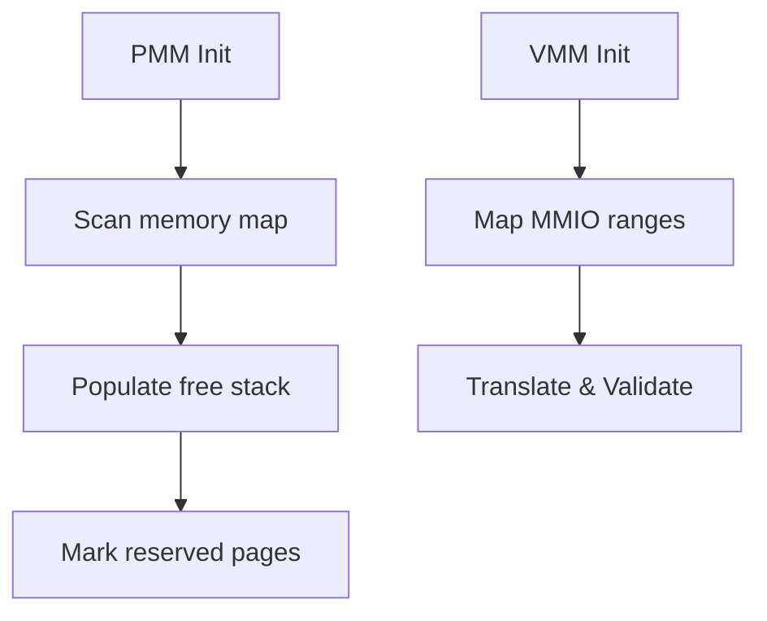

**Diagram sources**
- [pmm.c:41-77](file://kernel/mm/pmm.c#L41-L77)
- [vmm.h:18-26](file://kernel/include/osai/vmm.h#L18-L26)
- [kmain.c:78-84](file://kernel/core/kmain.c#L78-L84)

**Section sources**
- [pmm.c:41-77](file://kernel/mm/pmm.c#L41-L77)
- [vmm.h:8-26](file://kernel/include/osai/vmm.h#L8-L26)
- [kmain.c:78-84](file://kernel/core/kmain.c#L78-L84)

### Device Abstraction (VirtIO Block)
- Driver allocates descriptors, availability, and used rings; negotiates features and sets driver OK.
- DMA safety ensured via VMM translation; sector-based read/write with status handling.

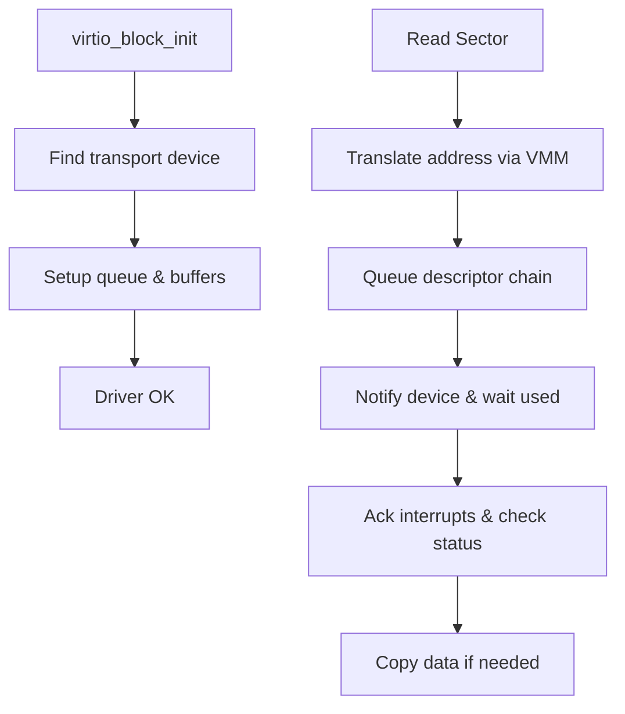

**Diagram sources**
- [virtio_blk.c:87-113](file://kernel/dev/virtio/virtio_blk.c#L87-L113)
- [virtio_blk.c:122-181](file://kernel/dev/virtio/virtio_blk.c#L122-L181)
- [virtio_blk.c:51-57](file://kernel/dev/virtio/virtio_blk.c#L51-L57)

**Section sources**
- [virtio_blk.c:87-113](file://kernel/dev/virtio/virtio_blk.c#L87-L113)
- [virtio_blk.c:122-181](file://kernel/dev/virtio/virtio_blk.c#L122-L181)
- [virtio_blk.c:51-57](file://kernel/dev/virtio/virtio_blk.c#L51-L57)

### Filesystem (Initramfs)
- Reads a read-only filesystem image from VirtIO block storage, validates header and entries, and exposes lookup and configuration.
- Manifest-driven configuration defines service paths and policies.

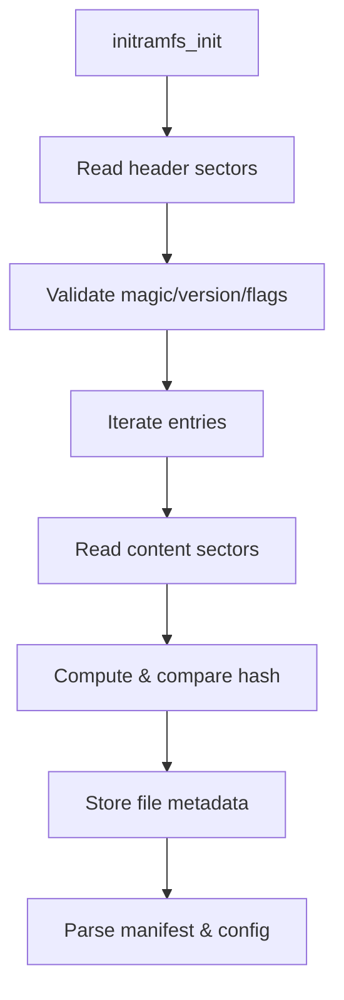

**Diagram sources**
- [initramfs.c:319-397](file://kernel/fs/initramfs.c#L319-L397)
- [initramfs.c:399-415](file://kernel/fs/initramfs.c#L399-L415)

**Section sources**
- [initramfs.c:319-397](file://kernel/fs/initramfs.c#L319-L397)
- [initramfs.c:399-415](file://kernel/fs/initramfs.c#L399-L415)

### Userspace Integration and Syscalls
- Userspace library provides syscall wrappers for logging, filesystem operations, networking, AI runtime, threading, and ML.
- Minimal init demonstrates osctl command usage and basic logging.

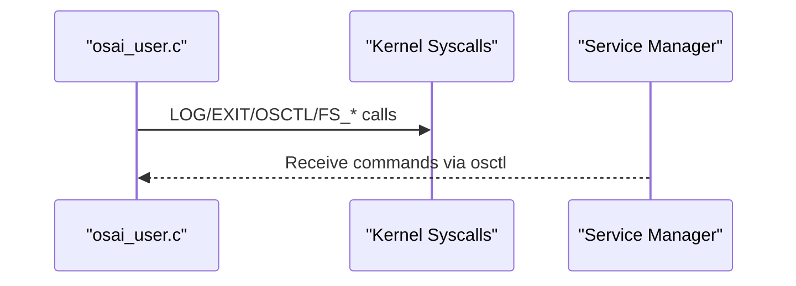

**Diagram sources**
- [osai_user.c:3-13](file://userspace/lib/osai_user.c#L3-L13)
- [osai_user.c:50-69](file://userspace/lib/osai_user.c#L50-L69)
- [init.S:5-83](file://userspace/init/init.S#L5-L83)

**Section sources**
- [osai_user.c:3-13](file://userspace/lib/osai_user.c#L3-L13)
- [osai_user.c:50-69](file://userspace/lib/osai_user.c#L50-L69)
- [init.S:5-83](file://userspace/init/init.S#L5-L83)

## Dependency Analysis
Key dependencies and interactions:
- Loader depends on UEFI protocols and constructs the boot info consumed by the kernel.
- Kernel entry points depend on architecture-specific assembly to set up registers and call the C entry.
- Kernel core depends on memory managers, device drivers, filesystem, and service supervisor.
- Service supervisor depends on security policy, filesystem, and syscall interfaces.
- Userspace relies on syscall wrappers and osctl commands to interact with the kernel.

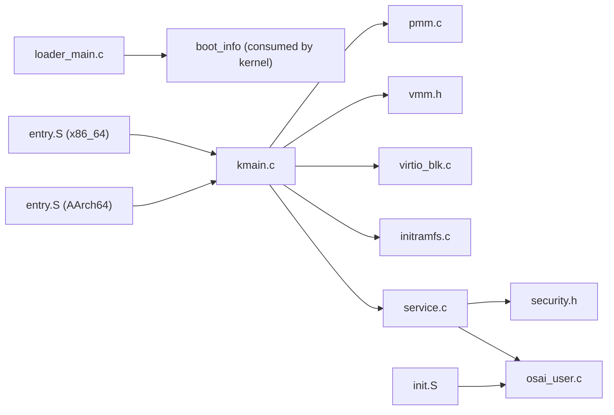

**Diagram sources**
- [loader_main.c:325-335](file://boot/uefi/loader_main.c#L325-L335)
- [entry.S (x86_64):5-15](file://kernel/arch/x86_64/entry.S#L5-L15)
- [entry.S (AArch64):9-22](file://kernel/arch/aarch64/entry.S#L9-L22)
- [kmain.c:71-133](file://kernel/core/kmain.c#L71-L133)
- [service.c:778-798](file://kernel/user/service.c#L778-L798)
- [security.h:7-53](file://kernel/include/osai/security.h#L7-L53)
- [osai_user.c:3-13](file://userspace/lib/osai_user.c#L3-L13)
- [init.S:5-83](file://userspace/init/init.S#L5-L83)

**Section sources**
- [loader_main.c:325-335](file://boot/uefi/loader_main.c#L325-L335)
- [kmain.c:71-133](file://kernel/core/kmain.c#L71-L133)
- [service.c:778-798](file://kernel/user/service.c#L778-L798)

## Performance Considerations
- Predictability: Minimizing scheduler jitter and avoiding generic network paths improves AI workload performance.
- Memory bandwidth: Reducing memory duplication and improving locality can increase effective CPU-AI memory bandwidth.
- Hardware focus: Performance gains derive from removing OS interference rather than exceeding silicon limits.

[No sources needed since this section provides general guidance]

## Troubleshooting Guide
- Boot failures: Validate ELF machine type and program headers; confirm memory map retrieval and boot services exit.
- Memory issues: Verify PMM free page counts and reserved regions; ensure VMM translation and mapping flags are correct.
- Device errors: Confirm VirtIO negotiation, queue setup, and interrupt acknowledgment; check DMA address translation.
- Service policy denials: Review capability masks and security authorizations; inspect denial counters and logs.
- Filesystem corruption: Re-check initramfs header, entry validation, and content hashes.

**Section sources**
- [loader_main.c:161-190](file://boot/uefi/loader_main.c#L161-L190)
- [loader_main.c:247-271](file://boot/uefi/loader_main.c#L247-L271)
- [pmm.c:41-77](file://kernel/mm/pmm.c#L41-L77)
- [virtio_blk.c:87-113](file://kernel/dev/virtio/virtio_blk.c#L87-L113)
- [virtio_blk.c:169-173](file://kernel/dev/virtio/virtio_blk.c#L169-L173)
- [service.c:110-123](file://kernel/user/service.c#L110-L123)
- [initramfs.c:281-294](file://kernel/fs/initramfs.c#L281-L294)

## Conclusion
OSAI’s microkernel architecture cleanly separates kernel and user space, enforces capability-based security, and organizes functionality around services. Multi-architecture support is achieved through minimal, per-arch entry points that delegate to a shared kernel entry routine. The end-to-end flow from UEFI boot to service startup is deterministic and auditable. The design prioritizes predictability and isolation for CPU-bound AI workloads, with performance improvements stemming from reduced OS interference rather than hardware acceleration.

[No sources needed since this section summarizes without analyzing specific files]

## Appendices

### System Boundaries and Integration Patterns
- Kernel boundary: Syscalls define the interface between user and kernel; capabilities gate privileged operations.
- Service boundary: Supervisor-managed state machines and policies govern service lifecycle and interactions.
- Device boundary: VirtIO transport abstraction isolates device specifics from kernel internals.
- Filesystem boundary: Read-only initramfs provides a stable, manifest-driven configuration surface.

[No sources needed since this section provides general guidance]