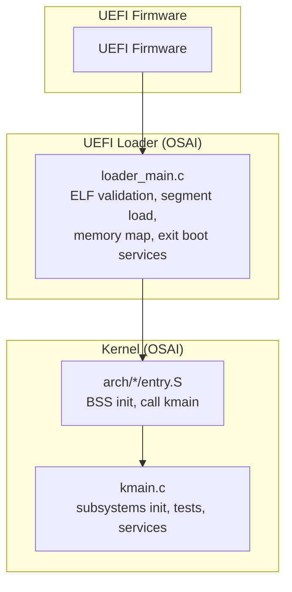
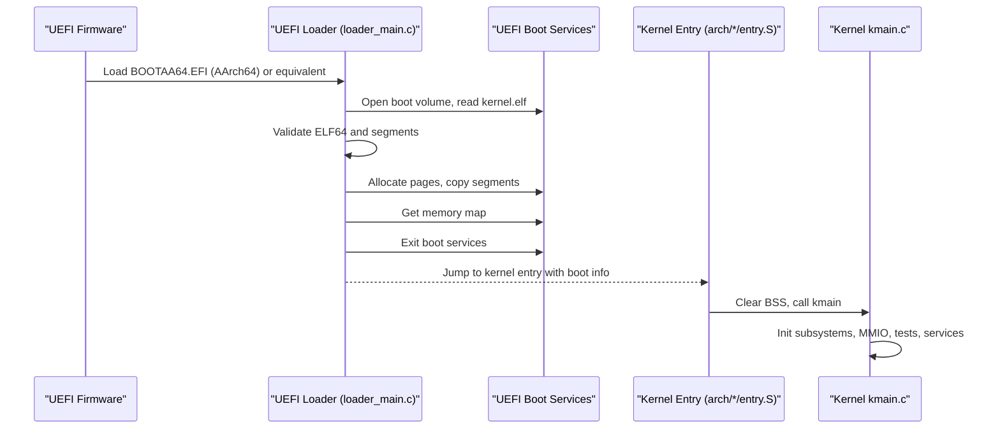
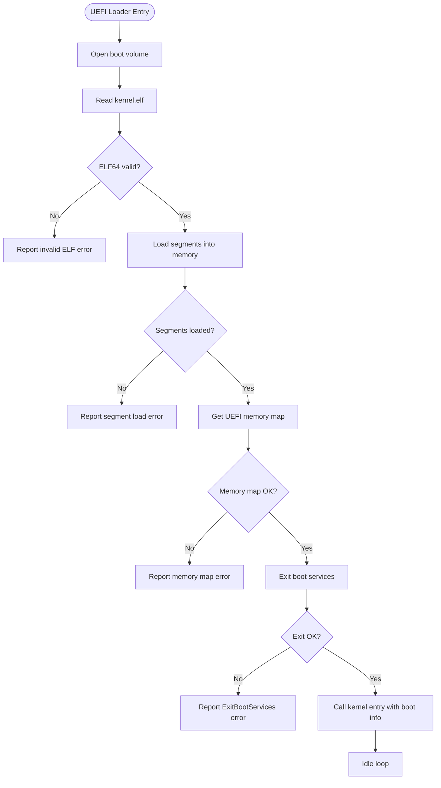
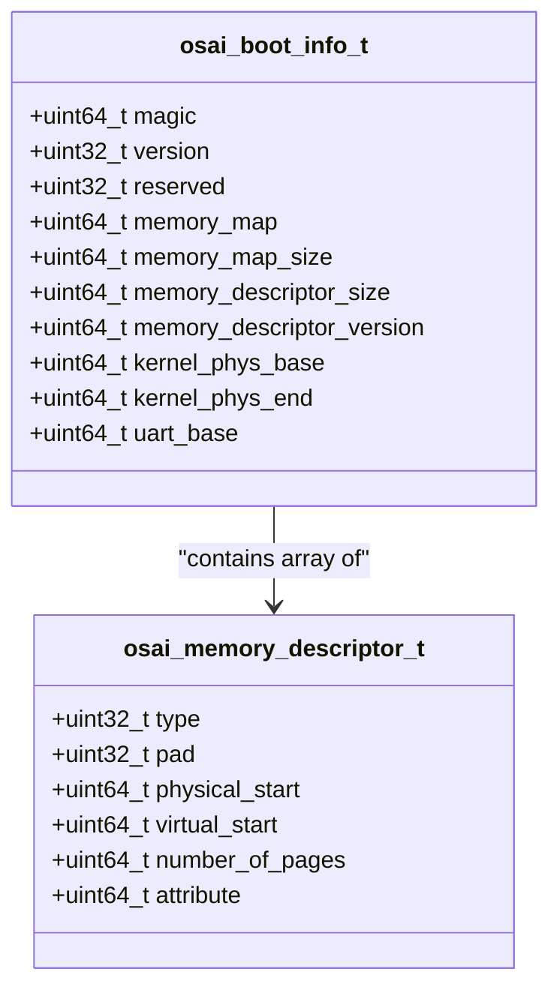
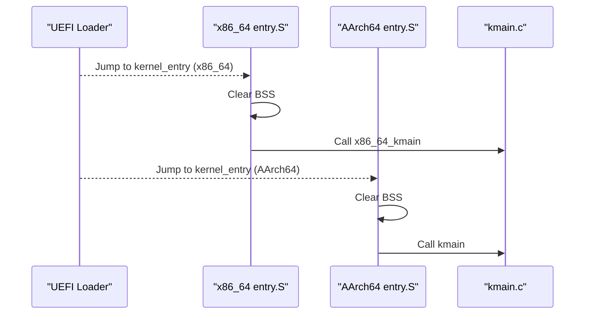
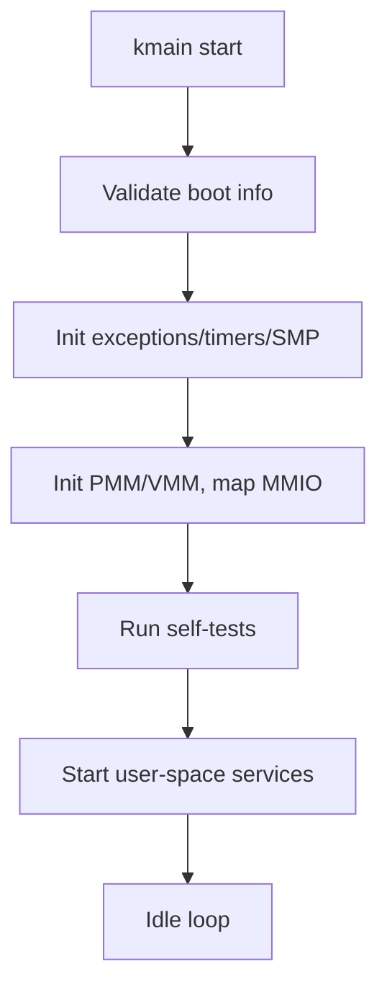
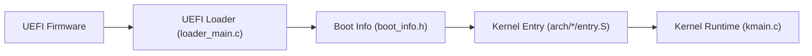

# Boot Troubleshooting

<cite>
**Referenced Files in This Document**
- [loader_main.c](file://boot/uefi/loader_main.c)
- [uefi_min.h](file://boot/uefi/include/uefi_min.h)
- [boot_info.h](file://boot/uefi/boot_info.h)
- [boot_info.h](file://kernel/include/osai/boot_info.h)
- [entry.S (AArch64)](file://kernel/arch/aarch64/entry.S)
- [entry.S (x86_64)](file://kernel/arch/x86_64/entry.S)
- [kmain.c](file://kernel/core/kmain.c)
- [early.c (x86_64)](file://kernel/arch/x86_64/early.c)
- [run-qemu-aarch64.sh](file://scripts/run-qemu-aarch64.sh)
- [run-qemu-x86_64.sh](file://scripts/run-qemu-x86_64.sh)
- [build-image.sh](file://scripts/build-image.sh)
- [create-initfs.py](file://scripts/create-initfs.py)
- [qemu-rc-v1.json](file://contracts/qemu-rc-v1.json)
- [qemu-abi-contract.py](file://scripts/qemu-abi-contract.py)
</cite>

## Table of Contents
1. [Introduction](#introduction)
2. [Project Structure](#project-structure)
3. [Core Components](#core-components)
4. [Architecture Overview](#architecture-overview)
5. [Detailed Component Analysis](#detailed-component-analysis)
6. [Dependency Analysis](#dependency-analysis)
7. [Performance Considerations](#performance-considerations)
8. [Troubleshooting Guide](#troubleshooting-guide)
9. [Conclusion](#conclusion)
10. [Appendices](#appendices)

## Introduction
This document provides a comprehensive boot troubleshooting guide for the OSAI system. It focuses on diagnosing and resolving UEFI boot failures, firmware compatibility issues, memory map initialization failures, kernel loading errors, and QEMU-specific boot problems. It also covers boot sequence debugging, UEFI console output interpretation, memory initialization diagnostics, and recovery procedures for corrupted boot media, missing kernel files, and firmware-related failures. The guide includes platform-agnostic workflows and environment-specific steps for both real hardware and virtualized environments.

## Project Structure
OSAI’s boot pipeline spans three stages:
- UEFI loader: Loads and validates the kernel ELF, collects the UEFI memory map, and transfers control to the OS kernel.
- Kernel entry: Architecture-specific entry assembly initializes BSS and invokes the C kernel main.
- Kernel runtime: Initializes subsystems, memory management, devices, and user-space services.

**Diagram sources**
- [loader_main.c:273-347](file://boot/uefi/loader_main.c#L273-L347)
- [entry.S (AArch64):9-25](file://kernel/arch/aarch64/entry.S#L9-L25)
- [entry.S (x86_64):5-19](file://kernel/arch/x86_64/entry.S#L5-L19)
- [kmain.c:60-133](file://kernel/core/kmain.c#L60-L133)

**Section sources**
- [loader_main.c:1-348](file://boot/uefi/loader_main.c#L1-L348)
- [boot_info.h:20-31](file://kernel/include/osai/boot_info.h#L20-L31)

## Core Components
- UEFI Loader
  - Opens the boot volume, reads kernel.elf, validates ELF64, loads segments, allocates pages, and exits UEFI boot services with a boot info structure containing memory map and UART base.
- Boot Info Contract
  - Defines the boot info layout and memory descriptor format passed from UEFI to the kernel.
- Kernel Entry
  - Architecture-specific entry clears BSS and jumps to kmain.
- Kernel Runtime
  - Validates boot info, initializes exception/timer/SMP/VMM/PMM, maps MMIO regions, runs self-tests, and starts user-space services.

Key responsibilities and failure points:
- UEFI loader: missing kernel.elf, invalid ELF, memory allocation failure, exit boot services failure.
- Memory map: empty or malformed descriptors, insufficient usable memory.
- Kernel entry: BSS clearing, entry symbol resolution, architecture mismatch.
- Kernel runtime: VMM/PMM initialization, MMIO mapping, device probing, user-space startup.

**Section sources**
- [loader_main.c:126-159](file://boot/uefi/loader_main.c#L126-L159)
- [loader_main.c:161-190](file://boot/uefi/loader_main.c#L161-L190)
- [loader_main.c:192-245](file://boot/uefi/loader_main.c#L192-L245)
- [loader_main.c:247-271](file://boot/uefi/loader_main.c#L247-L271)
- [loader_main.c:273-347](file://boot/uefi/loader_main.c#L273-L347)
- [boot_info.h:11-31](file://kernel/include/osai/boot_info.h#L11-L31)
- [entry.S (AArch64):9-25](file://kernel/arch/aarch64/entry.S#L9-L25)
- [entry.S (x86_64):5-19](file://kernel/arch/x86_64/entry.S#L5-L19)
- [kmain.c:60-133](file://kernel/core/kmain.c#L60-L133)

## Architecture Overview
The boot sequence is a strict pipeline with explicit handoffs and error reporting.

**Diagram sources**
- [loader_main.c:273-347](file://boot/uefi/loader_main.c#L273-L347)
- [entry.S (AArch64):9-25](file://kernel/arch/aarch64/entry.S#L9-L25)
- [entry.S (x86_64):5-19](file://kernel/arch/x86_64/entry.S#L5-L19)
- [kmain.c:60-133](file://kernel/core/kmain.c#L60-L133)

## Detailed Component Analysis

### UEFI Loader: ELF Validation and Segment Loading
- File operations: opens root volume and reads kernel.elf from the expected path.
- ELF validation: checks magic, class/data, type, machine, program header table presence and bounds.
- Segment loading: iterates program headers, allocates pages at the correct addresses, clears and copies segment data, tracks base/end.
- Memory map collection: queries UEFI memory map size, allocates buffer, retrieves descriptors.
- Boot services exit: passes the memory map key to exit boot services safely.
- Boot info construction: fills magic/version and metadata for the kernel.

Common failure modes:
- Missing kernel.elf: loader reports a missing kernel error and halts.
- Invalid ELF: loader rejects mismatched machine or invalid ELF header.
- Segment load failure: allocation or copying errors lead to load errors.
- Memory map retrieval failure: indicates firmware or memory issues.
- Exit boot services failure: prevents handoff to kernel.

**Diagram sources**
- [loader_main.c:126-159](file://boot/uefi/loader_main.c#L126-L159)
- [loader_main.c:161-190](file://boot/uefi/loader_main.c#L161-L190)
- [loader_main.c:192-245](file://boot/uefi/loader_main.c#L192-L245)
- [loader_main.c:247-271](file://boot/uefi/loader_main.c#L247-L271)
- [loader_main.c:273-347](file://boot/uefi/loader_main.c#L273-L347)

**Section sources**
- [loader_main.c:126-159](file://boot/uefi/loader_main.c#L126-L159)
- [loader_main.c:161-190](file://boot/uefi/loader_main.c#L161-L190)
- [loader_main.c:192-245](file://boot/uefi/loader_main.c#L192-L245)
- [loader_main.c:247-271](file://boot/uefi/loader_main.c#L247-L271)
- [loader_main.c:273-347](file://boot/uefi/loader_main.c#L273-L347)

### Boot Info Contract and Memory Descriptors
- Boot info structure includes magic/version, memory map pointer/size/descriptor size/version, kernel physical base/end, and UART base.
- Memory descriptors define type, physical/virtual start, number of pages, and attributes. Conventional memory type is used to compute usable memory.

**Diagram sources**
- [boot_info.h:11-31](file://kernel/include/osai/boot_info.h#L11-L31)

**Section sources**
- [boot_info.h:11-31](file://kernel/include/osai/boot_info.h#L11-L31)

### Kernel Entry: Architecture-Specific Assembly
- AArch64: Clears BSS, saves boot info pointer, calls kmain.
- x86_64: Clears BSS, calls architecture-specific kmain entry, loops with halt or WFE.

**Diagram sources**
- [entry.S (AArch64):9-25](file://kernel/arch/aarch64/entry.S#L9-L25)
- [entry.S (x86_64):5-19](file://kernel/arch/x86_64/entry.S#L5-L19)
- [kmain.c:60-70](file://kernel/core/kmain.c#L60-L70)

**Section sources**
- [entry.S (AArch64):9-25](file://kernel/arch/aarch64/entry.S#L9-L25)
- [entry.S (x86_64):5-19](file://kernel/arch/x86_64/entry.S#L5-L19)
- [kmain.c:60-70](file://kernel/core/kmain.c#L60-L70)

### Kernel Runtime: Subsystem Initialization and Diagnostics
- kmain validates boot info magic/version, logs memory map and kernel range, initializes exceptions/timers/SMP/VMM/PMM, maps MMIO regions, runs self-tests, and starts user-space services.
- x86_64 early path prints milestones via serial and performs memory map parsing and page table installation.

**Diagram sources**
- [kmain.c:60-133](file://kernel/core/kmain.c#L60-L133)
- [early.c (x86_64):356-387](file://kernel/arch/x86_64/early.c#L356-L387)
- [early.c (x86_64):689-715](file://kernel/arch/x86_64/early.c#L689-L715)

**Section sources**
- [kmain.c:60-133](file://kernel/core/kmain.c#L60-L133)
- [early.c (x86_64):356-387](file://kernel/arch/x86_64/early.c#L356-L387)
- [early.c (x86_64):689-715](file://kernel/arch/x86_64/early.c#L689-L715)

## Dependency Analysis
- UEFI Loader depends on UEFI protocols for file I/O and memory map retrieval.
- Boot info bridges UEFI loader and kernel.
- Kernel entry depends on architecture-specific assembly and the boot info contract.
- Kernel runtime depends on boot info correctness and firmware memory map quality.

**Diagram sources**
- [loader_main.c:273-347](file://boot/uefi/loader_main.c#L273-L347)
- [boot_info.h:20-31](file://kernel/include/osai/boot_info.h#L20-L31)
- [entry.S (AArch64):9-25](file://kernel/arch/aarch64/entry.S#L9-L25)
- [entry.S (x86_64):5-19](file://kernel/arch/x86_64/entry.S#L5-L19)
- [kmain.c:60-70](file://kernel/core/kmain.c#L60-L70)

**Section sources**
- [loader_main.c:273-347](file://boot/uefi/loader_main.c#L273-L347)
- [boot_info.h:20-31](file://kernel/include/osai/boot_info.h#L20-L31)
- [entry.S (AArch64):9-25](file://kernel/arch/aarch64/entry.S#L9-L25)
- [entry.S (x86_64):5-19](file://kernel/arch/x86_64/entry.S#L5-L19)
- [kmain.c:60-70](file://kernel/core/kmain.c#L60-L70)

## Performance Considerations
- Minimize UEFI boot services usage after handoff to reduce latency.
- Prefer aligned allocations and contiguous segments to simplify memory map parsing.
- Keep kernel.elf minimal and relocatable to reduce load overhead.
- Use appropriate accelerators in QEMU to avoid unnecessary emulation overhead during development.

[No sources needed since this section provides general guidance]

## Troubleshooting Guide

### Step-by-Step Boot Failure Diagnostics

- Stage 1: UEFI Loader Failures
  - Symptoms: Immediate halt after “OSAI loader starting” or “could not open boot volume.”
  - Checks:
    - Verify kernel.elf exists on the FAT partition under the expected path.
    - Confirm the loader target matches the built kernel (x86_64 vs AArch64).
    - Inspect loader error messages for missing kernel or invalid ELF.
  - Actions:
    - Rebuild images and ensure kernel.elf is copied to the FAT partition.
    - Validate ELF machine type and class.

- Stage 2: ELF Validation and Segment Loading
  - Symptoms: “invalid ELF” or “failed to load kernel segments.”
  - Checks:
    - Validate ELF64 magic/class/data/type/machine.
    - Ensure program headers are present and within file bounds.
    - Confirm segment alignment and file sizes.
  - Actions:
    - Recompile kernel with matching toolchain and architecture.
    - Fix linker script and ensure segment placement.

- Stage 3: Memory Map and Boot Services Exit
  - Symptoms: “failed to get memory map” or “ExitBootServices failed.”
  - Checks:
    - Confirm memory map retrieval succeeds and descriptors are non-empty.
    - Ensure the map key is passed correctly to exit boot services.
  - Actions:
    - Retry memory map buffer sizing and allocation.
    - Investigate firmware stability or memory issues.

- Stage 4: Kernel Entry and Runtime
  - Symptoms: Hang after “Clear BSS,” or immediate crash after “call kmain.”
  - Checks:
    - Verify architecture-specific entry assembly is correct.
    - Confirm boot info magic/version and kernel range are logged.
    - Review early x86_64 milestones and MMIO mappings.
  - Actions:
    - Align kernel entry with expected ABI and boot info layout.
    - Validate VMM/PMM initialization and MMIO mappings.

- Stage 5: QEMU-Specific Issues
  - Symptoms: Firmware not found, missing hardware, or architecture mismatch.
  - Checks:
    - Verify firmware paths and availability (OVMF/AAVMF).
    - Confirm machine/cpu/memory/smp settings match expectations.
    - Ensure VirtIO drives and networking are attached.
  - Actions:
    - Set firmware environment variables or adjust search paths.
    - Adjust machine acceleration and CPU model per platform.

**Section sources**
- [loader_main.c:273-347](file://boot/uefi/loader_main.c#L273-L347)
- [loader_main.c:161-190](file://boot/uefi/loader_main.c#L161-L190)
- [loader_main.c:192-245](file://boot/uefi/loader_main.c#L192-L245)
- [loader_main.c:247-271](file://boot/uefi/loader_main.c#L247-L271)
- [kmain.c:60-133](file://kernel/core/kmain.c#L60-L133)
- [early.c (x86_64):689-715](file://kernel/arch/x86_64/early.c#L689-L715)
- [run-qemu-aarch64.sh:41-96](file://scripts/run-qemu-aarch64.sh#L41-L96)
- [run-qemu-x86_64.sh:41-94](file://scripts/run-qemu-x86_64.sh#L41-L94)

### UEFI Console Output Interpretation
- “OSAI loader starting”: Loader entry point reached.
- “OSAI loader target: x86_64 UEFI” or “AArch64 UEFI”: Target architecture detected.
- “could not open boot volume”: Volume protocol or device handle issue.
- “missing kernel.elf”: Kernel file not found on FAT partition.
- “invalid x86_64 ELF64” or “invalid AArch64 ELF64”: ELF mismatch or corrupted file.
- “failed to load kernel segments”: Allocation or segment copy failure.
- “failed to get memory map”: UEFI memory map retrieval error.
- “ExitBootServices failed”: Boot services exit prevented by lingering protocols.

Action: Cross-check with loader error branches and firmware logs.

**Section sources**
- [loader_main.c:273-347](file://boot/uefi/loader_main.c#L273-L347)

### Memory Initialization Diagnostics
- x86_64 Early Path:
  - Milestones printed indicate successful memory map parsing, page table installation, APIC timer discovery, PCI enumeration, and placement policy building.
  - If milestones fail, inspect memory map parsing and page table installation routines.
- Boot Info Memory Descriptor:
  - Ensure conventional memory regions are recognized and usable pages are positive.

**Section sources**
- [early.c (x86_64):356-387](file://kernel/arch/x86_64/early.c#L356-L387)
- [early.c (x86_64):689-715](file://kernel/arch/x86_64/early.c#L689-L715)
- [boot_info.h:9-18](file://kernel/include/osai/boot_info.h#L9-L18)

### QEMU-Specific Boot Problems
- Firmware Not Found
  - x86_64: OVMF_CODE path not found; set OSAI_OVMF_CODE or install firmware.
  - AArch64: AAVMF_CODE path not found; set OSAI_AAVMF_CODE or install firmware.
- Architecture Mismatch
  - Using wrong QEMU binary or CPU/machine for the built kernel.
- Missing Hardware Emulation
  - Missing VirtIO block/net devices or drive attachments.
- Configuration Errors
  - Incorrect memory, SMP, or acceleration settings.

Recovery:
- Use provided scripts to locate firmware and attach drives.
- Adjust machine acceleration and CPU model per platform.
- Validate network and serial redirection settings.

**Section sources**
- [run-qemu-aarch64.sh:41-96](file://scripts/run-qemu-aarch64.sh#L41-L96)
- [run-qemu-x86_64.sh:41-94](file://scripts/run-qemu-x86_64.sh#L41-L94)

### Recovery Procedures
- Corrupted Boot Sector/Image
  - Recreate the FAT image and ensure kernel.elf and loader are copied correctly.
  - Use the build script to generate the image and initialize the read-only initramfs.
- Missing Kernel Files
  - Rebuild kernel and ensure kernel.elf is produced and placed on the FAT partition.
- Firmware-Related Failures
  - Point firmware variables to valid firmware images or install firmware packages.
  - Validate firmware compatibility with the chosen machine type.

**Section sources**
- [build-image.sh:339-351](file://scripts/build-image.sh#L339-L351)
- [build-image.sh:357-365](file://scripts/build-image.sh#L357-L365)
- [create-initfs.py:94-157](file://scripts/create-initfs.py#L94-L157)
- [run-qemu-aarch64.sh:93-96](file://scripts/run-qemu-aarch64.sh#L93-L96)
- [run-qemu-x86_64.sh:91-94](file://scripts/run-qemu-x86_64.sh#L91-L94)

### Troubleshooting Workflows by Platform and Environment
- Real Hardware (UEFI)
  - Verify firmware compatibility and secure boot settings.
  - Ensure the FAT partition contains the correct loader and kernel.
  - Monitor UEFI console output for loader errors.
- QEMU (AArch64)
  - Confirm firmware path and machine acceleration.
  - Attach VirtIO block and network devices.
  - Use serial redirection for console output.
- QEMU (x86_64)
  - Validate OVMF path and CPU/machine selection.
  - Redirect serial output and configure networking.

Contract and ABI Validation
- Use the ABI contract checker to validate initramfs and model formats against the release candidate contract.
- Ensure required paths and constants match the contract.

**Section sources**
- [qemu-rc-v1.json:190-231](file://contracts/qemu-rc-v1.json#L190-L231)
- [qemu-abi-contract.py:37-67](file://scripts/qemu-abi-contract.py#L37-L67)
- [qemu-abi-contract.py:70-94](file://scripts/qemu-abi-contract.py#L70-L94)

## Conclusion
This guide mapped OSAI’s boot pipeline from UEFI loader to kernel runtime, identified common failure points, and provided actionable diagnostics and recovery steps. By following the stage-wise troubleshooting procedures, interpreting UEFI console output, validating memory initialization, and ensuring QEMU configuration parity with the build artifacts, most boot failures can be diagnosed and resolved efficiently.

[No sources needed since this section summarizes without analyzing specific files]

## Appendices

### Appendix A: Boot Info Layout Reference
- Magic and Version: Used to validate boot info integrity.
- Memory Map Pointer/Size/Descriptor Size/Version: Passed from UEFI to kernel for memory management.
- Kernel Physical Base/End: Indicates where the kernel was loaded.
- UART Base: Provides a serial port address for logging.

**Section sources**
- [boot_info.h:20-31](file://kernel/include/osai/boot_info.h#L20-L31)

### Appendix B: QEMU Firmware and Image Creation
- Scripts locate firmware automatically and construct images with FAT partitions and kernel.elf.
- The initramfs generator creates a read-only filesystem image with required manifests and binaries.

**Section sources**
- [run-qemu-aarch64.sh:41-96](file://scripts/run-qemu-aarch64.sh#L41-L96)
- [run-qemu-x86_64.sh:41-94](file://scripts/run-qemu-x86_64.sh#L41-L94)
- [build-image.sh:339-351](file://scripts/build-image.sh#L339-L351)
- [build-image.sh:357-365](file://scripts/build-image.sh#L357-L365)
- [create-initfs.py:94-157](file://scripts/create-initfs.py#L94-L157)