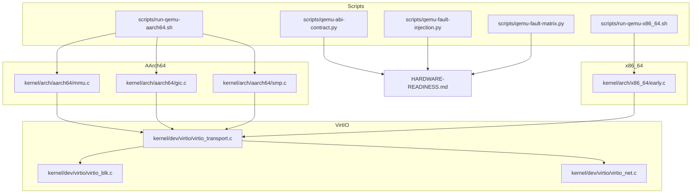
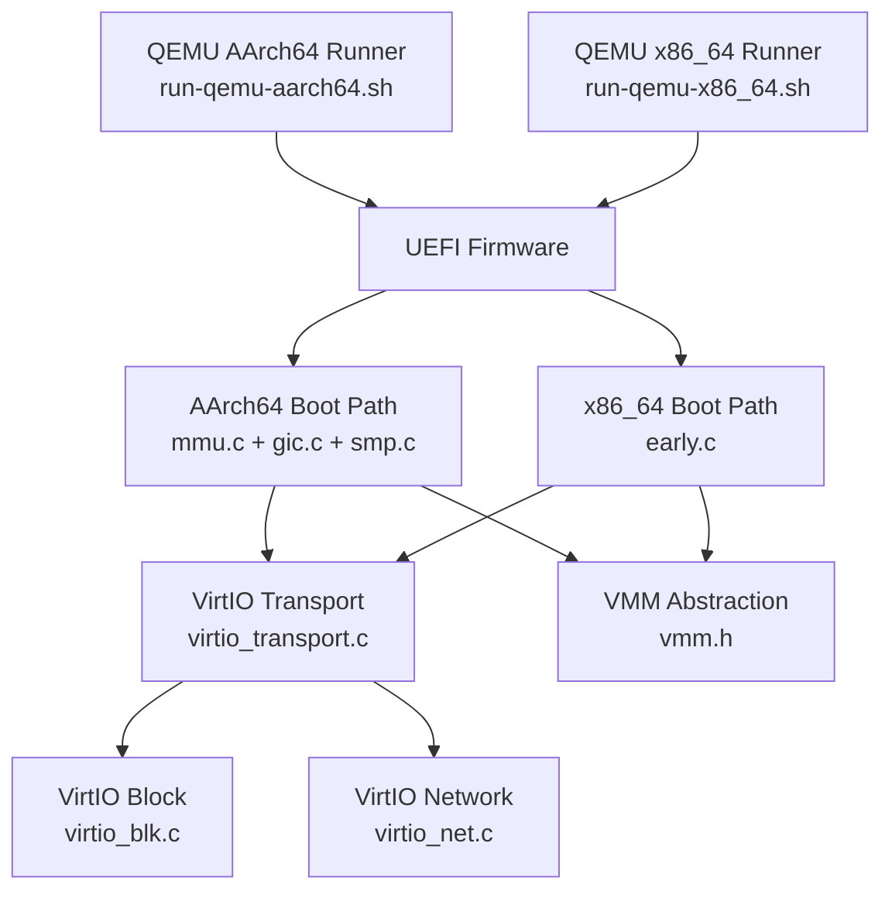
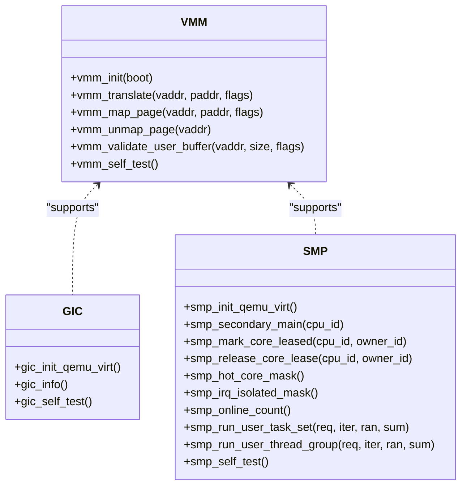
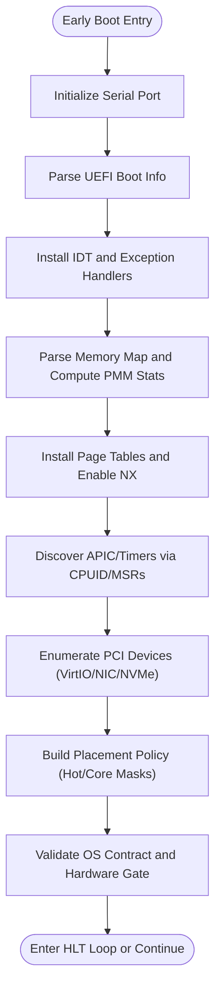
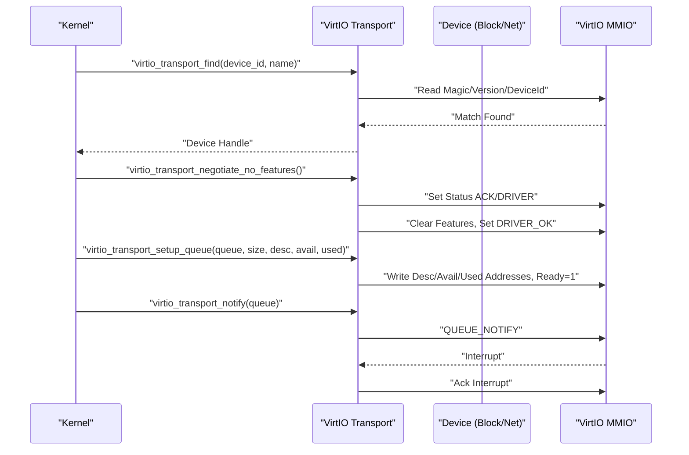
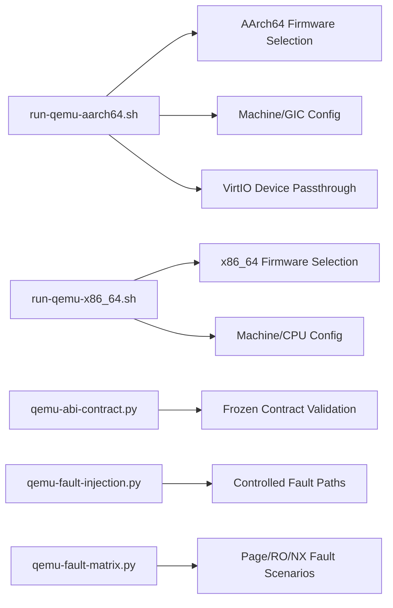
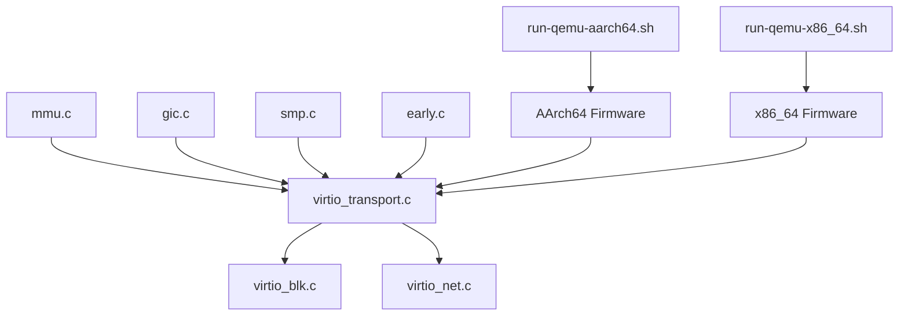

# Hardware Compatibility

<cite>
**Referenced Files in This Document**
- [gic.c](file://kernel/arch/aarch64/gic.c)
- [mmu.c](file://kernel/arch/aarch64/mmu.c)
- [smp.c](file://kernel/arch/aarch64/smp.c)
- [early.c](file://kernel/arch/x86_64/early.c)
- [virtio_blk.c](file://kernel/dev/virtio/virtio_blk.c)
- [virtio_net.c](file://kernel/dev/virtio/virtio_net.c)
- [virtio_transport.c](file://kernel/dev/virtio/virtio_transport.c)
- [run-qemu-aarch64.sh](file://scripts/run-qemu-aarch64.sh)
- [run-qemu-x86_64.sh](file://scripts/run-qemu-x86_64.sh)
- [qemu-abi-contract.py](file://scripts/qemu-abi-contract.py)
- [qemu-fault-injection.py](file://scripts/qemu-fault-injection.py)
- [qemu-fault-matrix.py](file://scripts/qemu-fault-matrix.py)
- [HARDWARE-READINESS.md](file://HARDWARE-READINESS.md)
- [vmm.h](file://kernel/include/osai/vmm.h)
- [gic.h](file://kernel/include/osai/gic.h)
</cite>

## Table of Contents
1. [Introduction](#introduction)
2. [Project Structure](#project-structure)
3. [Core Components](#core-components)
4. [Architecture Overview](#architecture-overview)
5. [Detailed Component Analysis](#detailed-component-analysis)
6. [Dependency Analysis](#dependency-analysis)
7. [Performance Considerations](#performance-considerations)
8. [Troubleshooting Guide](#troubleshooting-guide)
9. [Conclusion](#conclusion)
10. [Appendices](#appendices)

## Introduction
This document provides comprehensive hardware compatibility troubleshooting guidance for the OSAI system across AArch64 and x86_64 platforms. It focuses on architecture-specific compatibility issues, CPU feature detection, hardware abstraction via the Virtual Memory Manager (VMM), VirtIO driver compatibility, device emulation, and virtualization constraints. It also covers memory controller and cache coherency considerations, interrupt controller problems, firmware compatibility, and platform-specific initialization failures. Practical troubleshooting procedures, virtualization compatibility notes, and hardware debugging techniques are included to diagnose and resolve unsupported hardware, missing drivers, and feature detection failures.

## Project Structure
OSAI organizes hardware-related logic by architecture under kernel/arch and device drivers under kernel/dev. The scripts directory provides QEMU launchers and gating/validation utilities for virtualized environments. The HARDWARE-READINESS.md document defines acceptance criteria and gates for QEMU-based compatibility verification.

**Diagram sources**
- [mmu.c:1-452](file://kernel/arch/aarch64/mmu.c#L1-452)
- [gic.c:1-39](file://kernel/arch/aarch64/gic.c#L1-39)
- [smp.c:1-285](file://kernel/arch/aarch64/smp.c#L1-285)
- [early.c:1-726](file://kernel/arch/x86_64/early.c#L1-726)
- [virtio_transport.c:1-183](file://kernel/dev/virtio/virtio_transport.c#L1-183)
- [virtio_blk.c:1-225](file://kernel/dev/virtio/virtio_blk.c#L1-225)
- [virtio_net.c:1-183](file://kernel/dev/virtio/virtio_net.c#L1-183)
- [run-qemu-aarch64.sh:1-162](file://scripts/run-qemu-aarch64.sh#L1-162)
- [run-qemu-x86_64.sh:1-127](file://scripts/run-qemu-x86_64.sh#L1-127)
- [qemu-abi-contract.py:1-128](file://scripts/qemu-abi-contract.py#L1-128)
- [qemu-fault-injection.py:1-81](file://scripts/qemu-fault-injection.py#L1-81)
- [qemu-fault-matrix.py:1-136](file://scripts/qemu-fault-matrix.py#L1-136)
- [HARDWARE-READINESS.md:1-135](file://HARDWARE-READINESS.md#L1-135)

**Section sources**
- [mmu.c:1-452](file://kernel/arch/aarch64/mmu.c#L1-452)
- [gic.c:1-39](file://kernel/arch/aarch64/gic.c#L1-39)
- [smp.c:1-285](file://kernel/arch/aarch64/smp.c#L1-285)
- [early.c:1-726](file://kernel/arch/x86_64/early.c#L1-726)
- [virtio_transport.c:1-183](file://kernel/dev/virtio/virtio_transport.c#L1-183)
- [virtio_blk.c:1-225](file://kernel/dev/virtio/virtio_blk.c#L1-225)
- [virtio_net.c:1-183](file://kernel/dev/virtio/virtio_net.c#L1-183)
- [run-qemu-aarch64.sh:1-162](file://scripts/run-qemu-aarch64.sh#L1-162)
- [run-qemu-x86_64.sh:1-127](file://scripts/run-qemu-x86_64.sh#L1-127)
- [qemu-abi-contract.py:1-128](file://scripts/qemu-abi-contract.py#L1-128)
- [qemu-fault-injection.py:1-81](file://scripts/qemu-fault-injection.py#L1-81)
- [qemu-fault-matrix.py:1-136](file://scripts/qemu-fault-matrix.py#L1-136)
- [HARDWARE-READINESS.md:1-135](file://HARDWARE-READINESS.md#L1-135)

## Core Components
- AArch64 hardware abstraction:
  - MMU and memory mapping for early boot and runtime.
  - Generic Interrupt Controller (GIC) discovery for QEMU virt.
  - SMP initialization via PSCI for secondary cores.
- x86_64 hardware abstraction:
  - Early boot path including IDT setup, memory map parsing, paging, APIC/timer discovery, PCI enumeration, and OS contract validation.
- VirtIO subsystem:
  - Transport layer for MMIO-based VirtIO devices.
  - Block and network device drivers with DMA and queue management.
- Virtualization and firmware:
  - QEMU launch scripts for AArch64 and x86_64 with firmware selection and acceleration hints.
  - Contract and fault-injection validation suites for compatibility gates.

**Section sources**
- [mmu.c:1-452](file://kernel/arch/aarch64/mmu.c#L1-452)
- [gic.c:1-39](file://kernel/arch/aarch64/gic.c#L1-39)
- [smp.c:1-285](file://kernel/arch/aarch64/smp.c#L1-285)
- [early.c:1-726](file://kernel/arch/x86_64/early.c#L1-726)
- [virtio_transport.c:1-183](file://kernel/dev/virtio/virtio_transport.c#L1-183)
- [virtio_blk.c:1-225](file://kernel/dev/virtio/virtio_blk.c#L1-225)
- [virtio_net.c:1-183](file://kernel/dev/virtio/virtio_net.c#L1-183)
- [run-qemu-aarch64.sh:1-162](file://scripts/run-qemu-aarch64.sh#L1-162)
- [run-qemu-x86_64.sh:1-127](file://scripts/run-qemu-x86_64.sh#L1-127)

## Architecture Overview
The OSAI kernel implements architecture-specific hardware abstractions and a portable VirtIO transport to enable compatibility across AArch64 and x86_64. Early boot sequences initialize memory and interrupts, enumerate devices, and validate contracts before handing off to higher-level services.

**Diagram sources**
- [mmu.c:1-452](file://kernel/arch/aarch64/mmu.c#L1-452)
- [gic.c:1-39](file://kernel/arch/aarch64/gic.c#L1-39)
- [smp.c:1-285](file://kernel/arch/aarch64/smp.c#L1-285)
- [early.c:1-726](file://kernel/arch/x86_64/early.c#L1-726)
- [virtio_transport.c:1-183](file://kernel/dev/virtio/virtio_transport.c#L1-183)
- [virtio_blk.c:1-225](file://kernel/dev/virtio/virtio_blk.c#L1-225)
- [virtio_net.c:1-183](file://kernel/dev/virtio/virtio_net.c#L1-183)
- [vmm.h:1-29](file://kernel/include/osai/vmm.h#L1-29)
- [run-qemu-aarch64.sh:1-162](file://scripts/run-qemu-aarch64.sh#L1-162)
- [run-qemu-x86_64.sh:1-127](file://scripts/run-qemu-x86_64.sh#L1-127)

## Detailed Component Analysis

### AArch64 Hardware Abstraction Layer
- MMU and memory mapping:
  - Identity mapping for early boot and kernel regions.
  - Page table construction with attributes for normal, device, user, and privilege modes.
  - Translation and mapping APIs with TLB invalidation.
- GIC discovery:
  - Initializes QEMU virt GIC-Distributor registers and reads type/identification fields.
- SMP:
  - Uses PSCI to boot secondary CPUs and maintains per-CPU state and masks.

**Diagram sources**
- [mmu.c:335-451](file://kernel/arch/aarch64/mmu.c#L335-451)
- [gic.c:17-38](file://kernel/arch/aarch64/gic.c#L17-38)
- [smp.c:61-104](file://kernel/arch/aarch64/smp.c#L61-104)

**Section sources**
- [mmu.c:1-452](file://kernel/arch/aarch64/mmu.c#L1-452)
- [gic.c:1-39](file://kernel/arch/aarch64/gic.c#L1-39)
- [smp.c:1-285](file://kernel/arch/aarch64/smp.c#L1-285)

### x86_64 Hardware Abstraction Layer
- Early boot path:
  - Serial initialization and logging.
  - IDT setup for exception vectors.
  - Memory map parsing and PMM state computation.
  - Paging setup with EFER.NXE and identity mapping limits.
  - APIC/timer feature discovery via CPUID and MSRs.
  - PCI enumeration for VirtIO, NIC, and NVMe devices.
  - Placement policy and OS contract validation.
- Hardware gate validation and milestone progression.

**Diagram sources**
- [early.c:673-725](file://kernel/arch/x86_64/early.c#L673-725)

**Section sources**
- [early.c:1-726](file://kernel/arch/x86_64/early.c#L1-726)

### VirtIO Driver Compatibility
- Transport:
  - MMIO-based discovery of VirtIO devices.
  - Negotiation of features and queue setup with DMA addresses.
  - Notification and interrupt acknowledgment.
- Block driver:
  - Queue-based transfers with proper descriptor flags and barrier usage.
  - Capacity detection and read/write operations with status handling.
- Network driver:
  - ARP request generation and RX/TX queue setup.
  - Malformed packet filtering and self-test routines.

**Diagram sources**
- [virtio_transport.c:75-183](file://kernel/dev/virtio/virtio_transport.c#L75-183)
- [virtio_blk.c:87-113](file://kernel/dev/virtio/virtio_blk.c#L87-113)
- [virtio_net.c:131-182](file://kernel/dev/virtio/virtio_net.c#L131-182)

**Section sources**
- [virtio_transport.c:1-183](file://kernel/dev/virtio/virtio_transport.c#L1-183)
- [virtio_blk.c:1-225](file://kernel/dev/virtio/virtio_blk.c#L1-225)
- [virtio_net.c:1-183](file://kernel/dev/virtio/virtio_net.c#L1-183)

### Virtualization Compatibility and Firmware
- AArch64:
  - QEMU runner sets machine=gic-version=3, global virtio-mmio legacy off, and selects UEFI firmware.
  - Acceleration defaults to hvf when available; otherwise tcg.
- x86_64:
  - QEMU runner configures machine accel, CPU model, and OVMF firmware.
- Contract and fault-injection:
  - ABI contract validation ensures syscall and format contracts remain frozen.
  - Fault injection and matrix tests validate controlled fault paths and smoke behavior.

**Diagram sources**
- [run-qemu-aarch64.sh:132-154](file://scripts/run-qemu-aarch64.sh#L132-154)
- [run-qemu-x86_64.sh:109-119](file://scripts/run-qemu-x86_64.sh#L109-119)
- [qemu-abi-contract.py:97-128](file://scripts/qemu-abi-contract.py#L97-128)
- [qemu-fault-injection.py:42-77](file://scripts/qemu-fault-injection.py#L42-77)
- [qemu-fault-matrix.py:112-131](file://scripts/qemu-fault-matrix.py#L112-131)

**Section sources**
- [run-qemu-aarch64.sh:1-162](file://scripts/run-qemu-aarch64.sh#L1-162)
- [run-qemu-x86_64.sh:1-127](file://scripts/run-qemu-x86_64.sh#L1-127)
- [qemu-abi-contract.py:1-128](file://scripts/qemu-abi-contract.py#L1-128)
- [qemu-fault-injection.py:1-81](file://scripts/qemu-fault-injection.py#L1-81)
- [qemu-fault-matrix.py:1-136](file://scripts/qemu-fault-matrix.py#L1-136)

## Dependency Analysis
- AArch64 depends on MMU and GIC for memory and interrupts; SMP relies on PSCI.
- x86_64 depends on IDT, PMM, paging, APIC/timer, and PCI for device discovery.
- VirtIO transport is a shared dependency for both architectures.
- Scripts orchestrate firmware selection and device passthrough.

**Diagram sources**
- [mmu.c:1-452](file://kernel/arch/aarch64/mmu.c#L1-452)
- [gic.c:1-39](file://kernel/arch/aarch64/gic.c#L1-39)
- [smp.c:1-285](file://kernel/arch/aarch64/smp.c#L1-285)
- [early.c:1-726](file://kernel/arch/x86_64/early.c#L1-726)
- [virtio_transport.c:1-183](file://kernel/dev/virtio/virtio_transport.c#L1-183)
- [virtio_blk.c:1-225](file://kernel/dev/virtio/virtio_blk.c#L1-225)
- [virtio_net.c:1-183](file://kernel/dev/virtio/virtio_net.c#L1-183)
- [run-qemu-aarch64.sh:1-162](file://scripts/run-qemu-aarch64.sh#L1-162)
- [run-qemu-x86_64.sh:1-127](file://scripts/run-qemu-x86_64.sh#L1-127)

**Section sources**
- [mmu.c:1-452](file://kernel/arch/aarch64/mmu.c#L1-452)
- [gic.c:1-39](file://kernel/arch/aarch64/gic.c#L1-39)
- [smp.c:1-285](file://kernel/arch/aarch64/smp.c#L1-285)
- [early.c:1-726](file://kernel/arch/x86_64/early.c#L1-726)
- [virtio_transport.c:1-183](file://kernel/dev/virtio/virtio_transport.c#L1-183)
- [virtio_blk.c:1-225](file://kernel/dev/virtio/virtio_blk.c#L1-225)
- [virtio_net.c:1-183](file://kernel/dev/virtio/virtio_net.c#L1-183)
- [run-qemu-aarch64.sh:1-162](file://scripts/run-qemu-aarch64.sh#L1-162)
- [run-qemu-x86_64.sh:1-127](file://scripts/run-qemu-x86_64.sh#L1-127)

## Performance Considerations
- Virtualization acceleration:
  - AArch64 prefers HVF on macOS; falls back to TCG. x86_64 uses TCG by default but supports configurable accel.
- Firmware and device emulation:
  - Using modern UEFI firmware and virtio-mmio improves compatibility and reduces overhead.
- Memory and paging:
  - Proper page table attributes and TLB invalidation minimize translation faults and improve performance.
- Interrupt handling:
  - Correct GIC/APIC configuration and barrier usage reduce latency and spurious interrupts.

[No sources needed since this section provides general guidance]

## Troubleshooting Guide

### AArch64 Platform Differences and CPU Feature Detection
- Symptom: Secondary CPUs fail to boot or interrupts are routed incorrectly.
  - Verify PSCI CPU_ON status and MPIDR values; confirm GIC distribution and interrupt lines.
  - Ensure gic_init_qemu_virt discovers the correct distributor base and type fields.
- Symptom: MMU faults during early boot.
  - Confirm identity mapping for serial and kernel regions; validate page table attributes and TLB invalidation.
  - Check VMM flags for device vs normal memory and user/executable permissions.

**Section sources**
- [smp.c:61-104](file://kernel/arch/aarch64/smp.c#L61-104)
- [gic.c:17-38](file://kernel/arch/aarch64/gic.c#L17-38)
- [mmu.c:258-339](file://kernel/arch/aarch64/mmu.c#L258-339)

### x86_64 Platform Differences and CPU Feature Detection
- Symptom: Early boot halts due to invalid boot info or memory map parsing failure.
  - Validate UEFI boot info magic/version and memory descriptor counts.
  - Ensure IDT installation and PMM stats are populated; check paging enablement and NX bit.
- Symptom: APIC/timer or PCI enumeration missing expected devices.
  - Confirm CPUID features for APIC/TSC and deadline timers.
  - Verify PCI config space reads and VirtIO/NIC/NVMe presence.

**Section sources**
- [early.c:673-725](file://kernel/arch/x86_64/early.c#L673-725)
- [early.c:356-396](file://kernel/arch/x86_64/early.c#L356-396)
- [early.c:434-469](file://kernel/arch/x86_64/early.c#L434-469)
- [early.c:480-538](file://kernel/arch/x86_64/early.c#L480-538)

### VirtIO Driver Compatibility Problems
- Symptom: Device not found or negotiation fails.
  - Confirm MMIO base discovery and device ID match expectations.
  - Ensure features are cleared and DRIVER_OK is set after queue setup.
- Symptom: Block/Network I/O stalls or returns errors.
  - Verify queue sizes, DMA addresses, and descriptor flags.
  - Check notify and interrupt acknowledgment; ensure barriers are used around MMIO access.

**Section sources**
- [virtio_transport.c:75-183](file://kernel/dev/virtio/virtio_transport.c#L75-183)
- [virtio_blk.c:87-113](file://kernel/dev/virtio/virtio_blk.c#L87-113)
- [virtio_blk.c:122-181](file://kernel/dev/virtio/virtio_blk.c#L122-181)
- [virtio_net.c:131-182](file://kernel/dev/virtio/virtio_net.c#L131-182)

### Hardware Virtualization Limitations
- Symptom: Performance degradation or missing features compared to bare metal.
  - Use HVF acceleration on AArch64 when available; otherwise TCG.
  - On x86_64, choose appropriate machine/cpu accel and firmware.
- Symptom: Firmware not found or incompatible.
  - Set OVMF/AAVMF paths via environment variables for QEMU runners.

**Section sources**
- [run-qemu-aarch64.sh:98-111](file://scripts/run-qemu-aarch64.sh#L98-111)
- [run-qemu-aarch64.sh:41-64](file://scripts/run-qemu-aarch64.sh#L41-64)
- [run-qemu-x86_64.sh:86-94](file://scripts/run-qemu-x86_64.sh#L86-94)

### Memory Controller and Cache Coherency Issues
- Symptom: Data corruption or stale reads in DMA paths.
  - Ensure proper barrier usage around MMIO and consistent descriptor flags.
  - Validate VMM flags for device memory versus normal memory.

**Section sources**
- [virtio_transport.c:51-53](file://kernel/dev/virtio/virtio_transport.c#L51-53)
- [virtio_blk.c:164-172](file://kernel/dev/virtio/virtio_blk.c#L164-172)
- [mmu.c:307-333](file://kernel/arch/aarch64/mmu.c#L307-333)

### Interrupt Controller Problems
- Symptom: Spurious interrupts or missed notifications.
  - Verify GIC/APIC discovery and timer features; ensure interrupts are acknowledged after processing.
  - Confirm queue notify semantics and barrier ordering.

**Section sources**
- [gic.c:17-38](file://kernel/arch/aarch64/gic.c#L17-38)
- [early.c:434-469](file://kernel/arch/x86_64/early.c#L434-469)
- [virtio_transport.c:175-182](file://kernel/dev/virtio/virtio_transport.c#L175-182)

### Firmware Compatibility Problems
- Symptom: Boot hangs or UEFI handshake failures.
  - Ensure correct firmware paths are configured; AArch64 requires AA橡树 firmware; x86_64 requires OVMF.
  - Validate machine and GIC version parameters for AArch64.

**Section sources**
- [run-qemu-aarch64.sh:41-64](file://scripts/run-qemu-aarch64.sh#L41-64)
- [run-qemu-aarch64.sh:132-140](file://scripts/run-qemu-aarch64.sh#L132-140)
- [run-qemu-x86_64.sh:41-62](file://scripts/run-qemu-x86_64.sh#L41-62)
- [run-qemu-x86_64.sh:109-117](file://scripts/run-qemu-x86_64.sh#L109-117)

### Platform-Specific Initialization Failures
- AArch64:
  - Validate early MMU enable and serial stability during exception handling.
- x86_64:
  - Confirm IDT installation, memory map parsing, paging enablement, and PCI enumeration.

**Section sources**
- [mmu.c:282-305](file://kernel/arch/aarch64/mmu.c#L282-305)
- [early.c:326-354](file://kernel/arch/x86_64/early.c#L326-354)
- [early.c:704-710](file://kernel/arch/x86_64/early.c#L704-710)
- [early.c:713-714](file://kernel/arch/x86_64/early.c#L713-714)

### Unsupported Hardware and Missing Drivers
- Symptom: No VirtIO devices detected.
  - Check QEMU device passthrough and virtio-mmio force-legacy settings.
  - Re-run self-tests for block and network drivers.
- Contract and gate compliance:
  - Ensure ABI and format contracts remain frozen and validated by the contract checker.

**Section sources**
- [run-qemu-aarch64.sh:137-143](file://scripts/run-qemu-aarch64.sh#L137-143)
- [run-qemu-x86_64.sh:118-119](file://scripts/run-qemu-x86_64.sh#L118-119)
- [virtio_blk.c:195-224](file://kernel/dev/virtio/virtio_blk.c#L195-224)
- [virtio_net.c:131-182](file://kernel/dev/virtio/virtio_net.c#L131-182)
- [qemu-abi-contract.py:97-128](file://scripts/qemu-abi-contract.py#L97-128)

### Hardware Feature Detection Failures
- AArch64:
  - Confirm GIC type and interrupt line count; validate SMP online counts.
- x86_64:
  - Verify APIC/timer features via CPUID and MSRs; ensure PCI devices are enumerated.

**Section sources**
- [gic.c:20-27](file://kernel/arch/aarch64/gic.c#L20-27)
- [smp.c:91-98](file://kernel/arch/aarch64/smp.c#L91-98)
- [early.c:434-469](file://kernel/arch/x86_64/early.c#L434-469)
- [early.c:480-538](file://kernel/arch/x86_64/early.c#L480-538)

### Virtualization Compatibility Procedures
- AArch64:
  - Use HVF acceleration when available; otherwise TCG. Ensure firmware and machine parameters are correct.
- x86_64:
  - Select appropriate accel and firmware; verify device passthrough for network and storage.
- Contract and fault-injection:
  - Run ABI contract checks and fault-injection matrices to validate controlled failure paths.

**Section sources**
- [run-qemu-aarch64.sh:98-111](file://scripts/run-qemu-aarch64.sh#L98-111)
- [run-qemu-x86_64.sh:96-119](file://scripts/run-qemu-x86_64.sh#L96-119)
- [qemu-abi-contract.py:97-128](file://scripts/qemu-abi-contract.py#L97-128)
- [qemu-fault-injection.py:42-77](file://scripts/qemu-fault-injection.py#L42-77)
- [qemu-fault-matrix.py:112-131](file://scripts/qemu-fault-matrix.py#L112-131)

### Hardware Debugging Techniques
- Register inspection:
  - Read GIC/APIC registers and VirtIO MMIO registers to confirm expected values.
- Hardware tracing:
  - Use serial logs from early boot and device self-tests to trace initialization progress.
- Platform-specific diagnostics:
  - AArch64: Inspect early MMU enable and TLB invalidation.
  - x86_64: Inspect IDT, paging, APIC/timer, and PCI enumeration logs.

**Section sources**
- [gic.c:12-27](file://kernel/arch/aarch64/gic.c#L12-27)
- [virtio_transport.c:41-49](file://kernel/dev/virtio/virtio_transport.c#L41-49)
- [mmu.c:282-305](file://kernel/arch/aarch64/mmu.c#L282-305)
- [early.c:326-354](file://kernel/arch/x86_64/early.c#L326-354)
- [early.c:434-469](file://kernel/arch/x86_64/early.c#L434-469)
- [early.c:480-538](file://kernel/arch/x86_64/early.c#L480-538)

## Conclusion
OSAI’s hardware compatibility hinges on robust architecture-specific abstractions, precise VirtIO transport and device drivers, and rigorous virtualization and firmware validation. By following the troubleshooting procedures and leveraging the provided scripts and gates, teams can diagnose and resolve platform-specific issues, ensure driver compatibility, and maintain contract compliance across AArch64 and x86_64 environments.

[No sources needed since this section summarizes without analyzing specific files]

## Appendices

### Appendix A: Contract and Gate References
- Release-candidate and hardware-readiness gates define acceptance criteria and freeze contracts for QEMU compatibility.

**Section sources**
- [HARDWARE-READINESS.md:1-135](file://HARDWARE-READINESS.md#L1-135)