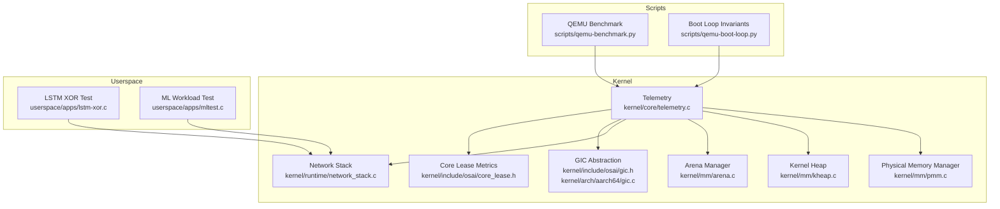
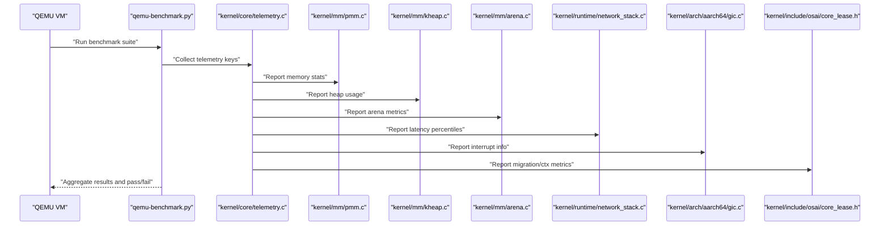
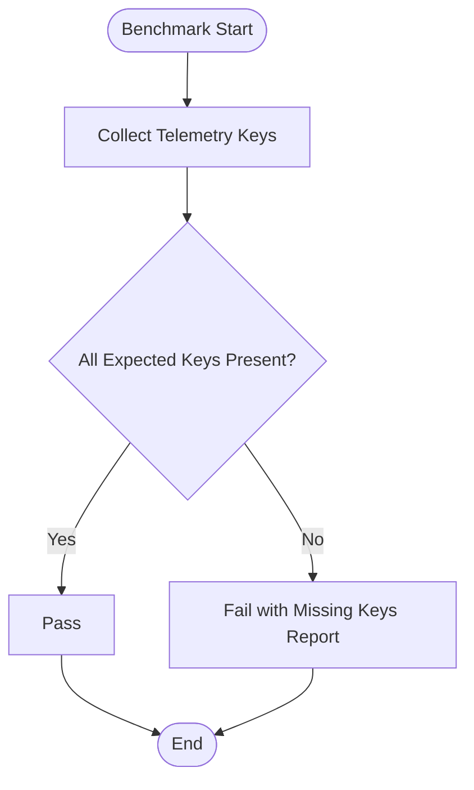
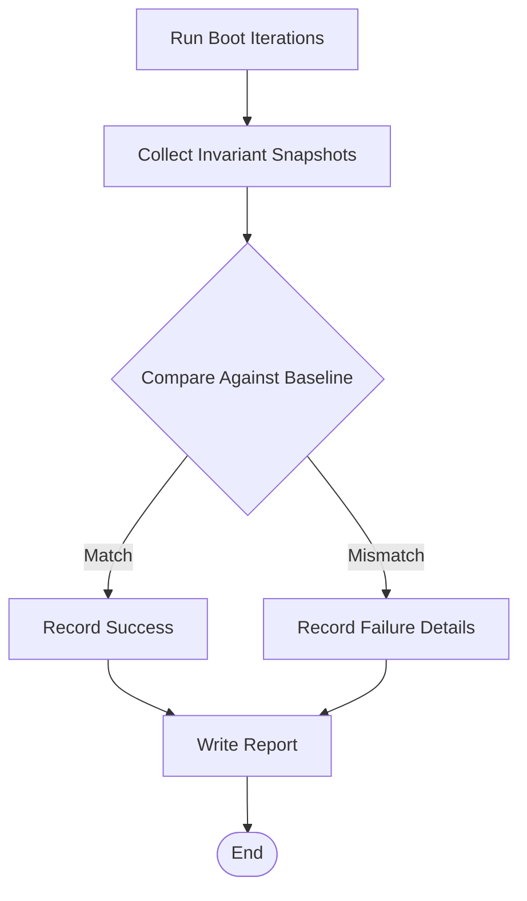
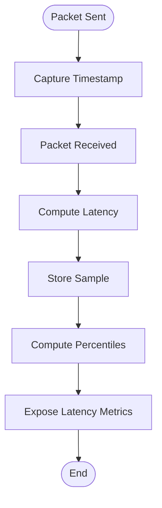
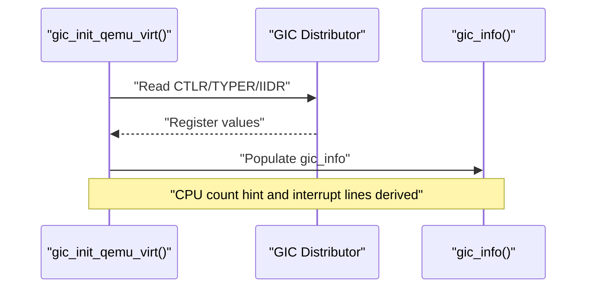
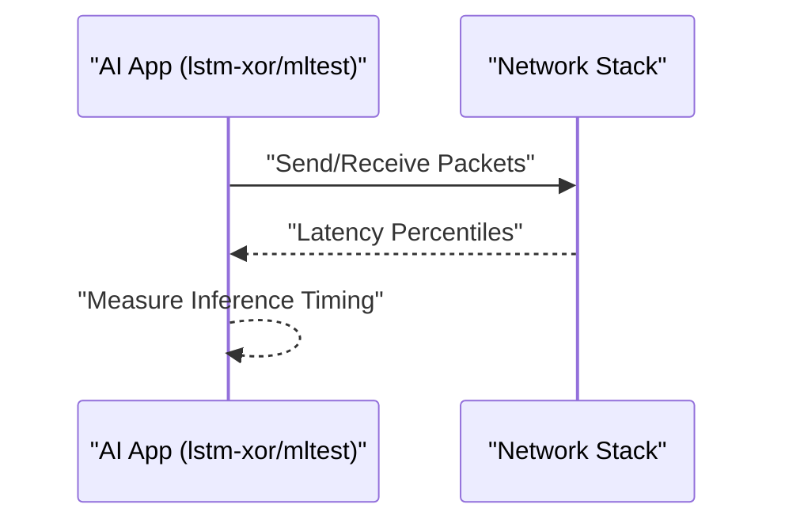
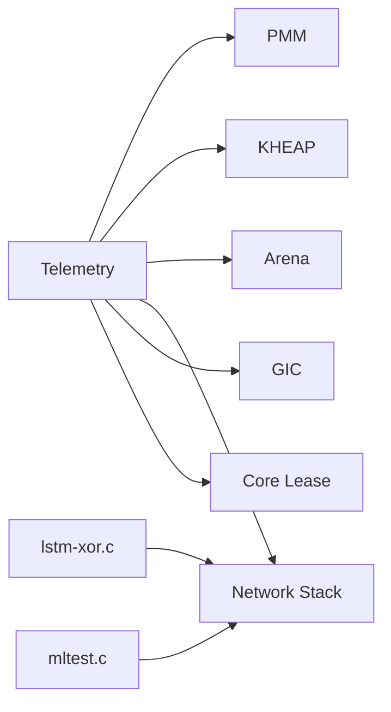

# Performance Analysis

<cite>
**Referenced Files in This Document**
- [README.md](file://README.md)
- [Makefile](file://Makefile)
- [kernel/core/telemetry.c](file://kernel/core/telemetry.c)
- [kernel/include/osai/telemetry.h](file://kernel/include/osai/telemetry.h)
- [scripts/qemu-benchmark.py](file://scripts/qemu-benchmark.py)
- [scripts/qemu-boot-loop.py](file://scripts/qemu-boot-loop.py)
- [kernel/mm/pmm.c](file://kernel/mm/pmm.c)
- [kernel/mm/kheap.c](file://kernel/mm/kheap.c)
- [kernel/include/osai/kheap.h](file://kernel/include/osai/kheap.h)
- [kernel/mm/arena.c](file://kernel/mm/arena.c)
- [kernel/runtime/network_stack.c](file://kernel/runtime/network_stack.c)
- [kernel/include/osai/gic.h](file://kernel/include/osai/gic.h)
- [kernel/arch/aarch64/gic.c](file://kernel/arch/aarch64/gic.c)
- [kernel/include/osai/core_lease.h](file://kernel/include/osai/core_lease.h)
- [userspace/apps/lstm-xor.c](file://userspace/apps/lstm-xor.c)
- [userspace/apps/mltest.c](file://userspace/apps/mltest.c)
</cite>

## Table of Contents
1. [Introduction](#introduction)
2. [Project Structure](#project-structure)
3. [Core Components](#core-components)
4. [Architecture Overview](#architecture-overview)
5. [Detailed Component Analysis](#detailed-component-analysis)
6. [Dependency Analysis](#dependency-analysis)
7. [Performance Considerations](#performance-considerations)
8. [Troubleshooting Guide](#troubleshooting-guide)
9. [Conclusion](#conclusion)
10. [Appendices](#appendices)

## Introduction
This document provides a comprehensive performance analysis of the OSAI system, focusing on telemetry-driven monitoring, memory subsystem performance, I/O and network latency measurement, CPU scheduling and interrupt efficiency, and AI workload performance. It synthesizes the repository’s kernel telemetry, memory allocators, arena manager, network stack, and test harnesses to define actionable profiling, bottleneck identification, and regression testing procedures.

## Project Structure
OSAI is organized around a small kernel with architecture-specific support, memory management primitives, runtime services, and userspace applications. Performance-critical areas include:
- Telemetry emission and verification via kernel telemetry and QEMU benchmark scripts
- Memory management via physical memory manager (PMM), kernel heap (KHEAP), and arena manager
- Network stack latency sampling and percentiles
- Interrupt controller initialization and core lease metrics for scheduling and migration
- Userspace AI workloads for inference timing and throughput

**Diagram sources**
- [kernel/core/telemetry.c](file://kernel/core/telemetry.c)
- [kernel/mm/pmm.c](file://kernel/mm/pmm.c)
- [kernel/mm/kheap.c](file://kernel/mm/kheap.c)
- [kernel/mm/arena.c](file://kernel/mm/arena.c)
- [kernel/runtime/network_stack.c](file://kernel/runtime/network_stack.c)
- [kernel/include/osai/gic.h](file://kernel/include/osai/gic.h)
- [kernel/arch/aarch64/gic.c](file://kernel/arch/aarch64/gic.c)
- [kernel/include/osai/core_lease.h](file://kernel/include/osai/core_lease.h)
- [scripts/qemu-benchmark.py](file://scripts/qemu-benchmark.py)
- [scripts/qemu-boot-loop.py](file://scripts/qemu-boot-loop.py)
- [userspace/apps/lstm-xor.c](file://userspace/apps/lstm-xor.c)
- [userspace/apps/mltest.c](file://userspace/apps/mltest.c)

**Section sources**
- [README.md](file://README.md)
- [Makefile](file://Makefile)

## Core Components
- Kernel telemetry: Emits boot summary and supports verification of expected telemetry keys during benchmarks.
- Memory subsystem: PMM initializes free/reserved pages; KHEAP provides aligned allocation with page mapping; Arena manager creates arenas and tracks committed pages and faults.
- Network stack: Records UDP/TCP latency samples and computes percentiles for performance reporting.
- Interrupt and scheduling: GIC discovery and core lease metrics expose migration and context switch counts.
- Benchmarking harness: QEMU-based scripts collect telemetry and enforce determinism checks.

**Section sources**
- [kernel/core/telemetry.c](file://kernel/core/telemetry.c)
- [kernel/include/osai/telemetry.h](file://kernel/include/osai/telemetry.h)
- [kernel/mm/pmm.c](file://kernel/mm/pmm.c)
- [kernel/mm/kheap.c](file://kernel/mm/kheap.c)
- [kernel/include/osai/kheap.h](file://kernel/include/osai/kheap.h)
- [kernel/mm/arena.c](file://kernel/mm/arena.c)
- [kernel/runtime/network_stack.c](file://kernel/runtime/network_stack.c)
- [kernel/include/osai/gic.h](file://kernel/include/osai/gic.h)
- [kernel/arch/aarch64/gic.c](file://kernel/arch/aarch64/gic.c)
- [kernel/include/osai/core_lease.h](file://kernel/include/osai/core_lease.h)
- [scripts/qemu-benchmark.py](file://scripts/qemu-benchmark.py)
- [scripts/qemu-boot-loop.py](file://scripts/qemu-boot-loop.py)

## Architecture Overview
The performance architecture integrates kernel telemetry with userspace tests and QEMU automation. Telemetry is emitted during boot and validated by benchmark scripts. Memory and networking performance are tracked through dedicated metrics and percentiles. Scheduling and interrupts are exposed via GIC and core lease interfaces.

**Diagram sources**
- [scripts/qemu-benchmark.py](file://scripts/qemu-benchmark.py)
- [kernel/core/telemetry.c](file://kernel/core/telemetry.c)
- [kernel/mm/pmm.c](file://kernel/mm/pmm.c)
- [kernel/mm/kheap.c](file://kernel/mm/kheap.c)
- [kernel/mm/arena.c](file://kernel/mm/arena.c)
- [kernel/runtime/network_stack.c](file://kernel/runtime/network_stack.c)
- [kernel/arch/aarch64/gic.c](file://kernel/arch/aarch64/gic.c)
- [kernel/include/osai/core_lease.h](file://kernel/include/osai/core_lease.h)

## Detailed Component Analysis

### Telemetry Collection and Validation
- Purpose: Emit boot-time telemetry and validate completeness in benchmark runs.
- Key behaviors:
  - Boot summary emission for initial system state.
  - Expected telemetry keys checked against collected metrics; missing keys cause failure.
- Performance relevance:
  - Ensures consistent metrics capture across runs.
  - Enables regression detection by comparing key counters.

**Diagram sources**
- [scripts/qemu-benchmark.py](file://scripts/qemu-benchmark.py)
- [kernel/core/telemetry.c](file://kernel/core/telemetry.c)

**Section sources**
- [kernel/core/telemetry.c](file://kernel/core/telemetry.c)
- [kernel/include/osai/telemetry.h](file://kernel/include/osai/telemetry.h)
- [scripts/qemu-benchmark.py](file://scripts/qemu-benchmark.py)

### Deterministic Boot Invariants
- Purpose: Validate repeated boots produce identical invariants (e.g., CPU count, memory pages, block sectors).
- Key behaviors:
  - Snapshot invariant checks across iterations.
  - Failure reporting with specific mismatches.
- Performance relevance:
  - Detects non-deterministic behavior that can mask performance regressions.

**Diagram sources**
- [scripts/qemu-boot-loop.py](file://scripts/qemu-boot-loop.py)

**Section sources**
- [scripts/qemu-boot-loop.py](file://scripts/qemu-boot-loop.py)

### Memory Subsystem Performance
- Physical Memory Manager (PMM):
  - Initializes free, reserved, and total page counts from firmware memory map.
  - Alloc/free single pages with assertions for safety.
- Kernel Heap (KHEAP):
  - Contiguous allocator with alignment and growth via page mapping.
  - Tracks allocated pages and bytes for capacity planning.
- Arena Manager:
  - Creates arenas with per-arena page arrays and fault accounting.
  - Unmaps and frees backing pages on teardown.

```mermaid
classDiagram
class PMM {
+pmm_init(boot)
+pmm_alloc_page() void*
+pmm_free_page(page)
+pmm_total_pages() uint64_t
+pmm_free_pages() uint64_t
}
class KHeap {
+kheap_init()
+kheap_alloc(size, align) void*
+kheap_calloc(size, align) void*
+kheap_pages_allocated() uint64_t
+kheap_bytes_allocated() uint64_t
+kheap_self_test()
}
class Arena {
+arena_manager_init()
+arena_create(id, kind, owner, name, size, flags, out_arena) Status
+arena_destroy(arena) Status
}
PMM <.. KHeap : "maps pages via"
KHeap <.. Arena : "allocates page ptr array"
```

**Diagram sources**
- [kernel/mm/pmm.c](file://kernel/mm/pmm.c)
- [kernel/mm/kheap.c](file://kernel/mm/kheap.c)
- [kernel/include/osai/kheap.h](file://kernel/include/osai/kheap.h)
- [kernel/mm/arena.c](file://kernel/mm/arena.c)

**Section sources**
- [kernel/mm/pmm.c](file://kernel/mm/pmm.c)
- [kernel/mm/kheap.c](file://kernel/mm/kheap.c)
- [kernel/include/osai/kheap.h](file://kernel/include/osai/kheap.h)
- [kernel/mm/arena.c](file://kernel/mm/arena.c)

### Network Latency Measurement
- Purpose: Measure UDP/TCP latencies and compute percentiles for performance reporting.
- Key behaviors:
  - Maintains rolling samples and computes percentiles (e.g., p50, p95, p99, p999).
  - Exposes getters for latency percentiles.
- Performance relevance:
  - Provides end-to-end latency SLA visibility for network-intensive workloads.

**Diagram sources**
- [kernel/runtime/network_stack.c](file://kernel/runtime/network_stack.c)

**Section sources**
- [kernel/runtime/network_stack.c](file://kernel/runtime/network_stack.c)

### Interrupts and Scheduling Metrics
- GIC Discovery:
  - Reads GIC distributor registers to determine interrupt lines and CPU hints.
- Core Lease Metrics:
  - Exposes core usage masks, IRQ isolation mask, migration counts, and involuntary context switches.
- Performance relevance:
  - Helps diagnose scheduling pressure, migration overhead, and interrupt saturation.

**Diagram sources**
- [kernel/include/osai/gic.h](file://kernel/include/osai/gic.h)
- [kernel/arch/aarch64/gic.c](file://kernel/arch/aarch64/gic.c)
- [kernel/include/osai/core_lease.h](file://kernel/include/osai/core_lease.h)

**Section sources**
- [kernel/arch/aarch64/gic.c](file://kernel/arch/aarch64/gic.c)
- [kernel/include/osai/gic.h](file://kernel/include/osai/gic.h)
- [kernel/include/osai/core_lease.h](file://kernel/include/osai/core_lease.h)

### AI Workload Performance
- LSTM XOR Test:
  - Demonstrates inference-like workload execution suitable for timing and throughput analysis.
- ML Workload Test:
  - Provides a second AI-focused scenario for comparative benchmarking.
- Performance relevance:
  - Enables measuring inference timing, memory bandwidth utilization, and parallel processing efficiency under realistic loads.

**Diagram sources**
- [userspace/apps/lstm-xor.c](file://userspace/apps/lstm-xor.c)
- [userspace/apps/mltest.c](file://userspace/apps/mltest.c)
- [kernel/runtime/network_stack.c](file://kernel/runtime/network_stack.c)

**Section sources**
- [userspace/apps/lstm-xor.c](file://userspace/apps/lstm-xor.c)
- [userspace/apps/mltest.c](file://userspace/apps/mltest.c)

## Dependency Analysis
- Telemetry depends on memory and runtime subsystems for accurate reporting.
- Network latency relies on packet capture timestamps and percentile computation.
- Core lease metrics depend on GIC and scheduler state for migration and context switch counts.
- Userspace AI apps exercise network stack and can influence latency metrics.

**Diagram sources**
- [kernel/core/telemetry.c](file://kernel/core/telemetry.c)
- [kernel/mm/pmm.c](file://kernel/mm/pmm.c)
- [kernel/mm/kheap.c](file://kernel/mm/kheap.c)
- [kernel/mm/arena.c](file://kernel/mm/arena.c)
- [kernel/runtime/network_stack.c](file://kernel/runtime/network_stack.c)
- [kernel/arch/aarch64/gic.c](file://kernel/arch/aarch64/gic.c)
- [kernel/include/osai/core_lease.h](file://kernel/include/osai/core_lease.h)
- [userspace/apps/lstm-xor.c](file://userspace/apps/lstm-xor.c)
- [userspace/apps/mltest.c](file://userspace/apps/mltest.c)

**Section sources**
- [kernel/core/telemetry.c](file://kernel/core/telemetry.c)
- [kernel/mm/pmm.c](file://kernel/mm/pmm.c)
- [kernel/mm/kheap.c](file://kernel/mm/kheap.c)
- [kernel/mm/arena.c](file://kernel/mm/arena.c)
- [kernel/runtime/network_stack.c](file://kernel/runtime/network_stack.c)
- [kernel/arch/aarch64/gic.c](file://kernel/arch/aarch64/gic.c)
- [kernel/include/osai/core_lease.h](file://kernel/include/osai/core_lease.h)
- [userspace/apps/lstm-xor.c](file://userspace/apps/lstm-xor.c)
- [userspace/apps/mltest.c](file://userspace/apps/mltest.c)

## Performance Considerations
- Memory performance
  - Track PMM free/reserved ratios and KHEAP page/byte allocations to detect fragmentation and growth trends.
  - Monitor arena fault counts to identify unexpected page faults impacting latency.
- CPU scheduling and interrupts
  - Use core lease migration and involuntary context switch counters to detect scheduling pressure.
  - Validate GIC interrupt line availability and CPU count hint to ensure balanced load distribution.
- I/O and network
  - Use network latency percentiles to establish SLAs and detect regressions in throughput or queuing delays.
- AI workloads
  - Pair inference timing with network latency to assess end-to-end performance under AI load.
- Determinism
  - Enforce boot invariants to eliminate non-deterministic noise in performance measurements.

[No sources needed since this section provides general guidance]

## Troubleshooting Guide
- Telemetry validation failures
  - Cause: Missing expected telemetry keys during benchmark runs.
  - Action: Verify telemetry emission paths and ensure all subsystems report required metrics.
- Non-deterministic boots
  - Cause: Mismatched invariants across repeated boots.
  - Action: Inspect firmware memory map handling and ensure consistent device state.
- Memory exhaustion or fragmentation
  - Cause: High KHEAP page allocation or arena faults.
  - Action: Review allocation patterns, reduce fragmentation by aligning sizes, and monitor arena fault rates.
- Elevated network latency
  - Cause: Increased UDP/TCP latency percentiles.
  - Action: Investigate packet processing paths, buffer sizes, and queue depths.
- Scheduling pressure
  - Cause: High migration or involuntary context switch counts.
  - Action: Adjust core leases, isolate IRQs, and review workload distribution.

**Section sources**
- [scripts/qemu-benchmark.py](file://scripts/qemu-benchmark.py)
- [scripts/qemu-boot-loop.py](file://scripts/qemu-boot-loop.py)
- [kernel/mm/kheap.c](file://kernel/mm/kheap.c)
- [kernel/mm/arena.c](file://kernel/mm/arena.c)
- [kernel/runtime/network_stack.c](file://kernel/runtime/network_stack.c)
- [kernel/include/osai/core_lease.h](file://kernel/include/osai/core_lease.h)

## Conclusion
By combining kernel telemetry, memory and network metrics, and QEMU-driven benchmarking, OSAI enables robust performance monitoring and regression testing. The provided components offer a practical foundation for identifying bottlenecks, optimizing memory and CPU usage, and ensuring deterministic behavior across repeated runs.

[No sources needed since this section summarizes without analyzing specific files]

## Appendices
- Benchmark execution checklist
  - Run qemu-benchmark.py to collect telemetry and validate keys.
  - Execute qemu-boot-loop.py to confirm deterministic invariants.
  - Analyze PMM/KHEAP/Arena metrics for memory trends.
  - Review network latency percentiles for I/O performance.
  - Inspect GIC and core lease metrics for scheduling health.
- Profiling workflow
  - Establish baselines with AI workloads (lstm-xor/mltest).
  - Measure inference timing and correlate with network latency.
  - Identify bottlenecks via percentiles and migration/context switch counters.
  - Apply targeted optimizations and re-validate with regression suites.

[No sources needed since this section provides general guidance]