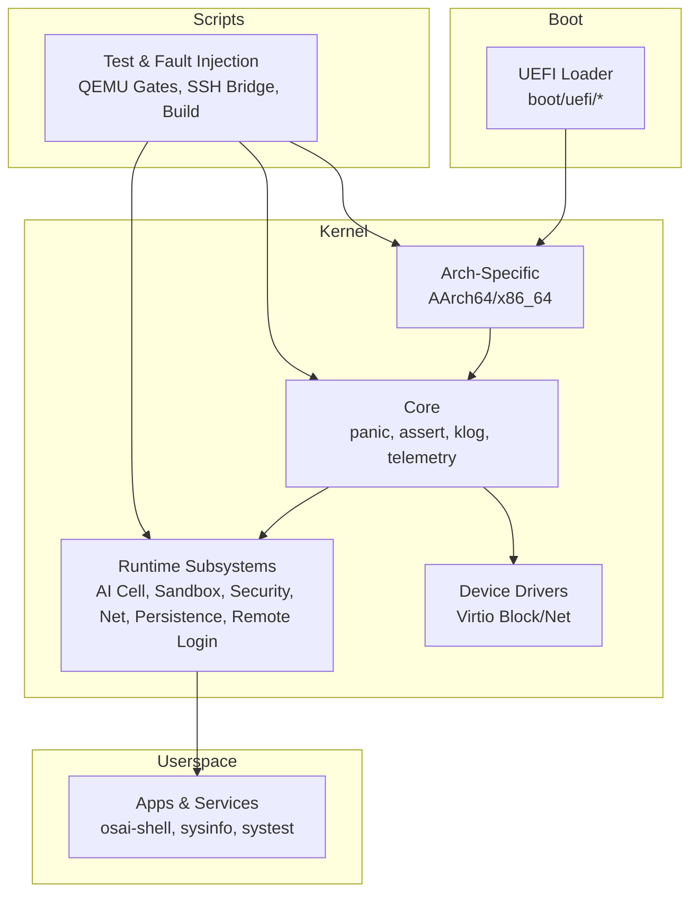
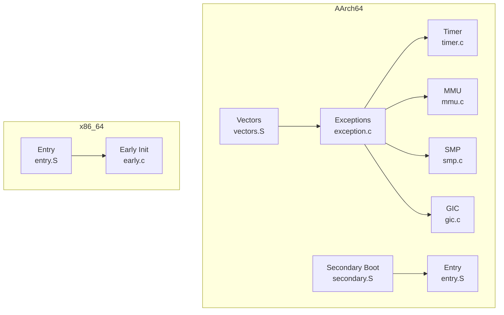
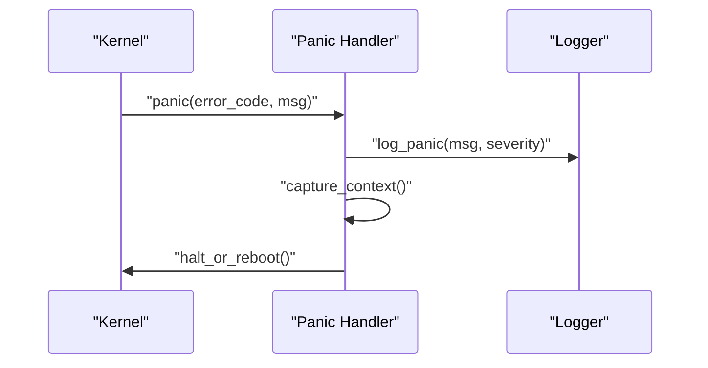
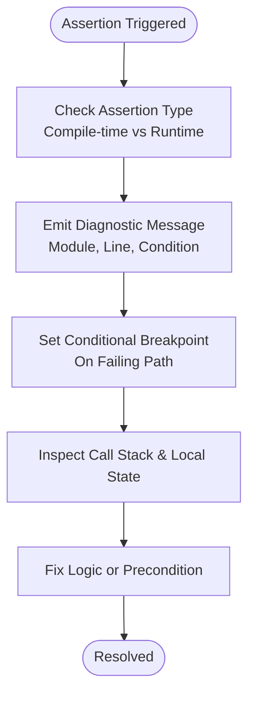
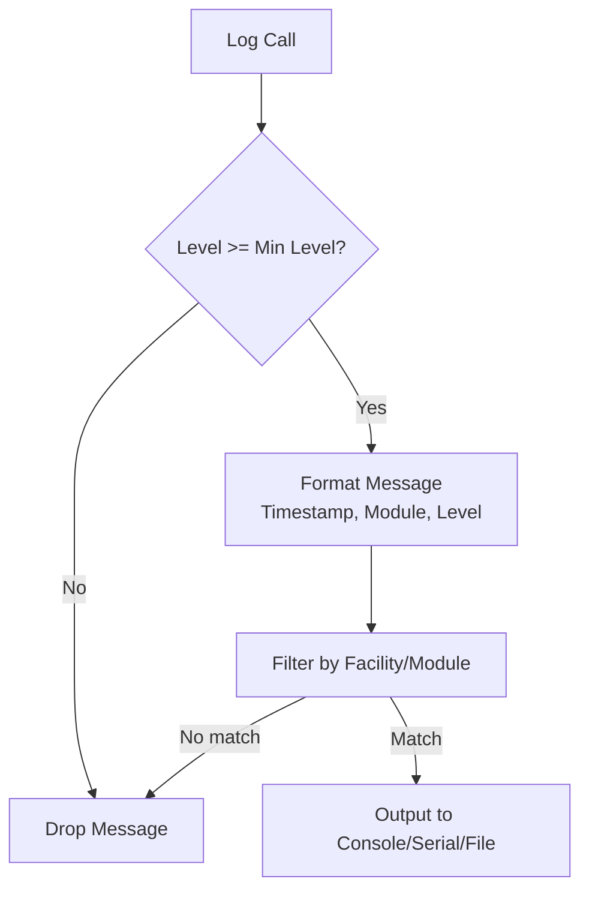
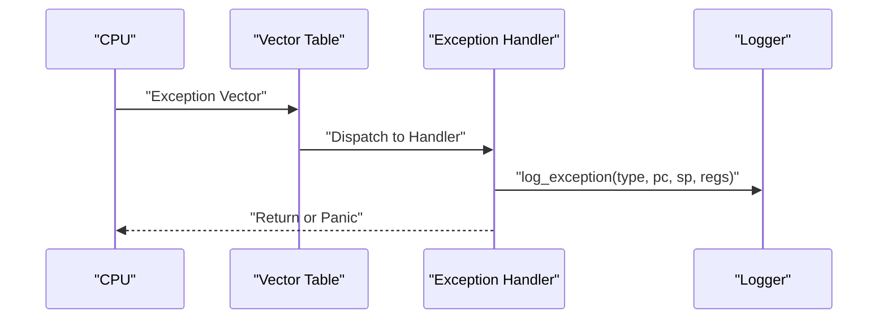
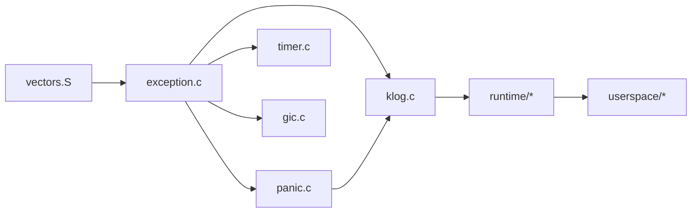

# Runtime Debugging

<cite>
**Referenced Files in This Document**
- [panic.c](file://kernel/core/panic.c)
- [assert.c](file://kernel/core/assert.c)
- [klog.c](file://kernel/core/klog.c)
- [panic.h](file://kernel/include/osai/panic.h)
- [assert.h](file://kernel/include/osai/assert.h)
- [klog.h](file://kernel/include/osai/klog.h)
- [exception.c](file://kernel/arch/aarch64/exception.c)
- [vectors.S](file://kernel/arch/aarch64/vectors.S)
- [timer.c](file://kernel/arch/aarch64/timer.c)
- [mmu.c](file://kernel/arch/aarch64/mmu.c)
- [smp.c](file://kernel/arch/aarch64/smp.c)
- [gic.c](file://kernel/arch/aarch64/gic.c)
- [secondary.S](file://kernel/arch/aarch64/secondary.S)
- [entry.S](file://kernel/arch/aarch64/entry.S)
- [early.c](file://kernel/arch/x86_64/early.c)
- [entry.S](file://kernel/arch/x86_64/entry.S)
- [linker.ld](file://kernel/arch/aarch64/linker.ld)
- [linker.ld](file://kernel/arch/x86_64/linker.ld)
- [ai_cell.c](file://kernel/runtime/ai_cell.c)
- [cpu_ai_runtime.c](file://kernel/runtime/cpu_ai_runtime.c)
- [sandbox.c](file://kernel/runtime/sandbox.c)
- [security.c](file://kernel/runtime/security.c)
- [network_stack.c](file://kernel/runtime/network_stack.c)
- [persistence.c](file://kernel/runtime/persistence.c)
- [remote_login.c](file://kernel/runtime/remote_login.c)
- [telemetry.c](file://kernel/telemetry.c)
- [service.c](file://kernel/user/service.c)
- [syscall.c](file://kernel/user/syscall.c)
- [user.c](file://kernel/user/user.c)
- [osai-shell.c](file://userspace/apps/osai-shell.c)
- [sysinfo.c](file://userspace/apps/sysinfo.c)
- [systest.c](file://userspace/apps/systest.c)
- [qemu-rc-v1.json](file://contracts/qemu-rc-v1.json)
- [run-qemu-aarch64.sh](file://scripts/run-qemu-aarch64.sh)
- [run-qemu-x86_64.sh](file://scripts/run-qemu-x86_64.sh)
- [osai-ssh-bridge.py](file://scripts/osai-ssh-bridge.py)
- [qemu-fault-injection.py](file://scripts/qemu-fault-injection.py)
- [qemu-fault-matrix.py](file://scripts/qemu-fault-matrix.py)
- [qemu-developer-ux.py](file://scripts/qemu-developer-ux.py)
- [qemu-soak-gate.py](file://scripts/qemu-soak-gate.py)
- [qemu-readiness-gate.py](file://scripts/qemu-readiness-gate.py)
- [qemu-milestone-gate.py](file://scripts/qemu-milestone-gate.py)
- [qemu-post51-gate.py](file://scripts/qemu-post51-gate.py)
- [qemu-osctl-gate.py](file://scripts/qemu-osctl-gate.py)
- [qemu-network-suite.py](file://scripts/qemu-network-suite.py)
- [qemu-userspace-suite.py](file://scripts/qemu-userspace-suite.py)
- [qemu-benchmark.py](file://scripts/qemu-benchmark.py)
- [qemu-boot-loop.py](file://scripts/qemu-boot-loop.py)
- [qemu-smoke.py](file://scripts/qemu-smoke.py)
- [qemu-x86_64-smoke.py](file://scripts/qemu-x86_64-smoke.py)
- [create-initfs.py](file://scripts/create-initfs.py)
- [build-image.sh](file://scripts/build-image.sh)
- [build-image-x86_64.sh](file://scripts/build-image-x86_64.sh)
</cite>

## Table of Contents
1. [Introduction](#introduction)
2. [Project Structure](#project-structure)
3. [Core Components](#core-components)
4. [Architecture Overview](#architecture-overview)
5. [Detailed Component Analysis](#detailed-component-analysis)
6. [Dependency Analysis](#dependency-analysis)
7. [Performance Considerations](#performance-considerations)
8. [Troubleshooting Guide](#troubleshooting-guide)
9. [Conclusion](#conclusion)
10. [Appendices](#appendices)

## Introduction
This document provides comprehensive runtime debugging guidance for the OSAI system. It covers kernel panic handling, assertion failure diagnosis, kernel log interpretation, and runtime diagnostics across CPU architectures, device drivers, runtime subsystems, and user-space applications. It also outlines techniques for detecting memory corruption, deadlocks, race conditions, and memory leaks, along with remote debugging and post-mortem analysis workflows. The goal is to enable systematic diagnosis of runtime issues from early boot through user-space services.

## Project Structure
OSAI is organized into:
- Boot and architecture-specific code (UEFI loader, AArch64 and x86_64 assembly and C)
- Kernel core (panic, assertions, logging, telemetry)
- Runtime subsystems (AI cells, CPU AI runtime, sandbox, security, networking, persistence, remote login)
- Device drivers (virtio block/net)
- Userspace applications and services
- Scripts for building, testing, and fault injection

**Section sources**
- [Makefile](file://Makefile)
- [README.md](file://README.md)

## Core Components
This section documents the foundational debugging primitives and their roles in diagnosing runtime issues.

- Panic handling: Centralized kernel termination with stack capture and optional halt.
- Assertions: Compile-time and runtime checks with diagnostic output.
- Kernel logging: Hierarchical log levels, formatted messages, and filtering.
- Telemetry: Optional runtime metrics collection for diagnostics.

Key implementation locations:
- Panic: [panic.c](file://kernel/core/panic.c), [panic.h](file://kernel/include/osai/panic.h)
- Assertions: [assert.c](file://kernel/core/assert.c), [assert.h](file://kernel/include/osai/assert.h)
- Logging: [klog.c](file://kernel/core/klog.c), [klog.h](file://kernel/include/osai/klog.h)
- Telemetry: [telemetry.c](file://kernel/core/telemetry.c)

**Section sources**
- [panic.c](file://kernel/core/panic.c)
- [panic.h](file://kernel/include/osai/panic.h)
- [assert.c](file://kernel/core/assert.c)
- [assert.h](file://kernel/include/osai/assert.h)
- [klog.c](file://kernel/core/klog.c)
- [klog.h](file://kernel/include/osai/klog.h)
- [telemetry.c](file://kernel/core/telemetry.c)

## Architecture Overview
The kernel integrates architecture-specific entry points, exception handling, timers, MMU, SMP, and GIC with the core runtime subsystems. Understanding these interactions is essential for diagnosing exceptions, interrupts, and concurrency issues.

**Diagram sources**
- [vectors.S](file://kernel/arch/aarch64/vectors.S)
- [exception.c](file://kernel/arch/aarch64/exception.c)
- [timer.c](file://kernel/arch/aarch64/timer.c)
- [mmu.c](file://kernel/arch/aarch64/mmu.c)
- [smp.c](file://kernel/arch/aarch64/smp.c)
- [gic.c](file://kernel/arch/aarch64/gic.c)
- [secondary.S](file://kernel/arch/aarch64/secondary.S)
- [entry.S](file://kernel/arch/aarch64/entry.S)
- [entry.S](file://kernel/arch/x86_64/entry.S)
- [early.c](file://kernel/arch/x86_64/early.c)

## Detailed Component Analysis

### Panic Handling
Panic is the kernel’s last resort for unrecoverable errors. Typical triggers include fatal assertion failures, invalid kernel states, or unrecoverable hardware faults. The panic handler should:
- Capture the current execution context (registers, return addresses)
- Print a structured diagnostic message with severity and module
- Optionally enter a halted state for post-mortem analysis

Recommended debugging steps:
- Inspect the panic message for module and error type
- Use saved registers to reconstruct the failing call chain
- Correlate with recent kernel logs around the panic time
- Reproduce with minimal workload and verbose logging enabled

**Diagram sources**
- [panic.c](file://kernel/core/panic.c)
- [klog.c](file://kernel/core/klog.c)

**Section sources**
- [panic.c](file://kernel/core/panic.c)
- [panic.h](file://kernel/include/osai/panic.h)
- [klog.c](file://kernel/core/klog.c)

### Assertion Failure Diagnosis
Assertions enforce invariants during development and testing. Failures indicate logic errors, invalid assumptions, or unexpected runtime states. To debug:
- Identify the assertion macro invocation site and condition
- Verify preconditions and data structures around the failure
- Enable assertion builds and re-run with verbose logging
- Use conditional breakpoints at assertion sites for targeted inspection

**Diagram sources**
- [assert.c](file://kernel/core/assert.c)
- [assert.h](file://kernel/include/osai/assert.h)
- [klog.c](file://kernel/core/klog.c)

**Section sources**
- [assert.c](file://kernel/core/assert.c)
- [assert.h](file://kernel/include/osai/assert.h)
- [klog.c](file://kernel/core/klog.c)

### Kernel Logging System
The logging system provides hierarchical levels and structured messages for runtime diagnostics. Typical levels include:
- Emergency, Alert, Critical, Error, Warning, Notice, Info, Debug
- Filtering by level, facility, and module
- Timestamps and thread/context identifiers

Interpretation tips:
- Error and Critical often correspond to immediate failures (e.g., driver init, allocation)
- Warning indicates recoverable anomalies (e.g., unexpected IRQs, retries)
- Info and Debug aid in tracing control flow and timing

Filtering strategies:
- Set minimum log level via configuration or environment
- Filter by facility/module to reduce noise
- Redirect logs to serial/console for headless systems

**Diagram sources**
- [klog.c](file://kernel/core/klog.c)
- [klog.h](file://kernel/include/osai/klog.h)

**Section sources**
- [klog.c](file://kernel/core/klog.c)
- [klog.h](file://kernel/include/osai/klog.h)

### Exception and Interrupt Handling
Exceptions and interrupts are architecture-dependent. Typical causes include page faults, alignment faults, timer interrupts, and IPIs. Diagnosing:
- Map fault types to instruction address and register state
- Check interrupt controller (GIC) and vector tables
- Validate MMU mappings and TLB state
- Confirm SMP inter-core signaling correctness

**Diagram sources**
- [vectors.S](file://kernel/arch/aarch64/vectors.S)
- [exception.c](file://kernel/arch/aarch64/exception.c)
- [klog.c](file://kernel/core/klog.c)

**Section sources**
- [vectors.S](file://kernel/arch/aarch64/vectors.S)
- [exception.c](file://kernel/arch/aarch64/exception.c)
- [gic.c](file://kernel/arch/aarch64/gic.c)
- [mmu.c](file://kernel/arch/aarch64/mmu.c)
- [timer.c](file://kernel/arch/aarch64/timer.c)

### Memory Management and Corruption Detection
Memory-related issues include heap corruption, double-free, use-after-free, and allocator exhaustion. Techniques:
- Enable guard pages and poison patterns in allocators
- Use memory debugging tools (valgrind-like) in userspace
- Monitor allocation statistics and fragmentation
- Validate pointers before dereference and after free

Common symptoms:
- Random panics or hangs near allocation boundaries
- Corrupted metadata leading to allocator failures
- Page faults on freed regions

**Section sources**
- [kheap.c](file://kernel/mm/kheap.c)
- [pmm.c](file://kernel/mm/pmm.c)
- [arena.c](file://kernel/mm/arena.c)

### Deadlock and Race Condition Diagnosis
Deadlocks occur when threads wait indefinitely for locks; races arise from unsynchronized shared access. Methods:
- Instrument lock acquisition/release with timestamps
- Use lock order enforcement and deadlock detection
- Add atomic counters and barriers around sensitive sections
- Employ deterministic scheduling or reproducers for races

Validation:
- Stress test with concurrent workloads
- Use deterministic replay environments
- Correlate timing logs with contention points

**Section sources**
- [smp.c](file://kernel/arch/aarch64/smp.c)
- [gic.c](file://kernel/arch/aarch64/gic.c)

### Memory Leak Detection
Leaks accumulate resources without release. Approaches:
- Track allocations with tags and backtraces
- Periodic scans of allocated pools
- Compare growth trends across subsystems
- Validate cleanup paths on teardown

**Section sources**
- [kheap.c](file://kernel/mm/kheap.c)
- [pmm.c](file://kernel/mm/pmm.c)

### Remote Debugging and Post-Mortem Analysis
Remote debugging enables live inspection and controlled restarts:
- Use serial console or SSH bridge for headless targets
- Configure persistent logging and crash dumps
- Collect backtraces and register snapshots post-panic

Post-mortem:
- Analyze logs around failure time
- Reconstruct call stacks from saved registers
- Validate hardware and firmware compatibility

**Section sources**
- [remote_login.c](file://kernel/runtime/remote_login.c)
- [osai-ssh-bridge.py](file://scripts/osai-ssh-bridge.py)
- [panic.c](file://kernel/core/panic.c)

### User-Space Debugging
User-space diagnostics span service failures, AI cell issues, and application crashes:
- Services: Validate startup order, dependencies, and resource limits
- AI Cells: Inspect model loading, memory usage, and scheduling
- Applications: Use signal handlers, core dumps, and sanitizers

Tools and techniques:
- Enable core dumps and analyze with debugger
- Trace system calls and signals
- Monitor resource consumption and timeouts

**Section sources**
- [service.c](file://kernel/user/service.c)
- [syscall.c](file://kernel/user/syscall.c)
- [user.c](file://kernel/user/user.c)
- [ai_cell.c](file://kernel/runtime/ai_cell.c)
- [cpu_ai_runtime.c](file://kernel/runtime/cpu_ai_runtime.c)
- [osai-shell.c](file://userspace/apps/osai-shell.c)
- [sysinfo.c](file://userspace/apps/sysinfo.c)
- [systest.c](file://userspace/apps/systest.c)

## Dependency Analysis
The kernel’s debugging infrastructure depends on architecture-specific entry points and runtime subsystems. Dependencies include:
- Exception vectors and handlers
- Timer and GIC for scheduling and interrupts
- Logging and panic for diagnostics
- Runtime subsystems for higher-level services

**Diagram sources**
- [vectors.S](file://kernel/arch/aarch64/vectors.S)
- [exception.c](file://kernel/arch/aarch64/exception.c)
- [panic.c](file://kernel/core/panic.c)
- [klog.c](file://kernel/core/klog.c)
- [timer.c](file://kernel/arch/aarch64/timer.c)
- [gic.c](file://kernel/arch/aarch64/gic.c)
- [ai_cell.c](file://kernel/runtime/ai_cell.c)
- [service.c](file://kernel/user/service.c)

**Section sources**
- [vectors.S](file://kernel/arch/aarch64/vectors.S)
- [exception.c](file://kernel/arch/aarch64/exception.c)
- [panic.c](file://kernel/core/panic.c)
- [klog.c](file://kernel/core/klog.c)
- [timer.c](file://kernel/arch/aarch64/timer.c)
- [gic.c](file://kernel/arch/aarch64/gic.c)
- [ai_cell.c](file://kernel/runtime/ai_cell.c)
- [service.c](file://kernel/user/service.c)

## Performance Considerations
- Keep logging levels appropriate for production to avoid overhead
- Use asynchronous logging for high-frequency events
- Minimize context switches during critical sections
- Profile hot paths with minimal instrumentation

## Troubleshooting Guide
- Kernel panics: collect panic message, backtrace, and recent logs; reproduce with reduced load
- Assertion failures: inspect failing condition and surrounding state; add targeted logging
- Memory issues: enable guard pages, monitor allocator stats, and validate pointer lifetimes
- Concurrency problems: enforce lock ordering, instrument synchronization, and stress-test
- Remote debugging: configure serial/SSH bridge and persistent logs; automate crash dump collection

**Section sources**
- [panic.c](file://kernel/core/panic.c)
- [assert.c](file://kernel/core/assert.c)
- [klog.c](file://kernel/core/klog.c)
- [osai-ssh-bridge.py](file://scripts/osai-ssh-bridge.py)

## Conclusion
Effective runtime debugging in OSAI requires familiarity with kernel panic and assertion mechanisms, robust logging with filtering, and architecture-specific exception handling. By combining these primitives with user-space diagnostics, remote debugging, and systematic reproducers, developers can quickly isolate and resolve complex runtime issues across the system.

## Appendices

### Appendix A: Kernel Log Levels and Facilities
- Levels: emergency, alert, critical, error, warning, notice, info, debug
- Facilities: core, runtime, device, user, mm
- Filtering: by level, facility, module, and keyword

**Section sources**
- [klog.h](file://kernel/include/osai/klog.h)
- [klog.c](file://kernel/core/klog.c)

### Appendix B: Crash Dump and Backtrace Collection
- Enable crash dump capture on panic
- Save register state and stack frames
- Use symbol tables to translate addresses to symbols

**Section sources**
- [panic.c](file://kernel/core/panic.c)
- [exception.c](file://kernel/arch/aarch64/exception.c)

### Appendix C: QEMU Test and Fault Injection Scripts
- Use gate scripts to validate stability under stress
- Inject faults to exercise error paths
- Automate smoke tests and soak runs

**Section sources**
- [qemu-fault-injection.py](file://scripts/qemu-fault-injection.py)
- [qemu-fault-matrix.py](file://scripts/qemu-fault-matrix.py)
- [qemu-soak-gate.py](file://scripts/qemu-soak-gate.py)
- [qemu-readiness-gate.py](file://scripts/qemu-readiness-gate.py)
- [qemu-milestone-gate.py](file://scripts/qemu-milestone-gate.py)
- [qemu-post51-gate.py](file://scripts/qemu-post51-gate.py)
- [qemu-osctl-gate.py](file://scripts/qemu-osctl-gate.py)
- [qemu-smoke.py](file://scripts/qemu-smoke.py)
- [qemu-x86_64-smoke.py](file://scripts/qemu-x86_64-smoke.py)

### Appendix D: Build and Environment Scripts
- Build images for AArch64 and x86_64
- Create initramfs and run QEMU targets
- Bootstrap developer environments

**Section sources**
- [build-image.sh](file://scripts/build-image.sh)
- [build-image-x86_64.sh](file://scripts/build-image-x86_64.sh)
- [create-initfs.py](file://scripts/create-initfs.py)
- [run-qemu-aarch64.sh](file://scripts/run-qemu-aarch64.sh)
- [run-qemu-x86_64.sh](file://scripts/run-qemu-x86_64.sh)