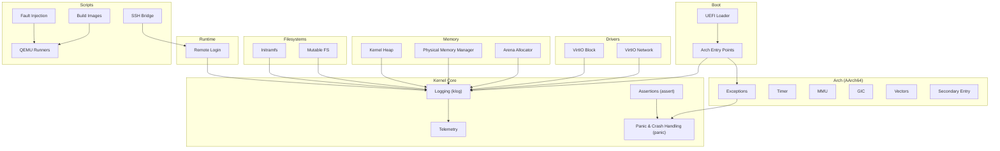
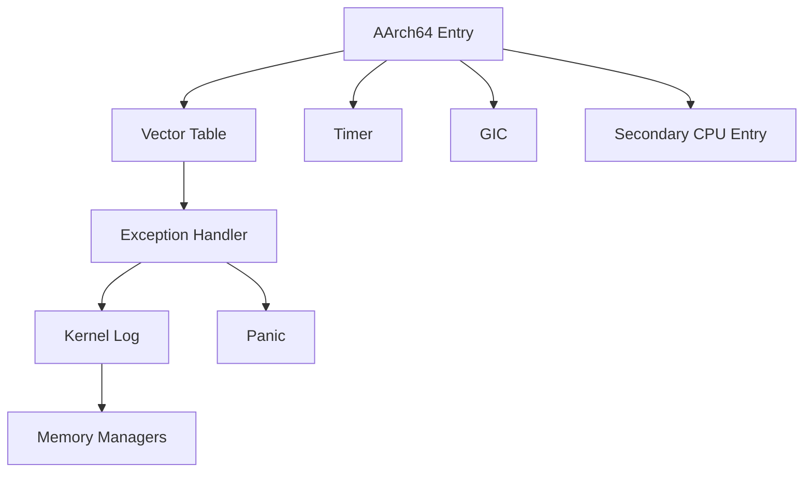
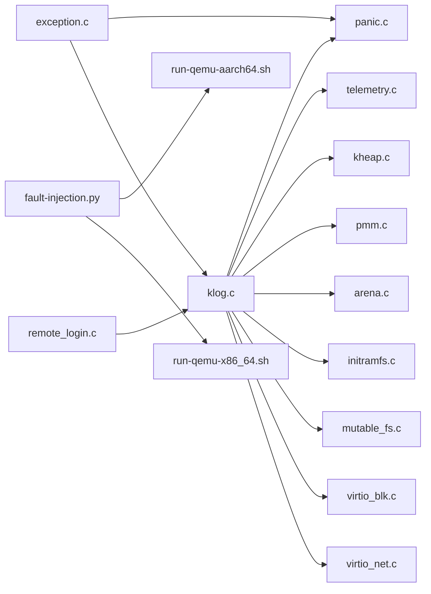

# Troubleshooting

<cite>
**Referenced Files in This Document**
- [klog.c](file://kernel/core/klog.c)
- [panic.c](file://kernel/core/panic.c)
- [assert.c](file://kernel/core/assert.c)
- [qemu-fault-injection.py](file://scripts/qemu-fault-injection.py)
- [qemu-fault-matrix.py](file://scripts/qemu-fault-matrix.py)
- [entry.S](file://kernel/arch/aarch64/entry.S)
- [exception.c](file://kernel/arch/aarch64/exception.c)
- [timer.c](file://kernel/arch/aarch64/timer.c)
- [mmu.c](file://kernel/arch/aarch64/mmu.c)
- [secondary.S](file://kernel/arch/aarch64/secondary.S)
- [vectors.S](file://kernel/arch/aarch64/vectors.S)
- [gic.c](file://kernel/arch/aarch64/gic.c)
- [virtio_blk.c](file://kernel/dev/virtio/virtio_blk.c)
- [virtio_net.c](file://kernel/dev/virtio/virtio_net.c)
- [initramfs.c](file://kernel/fs/initramfs.c)
- [mutable_fs.c](file://kernel/fs/mutable_fs.c)
- [kheap.c](file://kernel/mm/kheap.c)
- [pmm.c](file://kernel/mm/pmm.c)
- [arena.c](file://kernel/mm/arena.c)
- [remote_login.c](file://kernel/runtime/remote_login.c)
- [telemetry.c](file://kernel/core/telemetry.c)
- [README.md](file://README.md)
- [HARDWARE-READINESS.md](file://HARDWARE-READINESS.md)
- [QEMU-FULL-OS-PLAN.md](file://QEMU-FULL-OS-PLAN.md)
- [run-qemu-aarch64.sh](file://scripts/run-qemu-aarch64.sh)
- [run-qemu-x86_64.sh](file://scripts/run-qemu-x86_64.sh)
- [build-image.sh](file://scripts/build-image.sh)
- [build-image-x86_64.sh](file://scripts/build-image-x86_64.sh)
- [create-initfs.py](file://scripts/create-initfs.py)
- [osai-ssh-bridge.py](file://scripts/osai-ssh-bridge.py)
</cite>

## Table of Contents
1. [Introduction](#introduction)
2. [Project Structure](#project-structure)
3. [Core Components](#core-components)
4. [Architecture Overview](#architecture-overview)
5. [Detailed Component Analysis](#detailed-component-analysis)
6. [Dependency Analysis](#dependency-analysis)
7. [Performance Considerations](#performance-considerations)
8. [Troubleshooting Guide](#troubleshooting-guide)
9. [Conclusion](#conclusion)
10. [Appendices](#appendices)

## Introduction
This document provides comprehensive troubleshooting guidance for the OSAI operating system. It focuses on diagnosing boot failures, kernel panics, and system crashes; interpreting logging and debug output; performing fault injection tests; isolating hardware and driver issues; and applying systematic debugging techniques. It also covers performance troubleshooting (memory leaks, CPU bottlenecks, I/O issues) and remote debugging workflows.

## Project Structure
OSAI is organized into:
- Boot and firmware integration (UEFI loader and architecture-specific entry points)
- Kernel core (logging, assertions, panic handling, telemetry)
- Architecture-specific modules (AArch64/x86_64)
- Device drivers (VirtIO block/network)
- Memory management (heap, physical memory manager, arena allocator)
- Filesystems (initramfs, mutable filesystem)
- Runtime services (remote login, telemetry)
- Scripts for building, testing, and fault injection

**Diagram sources**
- [klog.c](file://kernel/core/klog.c)
- [assert.c](file://kernel/core/assert.c)
- [panic.c](file://kernel/core/panic.c)
- [entry.S](file://kernel/arch/aarch64/entry.S)
- [exception.c](file://kernel/arch/aarch64/exception.c)
- [timer.c](file://kernel/arch/aarch64/timer.c)
- [mmu.c](file://kernel/arch/aarch64/mmu.c)
- [gic.c](file://kernel/arch/aarch64/gic.c)
- [vectors.S](file://kernel/arch/aarch64/vectors.S)
- [secondary.S](file://kernel/arch/aarch64/secondary.S)
- [virtio_blk.c](file://kernel/dev/virtio/virtio_blk.c)
- [virtio_net.c](file://kernel/dev/virtio/virtio_net.c)
- [initramfs.c](file://kernel/fs/initramfs.c)
- [mutable_fs.c](file://kernel/fs/mutable_fs.c)
- [kheap.c](file://kernel/mm/kheap.c)
- [pmm.c](file://kernel/mm/pmm.c)
- [arena.c](file://kernel/mm/arena.c)
- [remote_login.c](file://kernel/runtime/remote_login.c)
- [telemetry.c](file://kernel/core/telemetry.c)
- [qemu-fault-injection.py](file://scripts/qemu-fault-injection.py)
- [run-qemu-aarch64.sh](file://scripts/run-qemu-aarch64.sh)
- [run-qemu-x86_64.sh](file://scripts/run-qemu-x86_64.sh)
- [build-image.sh](file://scripts/build-image.sh)
- [build-image-x86_64.sh](file://scripts/build-image-x86_64.sh)
- [osai-ssh-bridge.py](file://scripts/osai-ssh-bridge.py)

**Section sources**
- [README.md](file://README.md)
- [HARDWARE-READINESS.md](file://HARDWARE-READINESS.md)
- [QEMU-FULL-OS-PLAN.md](file://QEMU-FULL-OS-PLAN.md)

## Core Components
- Logging subsystem: centralized kernel logging and debug output emission
- Assertion framework: compile-time and runtime checks with failure reporting
- Panic handler: fatal error capture, optional backtrace, and halt/reboot
- Telemetry: runtime metrics collection and export
- Remote login: interactive shell/session for out-of-band debugging
- Fault injection scripts: controlled stress and failure injection for robustness validation

Key implementation anchors:
- Logging: [klog.c](file://kernel/core/klog.c)
- Assertions: [assert.c](file://kernel/core/assert.c)
- Panic: [panic.c](file://kernel/core/panic.c)
- Telemetry: [telemetry.c](file://kernel/core/telemetry.c)
- Remote login: [remote_login.c](file://kernel/runtime/remote_login.c)
- Fault injection: [qemu-fault-injection.py](file://scripts/qemu-fault-injection.py), [qemu-fault-matrix.py](file://scripts/qemu-fault-matrix.py)

**Section sources**
- [klog.c](file://kernel/core/klog.c)
- [assert.c](file://kernel/core/assert.c)
- [panic.c](file://kernel/core/panic.c)
- [telemetry.c](file://kernel/core/telemetry.c)
- [remote_login.c](file://kernel/runtime/remote_login.c)
- [qemu-fault-injection.py](file://scripts/qemu-fault-injection.py)
- [qemu-fault-matrix.py](file://scripts/qemu-fault-matrix.py)

## Architecture Overview
The OSAI kernel integrates architecture-specific entry points and exception handling with core subsystems. The AAarch64 path includes vector tables, exception dispatch, timer, GIC, and SMP secondary entry. Drivers and filesystems depend on core logging and memory management.

**Diagram sources**
- [entry.S](file://kernel/arch/aarch64/entry.S)
- [vectors.S](file://kernel/arch/aarch64/vectors.S)
- [exception.c](file://kernel/arch/aarch64/exception.c)
- [timer.c](file://kernel/arch/aarch64/timer.c)
- [gic.c](file://kernel/arch/aarch64/gic.c)
- [secondary.S](file://kernel/arch/aarch64/secondary.S)
- [klog.c](file://kernel/core/klog.c)
- [panic.c](file://kernel/core/panic.c)
- [kheap.c](file://kernel/mm/kheap.c)
- [pmm.c](file://kernel/mm/pmm.c)
- [arena.c](file://kernel/mm/arena.c)

## Detailed Component Analysis

### Logging Subsystem (klog)
- Purpose: Emit structured debug logs and support filtering/levels
- Typical symptoms indicating logging issues:
  - No debug output in serial console
  - Logs missing around critical paths (exceptions, device init)
- Diagnostic checklist:
  - Verify logging initialization during boot
  - Confirm serial/console output is enabled and configured
  - Check log level and filters
  - Validate that logging is enabled in the current build profile
- Resolution steps:
  - Enable verbose logging in build configuration
  - Ensure platform console is initialized before first log calls
  - Redirect logs to a persistent medium if applicable

**Section sources**
- [klog.c](file://kernel/core/klog.c)

### Assertion System (assert)
- Purpose: Catch programming logic errors early with immediate feedback
- Symptoms:
  - Immediate halt or panic after assertion failure
  - Stack traces pointing to assertion site
- Diagnostic checklist:
  - Identify failing assertion condition
  - Review recent changes near assertion location
  - Confirm assertion macros are active in current build
- Resolution steps:
  - Fix preconditions or data corruption causing assertion failure
  - Add defensive checks upstream
  - Temporarily disable assertions only for targeted debugging

**Section sources**
- [assert.c](file://kernel/core/assert.c)

### Panic Handling (panic)
- Purpose: Capture fatal errors, optionally print backtrace, and enter safe state
- Symptoms:
  - System freeze or reboot after panic
  - Panic message with error code or module name
- Diagnostic checklist:
  - Capture panic message and timestamp
  - Inspect recent kernel activity (logs) leading up to panic
  - Identify failing module or driver
- Resolution steps:
  - Isolate faulty driver or memory operation
  - Apply hotfixes or roll back changes
  - Strengthen error handling and bounds checking

**Section sources**
- [panic.c](file://kernel/core/panic.c)

### Exception and Fault Handling (AArch64)
- Purpose: Route synchronous/asynchronous faults to handlers
- Symptoms:
  - Frequent exceptions on memory access or instruction fetch
  - Instability under load or specific memory patterns
- Diagnostic checklist:
  - Validate MMU configuration and page tables
  - Check GIC interrupt routing if faults are interrupt-related
  - Inspect vector table and handler dispatch
- Resolution steps:
  - Correct memory mapping or alignment issues
  - Reinitialize MMU/GIC if misconfigured
  - Strengthen exception handler logic

**Section sources**
- [exception.c](file://kernel/arch/aarch64/exception.c)
- [vectors.S](file://kernel/arch/aarch64/vectors.S)
- [mmu.c](file://kernel/arch/aarch64/mmu.c)
- [gic.c](file://kernel/arch/aarch64/gic.c)

### VirtIO Block and Network Drivers
- Purpose: Provide storage and networking via virtualized devices
- Symptoms:
  - Storage I/O stalls or timeouts
  - Network packets dropped or delayed
- Diagnostic checklist:
  - Verify guest kernel VirtIO support and transport
  - Check queue setup and descriptor lists
  - Validate interrupts and polling modes
- Resolution steps:
  - Reinitialize device queues
  - Adjust buffer sizes and batching
  - Confirm host-side VirtIO backend availability

**Section sources**
- [virtio_blk.c](file://kernel/dev/virtio/virtio_blk.c)
- [virtio_net.c](file://kernel/dev/virtio/virtio_net.c)

### Filesystems (initramfs and mutable FS)
- Purpose: Provide early root and writable filesystems
- Symptoms:
  - Boot hangs while mounting root
  - Filesystem corruption or I/O errors
- Diagnostic checklist:
  - Confirm initramfs integrity and content
  - Validate mutable FS mount and permissions
  - Check for missing device nodes or symlinks
- Resolution steps:
  - Recreate initramfs with correct content
  - Repair or reformat mutable FS partition
  - Rebuild image with updated initramfs

**Section sources**
- [initramfs.c](file://kernel/fs/initramfs.c)
- [mutable_fs.c](file://kernel/fs/mutable_fs.c)

### Memory Management (Heap, PMM, Arena)
- Purpose: Manage kernel heap, physical pages, and temporary arenas
- Symptoms:
  - Memory allocation failures
  - Page table exhaustion
  - Memory leaks causing instability
- Diagnostic checklist:
  - Monitor heap usage and fragmentation
  - Track physical page allocation/free cycles
  - Inspect arena allocations and lifetimes
- Resolution steps:
  - Reduce peak allocations or increase limits
  - Audit leak-prone paths (missing frees)
  - Optimize allocation patterns and pooling

**Section sources**
- [kheap.c](file://kernel/mm/kheap.c)
- [pmm.c](file://kernel/mm/pmm.c)
- [arena.c](file://kernel/mm/arena.c)

### Remote Debugging and Telemetry
- Purpose: Provide interactive sessions and runtime metrics
- Symptoms:
  - SSH session drops or login fails
  - Telemetry data missing or stale
- Diagnostic checklist:
  - Verify network connectivity and credentials
  - Confirm remote login service is enabled and listening
  - Check telemetry collection intervals and sinks
- Resolution steps:
  - Reconfigure network and firewall rules
  - Restart remote login service
  - Validate telemetry pipeline and storage

**Section sources**
- [remote_login.c](file://kernel/runtime/remote_login.c)
- [telemetry.c](file://kernel/core/telemetry.c)

### Fault Injection Testing
- Purpose: Introduce controlled failures to validate resilience
- Tools:
  - Fault injection script for targeted stress
  - Fault matrix for broad coverage
- Diagnostic checklist:
  - Run fault injection suites and capture logs
  - Correlate injected faults with observed behaviors
  - Validate recovery paths and safety guarantees
- Resolution steps:
  - Strengthen error handling and retry logic
  - Improve resource cleanup on failure paths
  - Harden critical sections against timing-induced races

**Section sources**
- [qemu-fault-injection.py](file://scripts/qemu-fault-injection.py)
- [qemu-fault-matrix.py](file://scripts/qemu-fault-matrix.py)

## Dependency Analysis
The kernel’s core depends on architecture-specific modules for entry, exceptions, timers, and interrupts. Device drivers and filesystems depend on core logging and memory management. Remote debugging relies on network and runtime services.

**Diagram sources**
- [klog.c](file://kernel/core/klog.c)
- [panic.c](file://kernel/core/panic.c)
- [telemetry.c](file://kernel/core/telemetry.c)
- [kheap.c](file://kernel/mm/kheap.c)
- [pmm.c](file://kernel/mm/pmm.c)
- [arena.c](file://kernel/mm/arena.c)
- [initramfs.c](file://kernel/fs/initramfs.c)
- [mutable_fs.c](file://kernel/fs/mutable_fs.c)
- [virtio_blk.c](file://kernel/dev/virtio/virtio_blk.c)
- [virtio_net.c](file://kernel/dev/virtio/virtio_net.c)
- [exception.c](file://kernel/arch/aarch64/exception.c)
- [remote_login.c](file://kernel/runtime/remote_login.c)
- [qemu-fault-injection.py](file://scripts/qemu-fault-injection.py)
- [run-qemu-aarch64.sh](file://scripts/run-qemu-aarch64.sh)
- [run-qemu-x86_64.sh](file://scripts/run-qemu-x86_64.sh)

**Section sources**
- [klog.c](file://kernel/core/klog.c)
- [panic.c](file://kernel/core/panic.c)
- [exception.c](file://kernel/arch/aarch64/exception.c)
- [virtio_blk.c](file://kernel/dev/virtio/virtio_blk.c)
- [virtio_net.c](file://kernel/dev/virtio/virtio_net.c)
- [initramfs.c](file://kernel/fs/initramfs.c)
- [mutable_fs.c](file://kernel/fs/mutable_fs.c)
- [kheap.c](file://kernel/mm/kheap.c)
- [pmm.c](file://kernel/mm/pmm.c)
- [arena.c](file://kernel/mm/arena.c)
- [remote_login.c](file://kernel/runtime/remote_login.c)
- [qemu-fault-injection.py](file://scripts/qemu-fault-injection.py)
- [run-qemu-aarch64.sh](file://scripts/run-qemu-aarch64.sh)
- [run-qemu-x86_64.sh](file://scripts/run-qemu-x86_64.sh)

## Performance Considerations
- Memory leaks:
  - Symptom: gradual degradation in free memory or increased allocation latency
  - Technique: track allocations and frees; correlate with subsystems; use arena and heap statistics
  - Tools: telemetry and manual audits
- CPU bottlenecks:
  - Symptom: high scheduler utilization or long ISR durations
  - Technique: profile critical paths; reduce blocking in ISRs; optimize loops
  - Tools: telemetry counters and cycle profiling
- I/O issues:
  - Symptom: stalled VirtIO queues or excessive retries
  - Technique: validate queue setup, interrupt coalescing, and buffer sizes
  - Tools: driver logs and telemetry

[No sources needed since this section provides general guidance]

## Troubleshooting Guide

### Boot Failures
Common causes and checks:
- Firmware/UEFI issues:
  - Verify UEFI loader entry and handoff
  - Confirm architecture entry points are reachable
- Early kernel initialization:
  - Check logging output immediately after entry
  - Validate MMU and memory mapping before enabling caches
- Root filesystem:
  - Ensure initramfs is present and readable
  - Confirm mutable FS mount succeeds

Resolution steps:
- Rebuild image with correct initramfs and kernel config
- Enable verbose logging and serial console
- Validate hardware readiness per platform guidelines

**Section sources**
- [entry.S](file://kernel/arch/aarch64/entry.S)
- [mmu.c](file://kernel/arch/aarch64/mmu.c)
- [initramfs.c](file://kernel/fs/initramfs.c)
- [build-image.sh](file://scripts/build-image.sh)
- [build-image-x86_64.sh](file://scripts/build-image-x86_64.sh)
- [create-initfs.py](file://scripts/create-initfs.py)

### Kernel Panics and Crashes
Diagnostic procedure:
- Capture panic message and timestamp
- Inspect recent logs around the failure
- Identify failing module or driver
- Reproduce with minimal configuration

Resolution steps:
- Disable or fix the offending component
- Strengthen error handling and bounds checking
- Use telemetry to quantify impact

**Section sources**
- [panic.c](file://kernel/core/panic.c)
- [klog.c](file://kernel/core/klog.c)
- [telemetry.c](file://kernel/core/telemetry.c)

### Logging Mechanisms and Debug Output Interpretation
- Enable appropriate log levels for the subsystem under test
- Filter logs by facility/module to isolate issues
- Correlate timestamps with system events (interrupts, I/O)
- Export logs for offline analysis

**Section sources**
- [klog.c](file://kernel/core/klog.c)

### Fault Injection Testing Procedures
- Run fault injection suites to validate resilience
- Record logs and telemetry during injections
- Analyze recovery paths and safety guarantees
- Expand matrices to cover new failure modes

**Section sources**
- [qemu-fault-injection.py](file://scripts/qemu-fault-injection.py)
- [qemu-fault-matrix.py](file://scripts/qemu-fault-matrix.py)

### Hardware Compatibility and Driver Issues
- Validate VirtIO backend availability and driver presence
- Confirm device queue setup and interrupts
- Check platform-specific constraints (MMU, GIC, timers)

**Section sources**
- [virtio_blk.c](file://kernel/dev/virtio/virtio_blk.c)
- [virtio_net.c](file://kernel/dev/virtio/virtio_net.c)
- [gic.c](file://kernel/arch/aarch64/gic.c)
- [timer.c](file://kernel/arch/aarch64/timer.c)

### Configuration Errors
- Verify build configuration and enabled features
- Confirm initramfs content and mount targets
- Validate runtime service configurations (network, remote login)

**Section sources**
- [build-image.sh](file://scripts/build-image.sh)
- [create-initfs.py](file://scripts/create-initfs.py)
- [remote_login.c](file://kernel/runtime/remote_login.c)

### Assertion System and Panic Handling
- Use assertions to catch logic errors early
- On panic, collect and analyze the failure context
- Strengthen preconditions and error paths

**Section sources**
- [assert.c](file://kernel/core/assert.c)
- [panic.c](file://kernel/core/panic.c)

### Remote Debugging and Crash Dump Analysis
- Establish SSH bridge for out-of-band access
- Use remote login to inspect state and restart services
- Collect crash logs and telemetry for post-mortem

**Section sources**
- [osai-ssh-bridge.py](file://scripts/osai-ssh-bridge.py)
- [remote_login.c](file://kernel/runtime/remote_login.c)
- [telemetry.c](file://kernel/core/telemetry.c)

### Systematic Problem Isolation Procedures
- Narrow scope: reproduce with minimal components
- Change one variable at a time: config, driver, hardware
- Use telemetry and logs to triangulate cause
- Validate fixes with regression tests

[No sources needed since this section provides general guidance]

## Conclusion
Effective OSAI troubleshooting combines disciplined logging, assertion-driven development, robust panic handling, and systematic isolation techniques. Leverage built-in telemetry, remote debugging, and fault injection to validate resilience. For hardware and driver issues, focus on VirtIO and platform-specific subsystems. Adopt the procedures outlined here to quickly diagnose and resolve boot failures, panics, performance bottlenecks, and configuration errors.

[No sources needed since this section summarizes without analyzing specific files]

## Appendices

### Quick Reference: Where to Look
- Boot path: [entry.S](file://kernel/arch/aarch64/entry.S), [mmu.c](file://kernel/arch/aarch64/mmu.c)
- Exceptions: [exception.c](file://kernel/arch/aarch64/exception.c), [vectors.S](file://kernel/arch/aarch64/vectors.S)
- Logging: [klog.c](file://kernel/core/klog.c)
- Assertions: [assert.c](file://kernel/core/assert.c)
- Panic: [panic.c](file://kernel/core/panic.c)
- Drivers: [virtio_blk.c](file://kernel/dev/virtio/virtio_blk.c), [virtio_net.c](file://kernel/dev/virtio/virtio_net.c)
- Filesystems: [initramfs.c](file://kernel/fs/initramfs.c), [mutable_fs.c](file://kernel/fs/mutable_fs.c)
- Memory: [kheap.c](file://kernel/mm/kheap.c), [pmm.c](file://kernel/mm/pmm.c), [arena.c](file://kernel/mm/arena.c)
- Remote debugging: [remote_login.c](file://kernel/runtime/remote_login.c), [osai-ssh-bridge.py](file://scripts/osai-ssh-bridge.py)
- Fault injection: [qemu-fault-injection.py](file://scripts/qemu-fault-injection.py), [qemu-fault-matrix.py](file://scripts/qemu-fault-matrix.py)

**Section sources**
- [entry.S](file://kernel/arch/aarch64/entry.S)
- [exception.c](file://kernel/arch/aarch64/exception.c)
- [vectors.S](file://kernel/arch/aarch64/vectors.S)
- [mmu.c](file://kernel/arch/aarch64/mmu.c)
- [klog.c](file://kernel/core/klog.c)
- [assert.c](file://kernel/core/assert.c)
- [panic.c](file://kernel/core/panic.c)
- [virtio_blk.c](file://kernel/dev/virtio/virtio_blk.c)
- [virtio_net.c](file://kernel/dev/virtio/virtio_net.c)
- [initramfs.c](file://kernel/fs/initramfs.c)
- [mutable_fs.c](file://kernel/fs/mutable_fs.c)
- [kheap.c](file://kernel/mm/kheap.c)
- [pmm.c](file://kernel/mm/pmm.c)
- [arena.c](file://kernel/mm/arena.c)
- [remote_login.c](file://kernel/runtime/remote_login.c)
- [osai-ssh-bridge.py](file://scripts/osai-ssh-bridge.py)
- [qemu-fault-injection.py](file://scripts/qemu-fault-injection.py)
- [qemu-fault-matrix.py](file://scripts/qemu-fault-matrix.py)